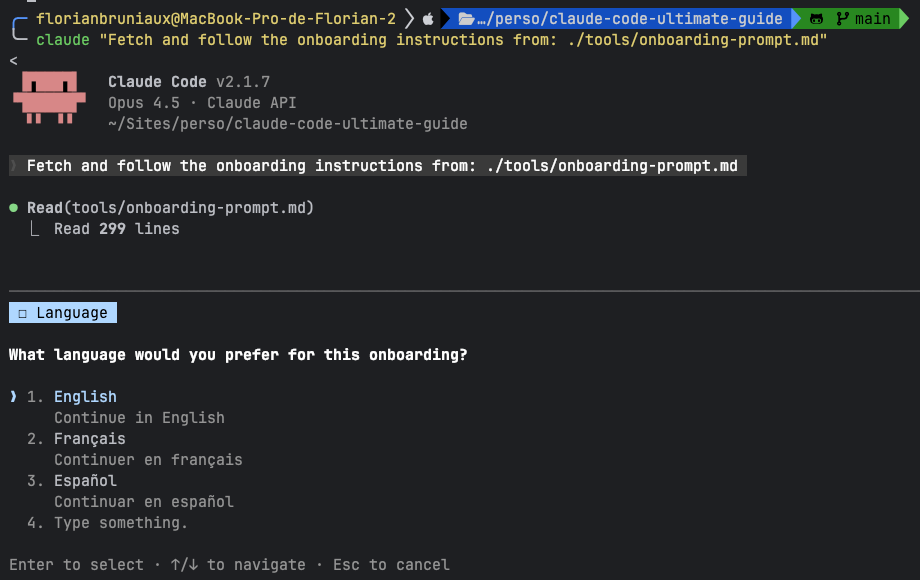
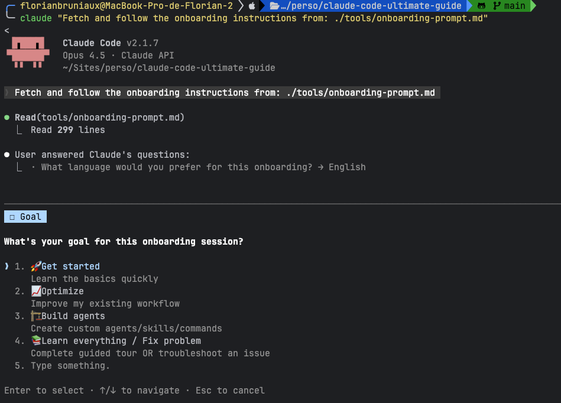
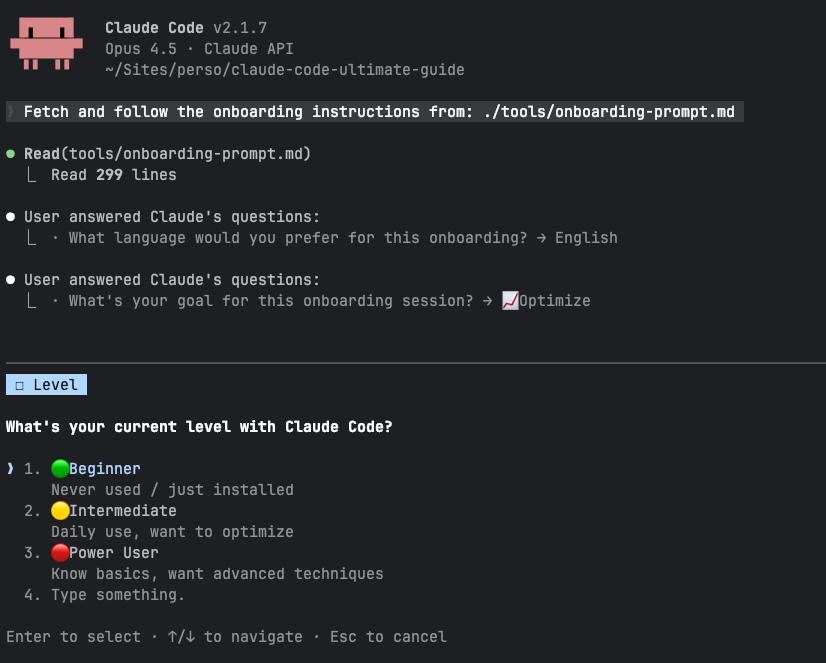
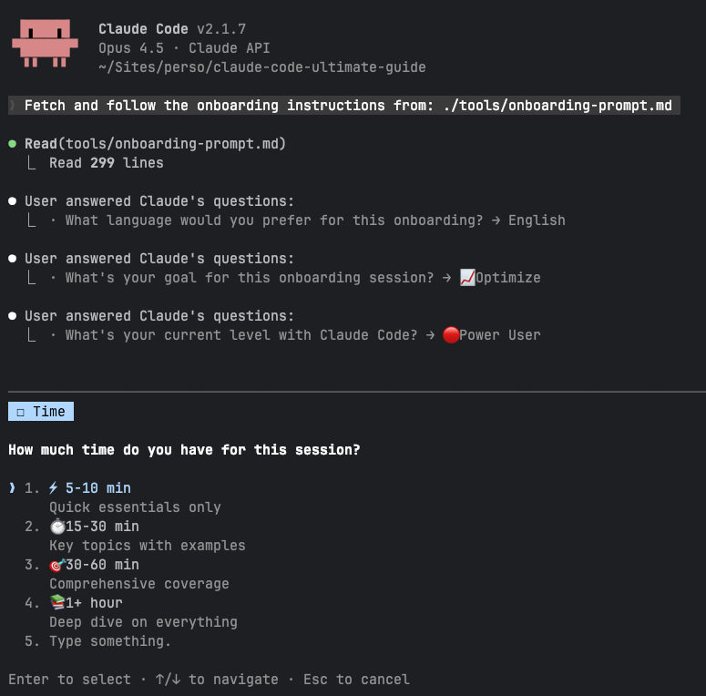

# Claude Code Guide

<p align="center">
  <a href="https://florianbruniaux.github.io/claude-code-ultimate-guide-landing/"></a>
</p>

<p align="center">
  <a href="https://github.com/FlorianBruniaux/claude-code-ultimate-guide/stargazers"></a>
  <a href="#"></a>
  <a href="./examples/"></a>
  <a href="./quiz/"></a>
</p>

<p align="center">
  <a href="https://creativecommons.org/licenses/by-sa/4.0/"></a>
  <a href="https://zread.ai/FlorianBruniaux/claude-code-ultimate-guide"></a>
</p>

<details>
<summary><strong>📑 Table of Contents</strong></summary>

**🆕 Beginner Path**
- [TL;DR](#-tldr-under-5-minutes) — Quick reference
- [Get Started](#get-started-in-60-seconds) — First steps
- [Golden Rules](#-golden-rules) — 5 principles

**👨‍💻 Developer Path**
- [By Role](#-by-role-tailored-learning-paths) — Junior/Senior/Power User
- [Guide Navigation](#-guide-navigation) — Section index
- [Examples](#-production-ready-examples) — Templates

**🚀 Advanced Path**
- [Audit Setup](#-audit-your-setup) — Check configuration
- [Quiz](#-knowledge-quiz) — Test knowledge
- [Ecosystem](#-ecosystem--positioning) — Complementary tools

**📚 Reference**
- [Complete Toolkit](#-complete-toolkit) — Full documentation
- [About](#-about-this-guide) — Philosophy & origins
- [Contributing](#-contributing) — How to help

</details>

---

## ⚡ TL;DR (Under 5 Minutes)

**In a hurry?** Pick one:

| I need... | Go here | Time |
|-----------|---------|------|
| **Quick reference** | [Cheat Sheet](./guide/cheatsheet.md) | 2 min |
| **Starter CLAUDE.md** | Copy below ↓ | 30 sec |
| **Key principles** | [Golden Rules](#-golden-rules) | 1 min |

<details>
<summary><strong>📋 Minimal CLAUDE.md Template (click to expand & copy)</strong></summary>

```markdown
# Project: [NAME]

## Tech Stack
- Language: [e.g., TypeScript]
- Framework: [e.g., Next.js 14]
- Testing: [e.g., Vitest]

## Commands
- Build: `npm run build`
- Test: `npm test`
- Lint: `npm run lint`

## Rules
- Run tests before marking tasks complete
- Follow existing code patterns
- Keep commits atomic and conventional
```

Save as `CLAUDE.md` in your project root. Claude reads it automatically.

</details>

---

**Transparency note**: This guide reflects my personal experience after several months of daily Claude Code usage. I'm sharing what I've learned, not claiming expertise. The tool evolves constantly, and so does my understanding. [Feedback welcome](./CONTRIBUTING.md).

---

> 🇫🇷 **Communauté francophone** | Tu veux parler de dev et d'IA ? Challenger des idées ? Présenter des outils ? En découvrir ?
> **[Dev With AI](https://www.devw.ai/)** rassemble près de 1500 devs sur Slack, tous niveaux et toutes technos confondus — enthousiastes comme sceptiques.
> Meetups à Paris, Bordeaux et Lyon.

---

> **Privacy Notice**: Claude Code sends your prompts, file contents, and MCP results to Anthropic servers.
> - **Default**: 5 years retention (training enabled) | **Opt-out**: 30 days | **Enterprise**: 0
> - **Action**: [Disable training](https://claude.ai/settings/data-privacy-controls) | [Full privacy guide](./guide/data-privacy.md)

---

## Get Started in 60 Seconds

**Option A: One-liner** (no clone needed)
```bash
claude "Fetch and follow the onboarding instructions from: https://raw.githubusercontent.com/FlorianBruniaux/claude-code-ultimate-guide/main/tools/onboarding-prompt.md"
```

<details>
<summary>📸 <strong>Preview: Interactive Onboarding Flow</strong></summary>

<table>
<tr>
<td width="50%"><br/><em>1. Choose your language</em></td>
<td width="50%"><br/><em>2. Select your goal</em></td>
</tr>
<tr>
<td width="50%"><br/><em>3. Pick your experience level</em></td>
<td width="50%"><br/><em>4. Set available time</em></td>
</tr>
</table>

</details>

**Option B: From cloned repo**
1. Copy the prompt from [tools/onboarding-prompt.md](./tools/onboarding-prompt.md#4-the-prompt)
2. Run `claude` → Paste → Enter

Claude asks 2-4 questions then guides you through personalized content based on your profile.

**Or browse directly:** [Cheat Sheet](./guide/cheatsheet.md) | [Quick Start](./guide/ultimate-guide.md#1-quick-start-day-1) | [Full Guide](./guide/ultimate-guide.md)

---

## Choose Your Path

> **New here?** Use the [Table of Contents](#-table-of-contents) above or pick:

| Profile | Start here |
|---------|------------|
| **Beginner** | [Get Started](#get-started-in-60-seconds) → [Golden Rules](#-golden-rules) |
| **Experienced** | [By Role](#-by-role-tailored-learning-paths) → [Examples](#-production-ready-examples) |
| **Troubleshooting** | [Troubleshooting](./guide/ultimate-guide.md#troubleshooting) |

---

## Why This Guide?

**The problem:**
- You scroll through awesome-lists → links, no learning path
- You read official docs → dense, no progression
- You search tutorials → scattered, outdated in weeks

**This guide:** Structured learning path with 60+ copy-paste templates. Your mileage may vary—but this saves you the exploration time.

| Traditional Docs | This Guide |
|------------------|------------|
| Lists features | Teaches workflows |
| Reference lookup | Progressive learning |
| Theoretical concepts | Production-ready patterns |
| "Figure it out" | "Here's exactly how" |

**By [Florian BRUNIAUX](https://github.com/FlorianBruniaux)** | Founding Engineer [@Méthode Aristote](https://methode-aristote.fr) | [Connect on LinkedIn](https://www.linkedin.com/in/florian-bruniaux-43408b83/)

**Reading time**: Quick Start ~15 min. Full guide ~3 hours (most read by section).

> **If this guide saves you hours of trial-and-error, please star it.**

### Prerequisites

- **Node.js 18+** (or use the [shell installer](./guide/ultimate-guide.md#11-installation) on macOS/Linux)
- **Anthropic API key** — [Get one here](https://console.anthropic.com/)

---

### ⚡ Audit Your Setup

Already have Claude Code installed? Quickly scan your configuration:

```bash
curl -sL https://raw.githubusercontent.com/FlorianBruniaux/claude-code-ultimate-guide/main/examples/scripts/audit-scan.sh | bash
```

**Instant checks**: Config files, tech stack, extensions, security hooks, MCP servers, CLAUDE.md quality

**Want deeper analysis?** Use [`tools/audit-prompt.md`](./tools/audit-prompt.md) for personalized recommendations (~3 min).

### 🤖 For AI Assistants

This guide is optimized for both human and AI consumption:

| Resource | Purpose | Tokens |
|----------|---------|--------|
| **[llms.txt](./machine-readable/llms.txt)** | Standard context file for AI crawlers | ~1K |
| **[reference.yaml](./machine-readable/reference.yaml)** | Structured index with line numbers | ~2K |

**Quick load** (paste in any AI assistant):
```bash
curl -sL https://raw.githubusercontent.com/FlorianBruniaux/claude-code-ultimate-guide/main/machine-readable/reference.yaml
```

**Use cases**: Inject into ChatGPT/Claude/Gemini, add to system prompts, reference in Claude Code with `@machine-readable/reference.yaml`

**What's inside**: Decision trees, command reference, context zones, MCP servers, agent templates, troubleshooting—optimized for machine consumption. Points to line numbers in the [full guide](./guide/ultimate-guide.md) for deep dives.

<details>
<summary><strong>🔬 Deep Audit (Personalized Recommendations)</strong></summary>

Get a comprehensive, **context-aware** audit that analyzes your project's README, CLAUDE.md files, and business domain to provide tailored recommendations:

> 🔒 **Privacy**: The audit downloads reference files from this repo, then analyzes YOUR local files with your Claude CLI. Your project files are sent only to your Anthropic API endpoint, not to this repository or any third party.

**Quick Version** (~10 sec):
```bash
curl -sL https://raw.githubusercontent.com/FlorianBruniaux/claude-code-ultimate-guide/main/examples/scripts/audit-scan.sh | bash -s -- --json | claude -p "Analyze this Claude Code setup. Give: 1) Health score 0-100 2) Top 3 quick wins 3) CLAUDE.md template for detected stack. Be concise."
```

**Full Audit with Context** (~30 sec, recommended):
```bash
# Claude Code Deep Audit - Context-Aware Version
# Downloads reference files, reads YOUR local files, analyzes with Claude
REF=$(curl -sL https://raw.githubusercontent.com/FlorianBruniaux/claude-code-ultimate-guide/main/machine-readable/reference.yaml)
SCAN=$(curl -sL https://raw.githubusercontent.com/FlorianBruniaux/claude-code-ultimate-guide/main/examples/scripts/audit-scan.sh | bash -s -- --json 2>/dev/null)
README_CONTENT=$(head -100 README.md 2>/dev/null || echo "No README.md found")
CLAUDE_MD=$(cat CLAUDE.md 2>/dev/null || echo "No CLAUDE.md found")
LOCAL_CLAUDE_MD=$(cat .claude/CLAUDE.md 2>/dev/null || echo "No .claude/CLAUDE.md found")

claude -p "Reference:
$REF

Scan results:
$SCAN

Project README (first 100 lines):
$README_CONTENT

Project CLAUDE.md:
$CLAUDE_MD

Local .claude/CLAUDE.md:
$LOCAL_CLAUDE_MD

IMPORTANT: Focus on INCREMENTAL improvements to existing setup. Don't suggest creating things that already exist. If CLAUDE.md exists, suggest specific improvements to it rather than a full rewrite.

Based on ALL this context, provide:
1. Stack Recap: runtime, framework, test runner, bundler, database, key integrations detected
2. Health Score (0-100) - be strict: penalize missing SSoT pattern if >100 lines without @refs
3. Findings table: Priority|Element|Status|Action (only gaps, not what exists)
4. Top 3 quick wins (<5 min) - MUST be specific to THIS project's domain (not generic advice)
5. If CLAUDE.md exists: list 3-5 specific improvements (not a full template). If missing: provide ~100 line template
6. Suggested agents/commands/hooks that DON'T duplicate existing ones - check extensions count first
7. Ideas to leverage Claude Code for this specific domain and detected integrations"
```

**What you get**:
- **Stack recap**: Runtime, framework, test runner, bundler, database, and key integrations auto-detected
- Strict health score (penalizes large CLAUDE.md without @refs)
- **Incremental improvements**: Specific fixes for YOUR setup, not generic advice
- Domain-aware suggestions (e.g., EdTech → session planning agents, E-commerce → inventory commands)
- Non-duplicate suggestions: Only recommends agents/commands you don't already have

**Want maximum depth?** Use [tools/audit-prompt.md](./tools/audit-prompt.md) (thinking is enabled by default with Opus 4.5)

</details>

### 🧠 Knowledge Quiz

Test your Claude Code knowledge with an interactive CLI quiz. **227 curated questions** covering all 14 guide sections, with immediate feedback and documentation links.

```bash
# Quick start
cd quiz && npm install && npm start

# With options
node quiz/src/index.js --profile senior --topics 2,4,7 --count 10
```

<details>
<summary><strong>Example Session</strong> (click to expand)</summary>

```
============================================================
   CLAUDE CODE KNOWLEDGE QUIZ
============================================================

? Select your profile: Senior Developer (40 min to mastery)
? Select topics to quiz: All topics (recommended)

------------------------------------------------------------
Question 1/20 [Core Concepts]

At what context percentage should you use /compact?

  A) 0-50%
  B) 50-70%
  C) 70-90%
  D) Only at 100%

? Your answer: C

✓ CORRECT!

------------------------------------------------------------
Question 2/20 [Hooks]

What exit code should a PreToolUse hook return to BLOCK an operation?

  A) 0
  B) 1
  C) 2
  D) -1

? Your answer: A

✗ INCORRECT. The correct answer is C) 2

Explanation:
Exit code 2 blocks the operation. Exit code 0 allows it to proceed.
Other exit codes are treated as errors and logged but don't block.

See: guide/ultimate-guide.md#72-creating-hooks

------------------------------------------------------------
   QUIZ COMPLETE
------------------------------------------------------------

Overall Score: 16/20 (80%)

By Category:
  Core Concepts       6/7  (86%)  [████████░░]
  Agents              5/7  (71%)  [███████░░░]
  Hooks               5/6  (83%)  [████████░░]

Weak Areas (< 75%):
  - Agents: Review section 4 in the guide

? What would you like to do? Retry wrong questions only
```

</details>

**Features**:
- **4 profiles**: Junior (15q), Senior (20q), Power User (25q), PM (10q)
- **10 topic categories** matching guide sections
- **Immediate feedback** with explanations and doc links
- **Score tracking** with category breakdown and weak area identification
- **Session history** saved to `~/.claude-quiz/`
- **Replay options**: Retry wrong questions or start fresh
- **Cross-platform**: Works on macOS, Linux, and Windows

**See**: [Quiz Documentation](./quiz/README.md) | [Contribute Questions](./quiz/templates/question-template.yaml)

### 🎯 By Role (Tailored Learning Paths)

<details>
<summary><strong>Junior Developer</strong> — Foundation path (7 steps)</summary>

1. [Quick Start](./guide/ultimate-guide.md#1-quick-start-day-1) — Install & first workflow
2. [Essential Commands](./guide/ultimate-guide.md#13-essential-commands) — The 7 commands
3. [Context Management](./guide/ultimate-guide.md#22-context-management) — Critical concept
4. [Memory Files](./guide/ultimate-guide.md#31-memory-files-claudemd) — Your first CLAUDE.md
5. [Learning with AI](./guide/learning-with-ai.md) — Use AI without becoming dependent ⭐
6. [TDD Workflow](./guide/workflows/tdd-with-claude.md) — Test-first development
7. [Cheat Sheet](./guide/cheatsheet.md) — Print this

</details>

<details>
<summary><strong>Senior Developer</strong> — Intermediate path (6 steps)</summary>

1. [Core Concepts](./guide/ultimate-guide.md#2-core-concepts) — Mental model
2. [Plan Mode](./guide/ultimate-guide.md#23-plan-mode) — Safe exploration
3. [Methodologies](./guide/methodologies.md) — TDD, SDD, BDD reference
4. [Agents](./guide/ultimate-guide.md#4-agents) — Custom AI personas
5. [Hooks](./guide/ultimate-guide.md#7-hooks) — Event automation
6. [CI/CD Integration](./guide/ultimate-guide.md#93-cicd-integration) — Pipelines

</details>

<details>
<summary><strong>Power User</strong> — Comprehensive path (7 steps)</summary>

1. [Complete Guide](./guide/ultimate-guide.md) — End-to-end
2. [Architecture](./guide/architecture.md) — How Claude Code works
3. [Security Hardening](./guide/security-hardening.md) — MCP vetting, injection defense
4. [MCP Servers](./guide/ultimate-guide.md#8-mcp-servers) — Extended capabilities
5. [Trinity Pattern](./guide/ultimate-guide.md#91-the-trinity) — Advanced workflows
6. [Observability](./guide/observability.md) — Monitor costs & sessions
7. [Examples](./examples/) — Production templates

</details>

<details>
<summary><strong>Product Manager</strong> — Overview path (5 steps)</summary>

1. [What's Inside](#-complete-toolkit) — Scope
2. [Golden Rules](#-golden-rules) — Key principles
3. [Data Privacy](./guide/data-privacy.md) — Retention & compliance
4. [Adoption Approaches](./guide/adoption-approaches.md) — Team strategies
5. [Context Management](./guide/ultimate-guide.md#22-context-management) — Why it matters

</details>

---

## 📚 Complete Toolkit

### Core Documentation

| File | Purpose | Time Investment |
|------|---------|-----------------|
| **[Ultimate Guide](./guide/ultimate-guide.md)** | Complete reference, 10 sections | ~3 hours (or by section) |
| **[Claude Code Releases](./guide/claude-code-releases.md)** | Official release history (condensed) | 10 minutes |
| **[Cheat Sheet](./guide/cheatsheet.md)** | 1-page printable reference | 5 minutes |
| **[Architecture & Internals](./guide/architecture.md)** | How Claude Code works under the hood | ~25 minutes |
| **[Methodologies](./guide/methodologies.md)** | 15 development methodologies reference | ~20 minutes |
| **[Workflows](./guide/workflows/)** | Practical guides (TDD, SDD, Plan-Driven) | ~30 minutes |
| **[Data Privacy](./guide/data-privacy.md)** | Data retention and privacy guide | ~10 minutes |
| **[Security Hardening](./guide/security-hardening.md)** | MCP vetting, injection defense, CVEs | ~25 minutes |
| **[Observability](./guide/observability.md)** | Session monitoring and cost tracking | ~15 minutes |
| **[AI Ecosystem](./guide/ai-ecosystem.md)** | Complementary tools (Perplexity, Gemini, Kimi, Cowork) | ~25 minutes |
| **[LLM Reference](./machine-readable/reference.yaml)** | Machine-optimized index (~2K tokens) | For Claude/AI assistants |
| **[Setup Audit](./tools/audit-prompt.md)** | Optimize your configuration | ~10 minutes |
| **[Examples Library](./examples/)** | Production-ready templates | Browse as needed |

<details>
<summary><strong>Alternative Formats</strong> (Interactive AI, PDFs)</summary>

- **[DeepWiki](https://deepwiki.com/FlorianBruniaux/claude-code-ultimate-guide/1-overview)** — AI-powered Q&A, semantic search, instant summaries
- **[NotebookLM Slides](./exports/notebooklm.pdf)** — Visual overview (~20 min)
- **[Kimi PDF](./exports/kimi.pdf)** — Full text export (~3 hours)

</details>

### Repository Structure

```
claude-code-ultimate-guide/
├── guide/                    # 📖 Core documentation
│   ├── ultimate-guide.md     # Complete reference (~10900 lines)
│   ├── cheatsheet.md         # 1-page printable reference
│   ├── architecture.md       # How Claude Code works internally
│   ├── adoption-approaches.md # Team implementation strategies
│   ├── data-privacy.md       # Data retention and privacy guide
│   ├── methodologies.md      # 15 development methodologies reference
│   ├── observability.md      # Session monitoring and cost tracking
│   └── workflows/            # Practical workflow guides
│       ├── tdd-with-claude.md
│       ├── spec-first.md
│       ├── plan-driven.md
│       ├── iterative-refinement.md
│       └── pdf-generation.md
│
├── tools/                    # 🔧 Interactive utilities
│   ├── audit-prompt.md       # Setup audit with recommendations
│   ├── onboarding-prompt.md  # Personalized guided tour
│   └── mobile-access.md      # Mobile access setup (ttyd + Tailscale)
│
├── machine-readable/         # 🤖 LLM/AI consumption
│   ├── reference.yaml        # Structured index (~2K tokens)
│   └── llms.txt              # Standard LLM context file
│
├── exports/                  # 📄 Generated outputs
│   ├── notebooklm.pdf        # Visual slides
│   └── kimi.pdf              # Full PDF export
│
├── examples/                 # 📦 Production templates
│   ├── agents/               # Custom AI personas
│   ├── commands/             # Slash commands (/pr, /commit, /diagnose...)
│   ├── hooks/                # Security & automation (bash + PowerShell)
│   ├── skills/               # Reusable knowledge modules
│   ├── scripts/              # Setup & diagnostic utilities
│   ├── github-actions/       # CI/CD workflows
│   ├── config/               # Configuration templates
│   ├── memory/               # CLAUDE.md templates
│   ├── mcp-configs/          # MCP server configurations
│   ├── modes/                # Behavioral modes (SuperClaude)
│   └── workflows/            # Advanced workflow guides
│
└── quiz/                     # 🧠 Interactive knowledge quiz (227 questions)
```

---

## 🎯 Production-Ready Examples

Copy-paste templates from [`examples/`](./examples/) for immediate use:

<details>
<summary><strong>Slash Commands</strong> (15 commands)</summary>

| Command | Purpose | Highlights |
|---------|---------|------------|
| [/pr](./examples/commands/pr.md) | Create PRs with scope analysis | Complexity scoring, auto-split detection |
| [/release-notes](./examples/commands/release-notes.md) | Generate release notes (3 formats) | CHANGELOG + PR body + Slack |
| [/sonarqube](./examples/commands/sonarqube.md) | Analyze quality issues | Executive summary, action plans |
| [/commit](./examples/commands/commit.md) | Conventional commits | Follows team conventions |
| [/diagnose](./examples/commands/diagnose.md) | Interactive troubleshooting | Bilingual FR/EN, auto-scans environment |
| [/generate-tests](./examples/commands/generate-tests.md) | Generate test suites | TDD integration, coverage focus |
| [/review-pr](./examples/commands/review-pr.md) | Review pull requests | Code quality analysis |
| [/git-worktree](./examples/commands/git-worktree.md) | Manage git worktrees | Parallel development |
| [/validate-changes](./examples/commands/validate-changes.md) | Validate code changes | Pre-commit checks |
| [/catchup](./examples/commands/catchup.md) | Restore context after /clear | Git history, TODOs, project state |
| [/security](./examples/commands/security.md) | Quick OWASP security audit | Secrets, injection, dependencies |
| [/refactor](./examples/commands/refactor.md) | SOLID-based improvements | Violation detection, risk levels |
| [/explain](./examples/commands/explain.md) | Code explanations (3 depths) | Files, functions, concepts |
| [/optimize](./examples/commands/optimize.md) | Performance analysis | Runtime, memory, bundle |
| [/ship](./examples/commands/ship.md) | Pre-deploy checklist | Tests, security, migrations |

</details>

### Utility Scripts

| Script | Purpose | Performance |
|--------|---------|-------------|
| [session-search.sh](./examples/scripts/session-search.sh) | Fast session search & resume | 15ms list, 400ms search |
| [audit-scan.sh](./examples/scripts/audit-scan.sh) | Setup audit scanner | ~2s |
| [update-cc-releases.sh](./scripts/update-cc-releases.sh) | Check for new Claude Code releases | ~1s |

<details>
<summary><strong>Security & Automation Hooks</strong> (8 highlighted, 15 total)</summary>

| Hook | Event | Purpose |
|------|-------|---------|
| [dangerous-actions-blocker.sh](./examples/hooks/bash/dangerous-actions-blocker.sh) | PreToolUse | Block `rm -rf /`, force push, secrets |
| [prompt-injection-detector.sh](./examples/hooks/bash/prompt-injection-detector.sh) | PreToolUse | Detect injection attempts |
| [unicode-injection-scanner.sh](./examples/hooks/bash/unicode-injection-scanner.sh) | PreToolUse | Detect zero-width, RTL, ANSI escape |
| [repo-integrity-scanner.sh](./examples/hooks/bash/repo-integrity-scanner.sh) | PreToolUse | Scan README/package.json for injection |
| [mcp-config-integrity.sh](./examples/hooks/bash/mcp-config-integrity.sh) | SessionStart | Verify MCP config hash (CVE protection) |
| [output-secrets-scanner.sh](./examples/hooks/bash/output-secrets-scanner.sh) | PostToolUse | Detect exposed secrets |
| [notification.sh](./examples/hooks/bash/notification.sh) | Notification | macOS sound alerts |
| [auto-format.sh](./examples/hooks/bash/auto-format.sh) | PostToolUse | Auto-format with Prettier |

**[See All 15 Hooks](./examples/hooks/)** — Includes session-logger, security-check, claudemd-scanner, and more

</details>

### GitHub Actions (CI/CD)

| Workflow | Trigger | Purpose |
|----------|---------|---------|
| [claude-pr-auto-review.yml](./examples/github-actions/claude-pr-auto-review.yml) | PR open | Auto code review with inline comments |
| [claude-security-review.yml](./examples/github-actions/claude-security-review.yml) | PR open | Security scan (OWASP Top 10) |
| [claude-issue-triage.yml](./examples/github-actions/claude-issue-triage.yml) | Issue opened | Auto-triage with labels |

**[See Complete Catalog](./examples/README.md)** | **[Browse Interactive Catalog](./examples/index.html)** — Includes agents, skills, memory templates, config files, workflows

---

## 📖 Guide Navigation

Jump directly to any section in the [Ultimate Guide](./guide/ultimate-guide.md):

| Section | After this, you can... | When |
|---------|------------------------|------|
| **[1. Quick Start](./guide/ultimate-guide.md#1-quick-start-day-1)** | Run Claude Code and complete your first AI-assisted task | Day 1 |
| **[2. Core Concepts](./guide/ultimate-guide.md#2-core-concepts)** | Manage context efficiently and avoid common pitfalls | Week 1 |
| **[3. Memory & Settings](./guide/ultimate-guide.md#3-memory--settings)** | Create CLAUDE.md files that improve AI responses | First project |
| **[4. Agents](./guide/ultimate-guide.md#4-agents)** | Build custom AI personas for specialized workflows | Advanced |
| **[5. Skills](./guide/ultimate-guide.md#5-skills)** | Package reusable knowledge modules for your team | Scaling |
| **[6. Commands](./guide/ultimate-guide.md#6-commands)** | Create custom slash commands with variable interpolation | Automation |
| **[7. Hooks](./guide/ultimate-guide.md#7-hooks)** | Automate security checks and formatting on every action | Production |
| **[8. MCP Servers](./guide/ultimate-guide.md#8-mcp-servers)** | Extend Claude with databases, browsers, and external tools | Extended |
| **[9. Advanced Patterns](./guide/ultimate-guide.md#9-advanced-patterns)** | Orchestrate Trinity workflows and CI/CD pipelines | Power user |
| **[10. Reference](./guide/ultimate-guide.md#10-reference)** | Look up commands, shortcuts, and troubleshooting tips | Daily |
| **[11. AI Ecosystem](./guide/ultimate-guide.md#11-ai-ecosystem-complementary-tools)** | Chain Claude Code with Perplexity, Gemini, Kimi, NotebookLM | Workflow |

---

## 🔑 Golden Rules

Master these five principles before diving deeper:

1. **Always review diffs** before accepting changes — Claude suggests, you decide
2. **Use `/compact`** before context hits 70% — prevention beats recovery
3. **Be specific** in requests — Include WHAT, WHERE, HOW, VERIFY
4. **Start with Plan Mode** for risky/complex tasks — read-only exploration first
5. **Create CLAUDE.md** for every project — single source of truth

**Context Management Quick Reference**:

| Context % | Status | Action |
|-----------|--------|--------|
| 0-50% | Green | Work freely |
| 50-70% | Yellow | Be selective |
| 70-90% | Orange | `/compact` now |
| 90%+ | Red | `/clear` required |

> *These thresholds are based on my experience. Your optimal workflow may differ.*

---

## 🌍 About This Guide

### Our Philosophy

**Learning journey over reference manual.** We focus on:

- Understanding **why** before diving into **how**
- Real-world patterns you can use immediately
- Progressive complexity — start simple, master advanced at your pace
- Practical workflows over theoretical concepts

Think of this as **a structured learning companion** — not just documentation.

### Origins & Transparency

This guide is the result of several months of daily practice with Claude Code. I don't claim expertise—I'm sharing what I've learned to help peers and evangelize AI-assisted development best practices.

**Key Inspirations**:
- [Claudelog.com](https://claudelog.com/) — Excellent patterns & tutorials
- [zebbern/claude-code-guide](https://github.com/zebbern/claude-code-guide) — Comprehensive reference with security focus
- [ykdojo/claude-code-tips](https://github.com/ykdojo/claude-code-tips) — Practical productivity techniques

**Created with Claude Code**. Community-validated through contributions and feedback. Found an issue? [Report it](../../issues) | [Contribute](./CONTRIBUTING.md)

> **Windows Users**: Most commands work with Git Bash. Use `%USERPROFILE%\.claude\` for paths. PowerShell scripts may need adjustment. [Report Windows issues](../../issues) | [Help improve support](./CONTRIBUTING.md)

### Language & Translation

Written in English for wider reach. French is my native language—I can translate directly or leverage AI + community for other languages. Request translations via [issues](../../issues).

---

## 🤝 Contributing

Found an error? Have a suggestion? See [CONTRIBUTING.md](./CONTRIBUTING.md) for guidelines.

**Ways to Help**:
- Star the repo to increase visibility
- Report issues (especially Windows-specific)
- Submit PRs with corrections or enhancements
- Share your workflows in [Discussions](../../discussions)
- Request missing topics or examples

---

<details>
<summary><strong>📚 Related Resources</strong></summary>

### Complementary Guides

- **[zebbern/claude-code-guide](https://github.com/zebbern/claude-code-guide)** — Comprehensive troubleshooting with cybersecurity focus
- **[Claudelog.com](https://claudelog.com/)** — Tips, patterns, tutorials (highly recommended)
- **[ykdojo/claude-code-tips](https://github.com/ykdojo/claude-code-tips)** — Voice workflows, context management, terminal efficiency
- **[DeepTo Guide](https://cc.deeptoai.com/docs/en/best-practices/claude-code-comprehensive-guide)** — XML prompts, session continuation, image processing
- **[Shipyard Cheat Sheet](https://shipyard.build/blog/claude-code-cheat-sheet/)** — CLI flags, MCP patterns

### Community Collections

- [awesome-claude-code](https://github.com/hesreallyhim/awesome-claude-code) — Extensive tool library (19.9k stars)
- [awesome-claude-skills](https://github.com/ComposioHQ/awesome-claude-skills) — Custom skills
- [awesome-claude-code-subagents](https://github.com/VoltAgent/awesome-claude-code-subagents) — Full-stack agents

### Frameworks & Advanced Reading

- [SuperClaude](https://github.com/SuperClaude-Org/SuperClaude_Framework) — Advanced configuration framework
- [Nick Tune: Coding Agent Workflows](https://medium.com/nick-tune-tech-strategy-blog/coding-agent-development-workflows-af52e6f912aa) — Autonomous patterns

### Official Documentation

- [Claude Code Docs](https://docs.anthropic.com/en/docs/claude-code) — Anthropic official reference

</details>

---

## 🌐 Ecosystem & Positioning

### Quick Start vs Deep Understanding

| I need... | Best Resource |
|-----------|---------------|
| Install templates NOW | → [claude-code-templates](https://github.com/davila7/claude-code-templates) (CLI, 17k⭐) |
| Discover community tools | → [awesome-claude-code](https://github.com/hesreallyhim/awesome-claude-code) |
| Visual walkthrough | → [Claude-Code-Everything](https://github.com/wesammustafa/Claude-Code-Everything) (screenshots, BMAD) |
| Understand & master | → **This guide** |
| Debug issues | → **This guide** → [Troubleshooting](./guide/ultimate-guide.md#troubleshooting) |

### What Makes This Guide Different

| Feature | claude-code-templates | awesome-claude-code | This Guide |
|---------|----------------------|---------------------|------------|
| **Focus** | Distribution | Curation | Education |
| **Approach** | Install & use | Discover & link | Learn & master |
| **Content** | Aggregated | Aggregated | Original |
| **Architecture docs** | ❌ | ❌ | ✅ Unique |
| **Methodologies (TDD/SDD)** | ❌ | ❌ | ✅ Unique |
| **Interactive quiz** | ❌ | ❌ | ✅ 227 questions |
| **Machine-readable index** | ❌ | ❌ | ✅ YAML with line numbers |

**Recommended path**:
1. Read this guide (2-3h) → Understand the concepts
2. Use CLI tools for installation → Faster setup
3. Return here for debugging/advanced patterns

### Quick Template Install

Install templates from this guide directly into your project:

```bash
# Base URL for convenience
URL="https://raw.githubusercontent.com/FlorianBruniaux/claude-code-ultimate-guide/main/scripts/install-templates.sh"

# List all available templates
curl -fsSL "$URL" | bash -s -- list

# Install specific templates
curl -fsSL "$URL" | bash -s -- command pr
curl -fsSL "$URL" | bash -s -- hook dangerous-actions-blocker
curl -fsSL "$URL" | bash -s -- agent security-reviewer
```

<details>
<summary><strong>All template types</strong></summary>

| Type | Install | Examples |
|------|---------|----------|
| **agent** | `bash -s -- agent <name>` | security-reviewer, code-reviewer |
| **hook** | `bash -s -- hook <name>` | dangerous-actions-blocker, auto-format |
| **command** | `bash -s -- command <name>` | pr, release-notes, commit |
| **skill** | `bash -s -- skill <name>` | TDD, pdf-generator |
| **memory** | `bash -s -- memory <name>` | minimal, comprehensive, nextjs |

</details>

---

## 📄 License

Licensed under [CC BY-SA 4.0](https://creativecommons.org/licenses/by-sa/4.0/). Free to share and adapt with attribution and same-license distribution.

---

## ⭐ Support This Project

If this guide saved you time, helped you master Claude Code, or inspired your workflows:

1. **Star this repository** — Help others discover it
2. **Share your success stories** in [Discussions](../../discussions)
3. **Contribute improvements** via [Pull Requests](../../pulls)
4. **Connect on [LinkedIn](https://www.linkedin.com/in/florian-bruniaux-43408b83/)** to discuss AI-assisted development

---

## 📬 Stay Updated

Get notified about major updates, new templates, and Claude Code best practices:

**[Subscribe to the newsletter](https://buttondown.com/claude-code-guide)** — No spam, 1-2 emails/month max, unsubscribe anytime.

---

*Version 3.9.5 | January 2026 | Crafted with Claude*

<!-- SEO Keywords -->
<!-- claude code, claude code tutorial, anthropic cli, ai coding assistant, claude code mcp,
claude code agents, claude code hooks, claude code skills, agentic coding, ai pair programming,
tdd ai, test driven development ai, sdd spec driven development, bdd claude, development methodologies,
claude code architecture, data privacy anthropic, claude code workflows, ai coding workflows -->