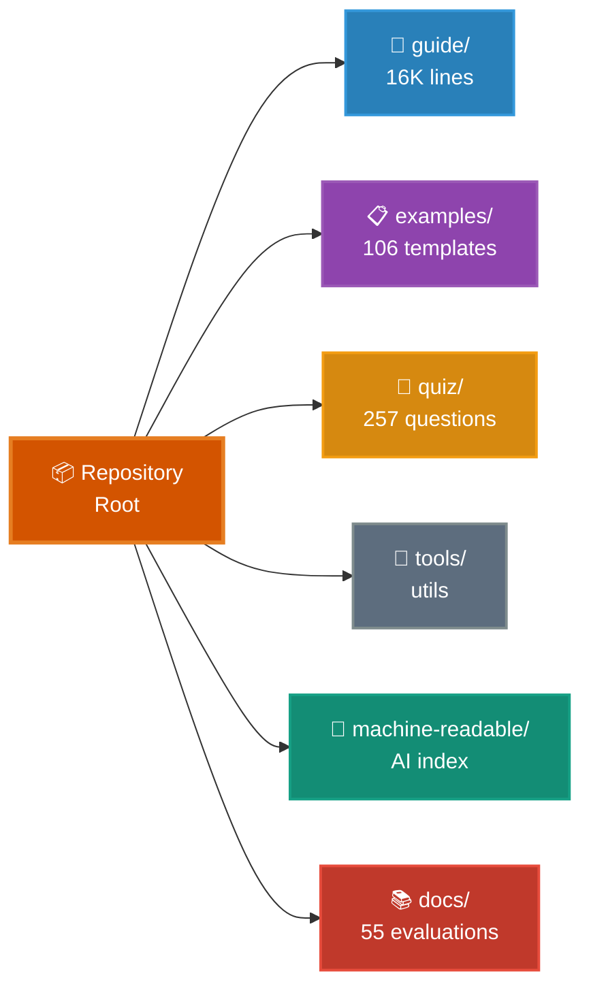

# Claude Code Ultimate Guide

<p align="center">
  <a href="https://florianbruniaux.github.io/claude-code-ultimate-guide-landing/"></a>
</p>

<p align="center">
  <a href="https://github.com/FlorianBruniaux/claude-code-ultimate-guide/stargazers"></a>
  <a href="./quiz/"></a>
  <a href="./examples/"></a>
</p>

<p align="center">
  <a href="https://creativecommons.org/licenses/by-sa/4.0/"></a>
  <a href="https://zread.ai/FlorianBruniaux/claude-code-ultimate-guide"></a>
</p>

> **Claude Code (Anthropic): the learning curve, solved.** ~16K-line guide + 107 templates + 257 quiz questions + 22 event hooks + 55 resource evaluations. Beginner → Power User.

---

## ⚡ Quick Start

**Quickest path**: [Cheat Sheet](./guide/cheatsheet.md) — 1 printable page with daily essentials

**Interactive onboarding** (no clone needed):
```bash
claude "Fetch and follow the onboarding instructions from: https://raw.githubusercontent.com/FlorianBruniaux/claude-code-ultimate-guide/main/tools/onboarding-prompt.md"
```

**Browse directly**: [Full Guide](./guide/ultimate-guide.md) | [Examples](./examples/) | [Quiz](./quiz/)

<details>
<summary><strong>Prerequisites & Minimal CLAUDE.md Template</strong></summary>

**Prerequisites**: Node.js 18+ | [Anthropic API key](https://console.anthropic.com/)

```markdown
# Project: [NAME]

## Tech Stack
- Language: [e.g., TypeScript]
- Framework: [e.g., Next.js 14]
- Testing: [e.g., Vitest]

## Commands
- Build: `npm run build`
- Test: `npm test`
- Lint: `npm run lint`

## Rules
- Run tests before marking tasks complete
- Follow existing code patterns
- Keep commits atomic and conventional
```

Save as `CLAUDE.md` in your project root. Claude reads it automatically.

</details>

---

## 📁 Repository Structure



<details>
<summary><strong>Detailed Structure (Text View)</strong></summary>

```
📦 claude-code-ultimate-guide/
│
├─ 📖 guide/              Core Documentation (~16K lines)
│  ├─ ultimate-guide.md   Complete reference, 10 sections
│  ├─ cheatsheet.md       1-page printable
│  ├─ architecture.md     How Claude Code works internally
│  ├─ methodologies.md    TDD, SDD, BDD workflows
│  ├─ mcp-servers-ecosystem.md  Official & community MCP servers
│  └─ workflows/          Step-by-step guides
│
├─ 📋 examples/           107 Production Templates
│  ├─ agents/             6 custom AI personas
│  ├─ commands/           18 slash commands
│  ├─ hooks/              18 security hooks (bash + PowerShell)
│  ├─ skills/             1 meta-skill (Claudeception)
│  └─ scripts/            Utility scripts (audit, search)
│
├─ 🧠 quiz/               257 Questions
│  ├─ 9 categories        Setup, Agents, MCP, Trust, Advanced...
│  ├─ 4 profiles          Junior, Senior, Power User, PM
│  └─ Instant feedback    Doc links + score tracking
│
├─ 🔧 tools/              Interactive Utilities
│  ├─ onboarding-prompt   Personalized guided tour
│  └─ audit-prompt        Setup audit & recommendations
│
├─ 🤖 machine-readable/   AI-Optimized Index
│  ├─ reference.yaml      Structured index (~2K tokens)
│  └─ llms.txt            Standard LLM context file
│
└─ 📚 docs/               55 Resource Evaluations
   └─ resource-evaluations/  5-point scoring, source attribution
```

</details>

---

## 🎯 What Makes This Guide Unique

### 🎓 Educational Depth

We explain **concepts first**, not just configs:
- [Architecture](./guide/architecture.md) — How Claude Code works internally
- [Trade-offs](./guide/ultimate-guide.md#when-to-use-what) — When to use agents vs skills vs commands
- [Pitfalls](./guide/ultimate-guide.md#common-mistakes) — Common mistakes and solutions

### 📝 257-Question Quiz (Unique in Ecosystem)

**Only comprehensive assessment available** — test your understanding across 9 categories:
- Setup & Configuration
- Agents & Sub-Agents
- MCP Servers & Integration
- Trust & Verification
- Advanced Patterns

[Try the Quiz Online →](https://florianbruniaux.github.io/claude-code-ultimate-guide-landing/quiz/) | [Run Locally](./quiz/)

### 🤖 Agent Teams Coverage (v2.1.32+)

**Only comprehensive guide to Anthropic's experimental multi-agent coordination**:
- Production metrics (Fountain 50% faster, CRED 2x speed, autonomous C compiler)
- 5 validated workflows (multi-layer review, parallel debugging, large-scale refactoring)
- Git-based coordination architecture (team lead + teammates)
- Decision framework: Teams vs Multi-Instance vs Dual-Instance vs Beads
- Setup, limitations, best practices, troubleshooting

[Agent Teams Workflow →](./guide/workflows/agent-teams.md) | [Section 9.20 →](./guide/ultimate-guide.md#920-agent-teams-multi-agent-coordination)

### 🔬 Methodologies (Structured Workflows)

Complete guides with rationale and examples:
- [TDD](./guide/methodologies.md#1-tdd-test-driven-development-with-claude) — Test-Driven Development
- [SDD](./guide/methodologies.md#2-sdd-specification-driven-development) — Specification-Driven Development
- [BDD](./guide/methodologies.md#3-bdd-behavior-driven-development) — Behavior-Driven Development
- [GSD](./guide/methodologies.md#gsd-get-shit-done) — Get Shit Done pattern

### 📚 106 Annotated Templates

Educational templates with explanations:
- Agents (6), Commands (18), Hooks (18), Skills
- Comments explaining **why** each pattern works
- Gradual complexity progression

[Browse Catalog →](./examples/)

### 🔍 55 Resource Evaluations

Systematic assessment of external resources (5-point scoring):
- Articles, videos, tools, frameworks
- Honest assessments with source attribution
- Integration recommendations

[See Evaluations →](./docs/resource-evaluations/)

---

## 🎯 Learning Paths

<details>
<summary><strong>Junior Developer</strong> — Foundation path (7 steps)</summary>

1. [Quick Start](./guide/ultimate-guide.md#1-quick-start-day-1) — Install & first workflow
2. [Essential Commands](./guide/ultimate-guide.md#13-essential-commands) — The 7 commands
3. [Context Management](./guide/ultimate-guide.md#22-context-management) — Critical concept
4. [Memory Files](./guide/ultimate-guide.md#31-memory-files-claudemd) — Your first CLAUDE.md
5. [Learning with AI](./guide/learning-with-ai.md) — Use AI without becoming dependent ⭐
6. [TDD Workflow](./guide/workflows/tdd-with-claude.md) — Test-first development
7. [Cheat Sheet](./guide/cheatsheet.md) — Print this

</details>

<details>
<summary><strong>Senior Developer</strong> — Intermediate path (6 steps)</summary>

1. [Core Concepts](./guide/ultimate-guide.md#2-core-concepts) — Mental model
2. [Plan Mode](./guide/ultimate-guide.md#23-plan-mode) — Safe exploration
3. [Methodologies](./guide/methodologies.md) — TDD, SDD, BDD reference
4. [Agents](./guide/ultimate-guide.md#4-agents) — Custom AI personas
5. [Hooks](./guide/ultimate-guide.md#7-hooks) — Event automation
6. [CI/CD Integration](./guide/ultimate-guide.md#93-cicd-integration) — Pipelines

</details>

<details>
<summary><strong>Power User</strong> — Comprehensive path (8 steps)</summary>

1. [Complete Guide](./guide/ultimate-guide.md) — End-to-end
2. [Architecture](./guide/architecture.md) — How Claude Code works
3. [Security Hardening](./guide/security-hardening.md) — MCP vetting, injection defense
4. [MCP Servers](./guide/ultimate-guide.md#8-mcp-servers) — Extended capabilities
5. [Trinity Pattern](./guide/ultimate-guide.md#91-the-trinity) — Advanced workflows
6. [Observability](./guide/observability.md) — Monitor costs & sessions
7. [Agent Teams](./guide/workflows/agent-teams.md) — Multi-agent coordination (Opus 4.6 experimental)
8. [Examples](./examples/) — Production templates

</details>

<details>
<summary><strong>Product Manager / DevOps / Designer</strong></summary>

**Product Manager** (5 steps):
1. [What's Inside](#-whats-inside) — Scope overview
2. [Golden Rules](#-golden-rules) — Key principles
3. [Data Privacy](./guide/data-privacy.md) — Retention & compliance
4. [Adoption Approaches](./guide/adoption-approaches.md) — Team strategies
5. [PM FAQ](./guide/ultimate-guide.md#can-product-managers-use-claude-code) — Code-adjacent vs non-coding PMs

**Note**: Non-coding PMs should consider [Claude Cowork Guide](https://github.com/FlorianBruniaux/claude-cowork-guide) instead.

**DevOps / SRE** (5 steps):
1. [DevOps & SRE Guide](./guide/devops-sre.md) — FIRE framework
2. [K8s Troubleshooting](./guide/devops-sre.md#kubernetes-troubleshooting) — Symptom-based prompts
3. [Incident Response](./guide/devops-sre.md#pattern-incident-response) — Workflows
4. [IaC Patterns](./guide/devops-sre.md#pattern-infrastructure-as-code) — Terraform, Ansible
5. [Guardrails](./guide/devops-sre.md#guardrails--adoption) — Security boundaries

**Product Designer** (5 steps):
1. [Working with Images](./guide/ultimate-guide.md#24-working-with-images) — Image analysis
2. [Wireframing Tools](./guide/ultimate-guide.md#wireframing-tools) — ASCII/Excalidraw
3. [Figma MCP](./guide/ultimate-guide.md#figma-mcp) — Design file access
4. [Design-to-Code Workflow](./guide/workflows/design-to-code.md) — Figma → Claude
5. [Cheat Sheet](./guide/cheatsheet.md) — Print this

</details>

### Progressive Journey

- **Week 1**: Foundations (install, CLAUDE.md, first agent)
- **Week 2**: Core Features (skills, hooks, trust calibration)
- **Week 3**: Advanced (MCP servers, methodologies)
- **Month 2+**: Production mastery (CI/CD, observability)

---

## 🔧 Rate Limits & Cost Savings

**cc-copilot-bridge** routes Claude Code through GitHub Copilot Pro+ for flat-rate access ($10/month instead of per-token billing).

```bash
# Install
git clone https://github.com/FlorianBruniaux/cc-copilot-bridge.git && cd cc-copilot-bridge && ./install.sh

# Use
ccc   # Copilot mode (flat $10/month)
ccd   # Direct Anthropic mode (per-token)
cco   # Offline mode (Ollama, 100% local)
```

**Benefits**: Multi-provider switching, rate limit bypass, 99%+ cost savings on heavy usage.

→ **[cc-copilot-bridge](https://github.com/FlorianBruniaux/cc-copilot-bridge)**

---

## 🔑 Golden Rules

1. **Start small** — First project: 10-15 lines CLAUDE.md max
2. **Read before edit** — Always Read → Understand → Edit (never blind Write)
3. **Test-first** — Write test → Watch fail → Implement → Pass
4. **Use `/compact`** before context hits 70% — prevention beats recovery
5. **Review everything** — AI code has 1.75× more logic errors ([source](https://dl.acm.org/doi/10.1145/3716848))
6. **Context = Gold** — Clear CLAUDE.md > clever prompts

> Context management is critical. See the [Cheat Sheet](./guide/cheatsheet.md#context-management-critical) for thresholds and actions.

---

## 🤖 For AI Assistants

| Resource | Purpose | Tokens |
|----------|---------|--------|
| **[llms.txt](./machine-readable/llms.txt)** | Standard context file | ~1K |
| **[reference.yaml](./machine-readable/reference.yaml)** | Structured index with line numbers | ~2K |

**Quick load**: `curl -sL https://raw.githubusercontent.com/FlorianBruniaux/claude-code-ultimate-guide/main/machine-readable/reference.yaml`

---

## 🌍 Ecosystem

### Positioning: Complementary, Not Competitive

**Claude Code has two major community resources:**

| Resource | Focus | Best For |
|----------|-------|----------|
| **This Guide** | 🎓 Educational depth, methodologies | Deep understanding, learning WHY |
| [everything-claude-code](https://github.com/affaan-m/everything-claude-code) | ⚙️ Production configs, plugin install | Quick setup, battle-tested patterns |

**Recommended workflow**: Learn concepts here → Leverage production configs there → Return for deep dives

Both resources serve different needs. Use what fits your learning style and project requirements.

### Claude Cowork (Non-Developers)

**Claude Cowork** is the companion guide for non-technical users (knowledge workers, assistants, managers).

Same agentic capabilities as Claude Code, but through a visual interface with no coding required.

→ **[Claude Cowork Guide](https://github.com/FlorianBruniaux/claude-cowork-guide)** — File organization, document generation, automated workflows

**Status**: Research preview (Pro $20/mo or Max $100-200/mo, macOS only, **VPN incompatible**)

### Complementary Resources

| Project | Focus | Best For |
|---------|-------|----------|
| [claude-code-templates](https://github.com/davila7/claude-code-templates) | Distribution (200+ templates) | CLI installation (17k⭐) |
| [anthropics/skills](https://github.com/anthropics/skills) | Official Anthropic skills (60K+⭐) | Documents, design, dev templates |
| [anthropics/claude-plugins-official](https://skills.sh/anthropics/claude-plugins-official) | Plugin dev tools (3.1K installs) | CLAUDE.md audit, automation discovery |
| [skills.sh](https://skills.sh/) | Skills marketplace | One-command install (Vercel Labs) |
| [awesome-claude-code](https://github.com/hesreallyhim/awesome-claude-code) | Curation | Resource discovery |
| [awesome-claude-skills](https://github.com/BehiSecc/awesome-claude-skills) | Skills taxonomy | 62 skills across 12 categories |
| [AI Coding Agents Matrix](https://coding-agents-matrix.dev) | Technical comparison | Comparing 23+ alternatives |

**Community**: 🇫🇷 [Dev With AI](https://www.devw.ai/) — 1500+ devs on Slack, meetups in Paris, Bordeaux, Lyon

→ **[AI Ecosystem Guide](./guide/ai-ecosystem.md)** — Complete integration patterns with complementary AI tools

---

## 📖 About

<details>
<summary><strong>Origins & Philosophy</strong></summary>

This guide is the result of several months of daily practice with Claude Code. I don't claim expertise—I'm sharing what I've learned to help peers and evangelize AI-assisted development best practices.

**Philosophy**: Learning journey over reference manual. Understanding **why** before **how**. Progressive complexity — start simple, master advanced at your pace.

**Created with Claude Code**. Community-validated through contributions and feedback.

**Key Inspirations**:
- [Claudelog.com](https://claudelog.com/) — Excellent patterns & tutorials
- [zebbern/claude-code-guide](https://github.com/zebbern/claude-code-guide) — Comprehensive reference with security focus
- [ykdojo/claude-code-tips](https://github.com/ykdojo/claude-code-tips) — Practical productivity techniques

</details>

<details>
<summary><strong>Privacy & Data</strong></summary>

Claude Code sends your prompts, file contents, and MCP results to Anthropic servers.
- **Default**: 5 years retention (training enabled) | **Opt-out**: 30 days | **Enterprise**: 0
- **Action**: [Disable training](https://claude.ai/settings/data-privacy-controls) | [Full privacy guide](./guide/data-privacy.md)

</details>

---

## 📚 What's Inside

### Core Documentation

| File | Purpose | Time |
|------|---------|------|
| **[Ultimate Guide](./guide/ultimate-guide.md)** | Complete reference (~16K lines), 10 sections | ~4 hours |
| **[Cheat Sheet](./guide/cheatsheet.md)** | 1-page printable reference | 5 min |
| **[Visual Reference](./guide/visual-reference.md)** | 20 ASCII diagrams for key concepts | 5 min |
| **[Architecture](./guide/architecture.md)** | How Claude Code works internally | 25 min |
| **[Methodologies](./guide/methodologies.md)** | TDD, SDD, BDD reference | 20 min |
| **[Workflows](./guide/workflows/)** | Practical guides (TDD, Plan-Driven, Task Management) | 30 min |
| **[Data Privacy](./guide/data-privacy.md)** | Retention & compliance | 10 min |
| **[Security Hardening](./guide/security-hardening.md)** | MCP vetting, injection defense | 25 min |
| **[Sandbox Isolation](./guide/sandbox-isolation.md)** | Docker Sandboxes, cloud alternatives, safe autonomy | 10 min |
| **[Production Safety](./guide/production-safety.md)** | Port stability, DB safety, infrastructure lock | 20 min |
| **[DevOps & SRE](./guide/devops-sre.md)** | FIRE framework, K8s troubleshooting, incident response | 30 min |
| **[AI Ecosystem](./guide/ai-ecosystem.md)** | Complementary AI tools & integration patterns | 20 min |
| **[AI Traceability](./guide/ai-traceability.md)** | Code attribution & provenance tracking | 15 min |
| **[Search Tools Cheatsheet](./guide/search-tools-cheatsheet.md)** | Grep, Serena, ast-grep, grepai comparison | 5 min |
| **[Learning with AI](./guide/learning-with-ai.md)** | Use AI without becoming dependent | 15 min |
| **[Claude Code Releases](./guide/claude-code-releases.md)** | Official release history | 10 min |

<details>
<summary><strong>Examples Library</strong> (106 templates)</summary>

**Agents** (6): [code-reviewer](./examples/agents/code-reviewer.md), [test-writer](./examples/agents/test-writer.md), [security-auditor](./examples/agents/security-auditor.md), [refactoring-specialist](./examples/agents/refactoring-specialist.md), [output-evaluator](./examples/agents/output-evaluator.md), [devops-sre](./examples/agents/devops-sre.md) ⭐

**Slash Commands** (18): [/pr](./examples/commands/pr.md), [/commit](./examples/commands/commit.md), [/release-notes](./examples/commands/release-notes.md), [/diagnose](./examples/commands/diagnose.md), [/security](./examples/commands/security.md), [/refactor](./examples/commands/refactor.md), [/explain](./examples/commands/explain.md), [/optimize](./examples/commands/optimize.md), [/ship](./examples/commands/ship.md)...

**Security Hooks** (18): [dangerous-actions-blocker](./examples/hooks/bash/dangerous-actions-blocker.sh), [prompt-injection-detector](./examples/hooks/bash/prompt-injection-detector.sh), [unicode-injection-scanner](./examples/hooks/bash/unicode-injection-scanner.sh), [output-secrets-scanner](./examples/hooks/bash/output-secrets-scanner.sh)...

**Skills** (1): [Claudeception](https://github.com/blader/Claudeception) — Meta-skill that auto-generates skills from session discoveries ⭐

**Plugins** (1): [SE-CoVe](./examples/plugins/se-cove.md) — Chain-of-Verification for independent code review (Meta AI, ACL 2024)

**Utility Scripts**: [session-search.sh](./examples/scripts/session-search.sh), [audit-scan.sh](./examples/scripts/audit-scan.sh)

**GitHub Actions**: [claude-pr-auto-review.yml](./examples/github-actions/claude-pr-auto-review.yml), [claude-security-review.yml](./examples/github-actions/claude-security-review.yml), [claude-issue-triage.yml](./examples/github-actions/claude-issue-triage.yml)

**Integrations** (1): [Agent Vibes TTS](./examples/integrations/agent-vibes/) - Text-to-speech narration for Claude Code responses

**[Browse Complete Catalog](./examples/README.md)** | **[Interactive Catalog](./examples/index.html)**

</details>

<details>
<summary><strong>Knowledge Quiz</strong> (257 questions)</summary>

Test your Claude Code knowledge with an interactive CLI quiz covering all guide sections.

```bash
cd quiz && npm install && npm start
```

**Features**: 4 profiles (Junior/Senior/Power User/PM), 10 topic categories, immediate feedback with doc links, score tracking with weak area identification.

**[Quiz Documentation](./quiz/README.md)** | **[Contribute Questions](./quiz/templates/question-template.yaml)**

</details>

<details>
<summary><strong>Resource Evaluations</strong> (55 assessments)</summary>

Systematic evaluation of external resources (tools, methodologies, articles) before integration into the guide.

**Methodology**: 5-point scoring system (Critical → Low) with technical review and challenge phase for objectivity.

**Evaluations**: GSD methodology, Worktrunk, Boris Cowork video, AST-grep, ClawdBot analysis, and more.

**[Browse Evaluations](./docs/resource-evaluations/)** | **[Evaluation Methodology](./docs/resource-evaluations/README.md)**

</details>

---

## 🤝 Contributing

We welcome:
- ✅ Corrections and clarifications
- ✅ New quiz questions
- ✅ Methodologies and workflows
- ✅ Resource evaluations (see [process](./docs/resource-evaluations/README.md))
- ✅ Educational content improvements

See [CONTRIBUTING.md](./CONTRIBUTING.md) for guidelines.

**Ways to Help**: Star the repo • Report issues • Submit PRs • Share workflows in [Discussions](../../discussions)

---

## 📄 License & Support

**Guide**: [CC BY-SA 4.0](https://creativecommons.org/licenses/by-sa/4.0/) — Educational content is open for reuse with attribution.

**Templates**: [CC0 1.0](https://creativecommons.org/publicdomain/zero/1.0/) — Copy-paste freely, no attribution needed.

**Author**: [Florian BRUNIAUX](https://github.com/FlorianBruniaux) | Founding Engineer [@Méthode Aristote](https://methode-aristote.fr)

**Stay Updated**: [Watch releases](../../releases) | [Discussions](../../discussions) | [Connect on LinkedIn](https://www.linkedin.com/in/florian-bruniaux-43408b83/)

---

## 📚 Further Reading

### Official Resources
- [Claude Code CLI](https://code.claude.com) — Official website
- [Documentation](https://code.claude.com/docs) — Official docs
- [CHANGELOG](https://github.com/anthropics/claude-code/blob/main/CHANGELOG.md) — Official changelog
- [GitHub Issues](https://github.com/anthropics/claude-code/issues) — Bug reports & feature requests

### Community Resources
- [everything-claude-code](https://github.com/affaan-m/everything-claude-code) — Production configs (31.9k⭐)
- [awesome-claude-code](https://github.com/hesreallyhim/awesome-claude-code) — Curated links
- [SuperClaude Framework](https://github.com/SuperClaude-Org/SuperClaude_Framework) — Behavioral modes

### Tools
- [Ask Zread](https://zread.ai/FlorianBruniaux/claude-code-ultimate-guide) — Ask questions about this guide
- [Interactive Quiz](./quiz/) — 257 questions
- [Landing Site](https://florianbruniaux.github.io/claude-code-ultimate-guide-landing/) — Visual navigation

---

*Version 3.23.2 | February 2026 | Crafted with Claude*

<!-- SEO Keywords -->
<!-- claude code, claude code tutorial, anthropic cli, ai coding assistant, claude code mcp,
claude code agents, claude code hooks, claude code skills, agentic coding, ai pair programming,
tdd ai, test driven development ai, sdd spec driven development, bdd claude, development methodologies,
claude code architecture, data privacy anthropic, claude code workflows, ai coding workflows -->
