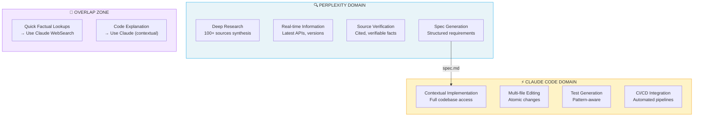
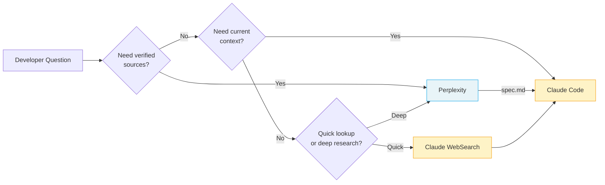

# AI Ecosystem: Maximizing Claude Code with Complementary Tools

> **Reading time**: ~25 minutes
>
> **Purpose**: This guide helps you understand when to use Claude Code vs. complementary AI tools, and how to chain them for optimal workflows.

---

## Table of Contents

- [Introduction](#introduction)
- [1. Perplexity AI (Research & Sourcing)](#1-perplexity-ai-research--sourcing)
- [2. Google Gemini (Visual Understanding)](#2-google-gemini-visual-understanding)
- [3. Kimi (PPTX & Long Document Generation)](#3-kimi-pptx--long-document-generation)
- [4. NotebookLM (Synthesis & Audio)](#4-notebooklm-synthesis--audio)
- [5. Voice-to-Text Tools (Wispr Flow, Superwhisper)](#5-voice-to-text-tools-wispr-flow-superwhisper)
- [6. IDE-Based Tools (Cursor, Windsurf, Cline)](#6-ide-based-tools-cursor-windsurf-cline)
- [7. UI Prototypers (v0, Bolt, Lovable)](#7-ui-prototypers-v0-bolt-lovable)
- [8. Workflow Orchestration](#8-workflow-orchestration)
- [9. Cost & Subscription Strategy](#9-cost--subscription-strategy)
- [10. Claude Cowork (Research Preview)](#10-claude-cowork-research-preview)
- [Appendix: Ready-to-Use Prompts](#appendix-ready-to-use-prompts)
- [Alternative Providers (Community Workarounds)](#alternative-providers-community-workarounds)

---

## Introduction

### Philosophy: Augmentation, Not Replacement

Claude Code excels at:
- **Contextual reasoning** across entire codebases
- **Multi-file implementation** with test integration
- **Persistent memory** via CLAUDE.md files
- **CLI automation** for CI/CD pipelines
- **Agentic task completion** with minimal supervision

What Claude Code doesn't do well (by design):
- **Real-time web search with source verification** (WebSearch exists but limited)
- **Image generation** (no native capability)
- **PowerPoint/slide generation** (no PPTX output)
- **Audio synthesis** (no TTS)
- **Browser-based prototyping** (no visual preview)

The goal is not to find "better" tools, but to chain the **right tool for each step**.

### The Complementarity Matrix

| Task | Claude Code | Better Alternative | Why |
|------|-------------|-------------------|-----|
| **Code implementation** | ✅ Best | - | Contextual reasoning + file editing |
| **Deep research with sources** | ⚠️ Limited | Perplexity Pro | 100+ verified sources |
| **Image → Code** | ⚠️ Limited | Gemini 2.5+ | Superior visual understanding |
| **Slide generation** | ❌ None | Kimi.com | Native PPTX export |
| **Audio overview** | ❌ None | NotebookLM | Podcast-style synthesis |
| **Browser prototyping** | ❌ None | v0.dev, Bolt | Live preview |
| **IDE autocomplete** | ❌ None | Copilot, Cursor | Inline suggestions |

---

## 1. Perplexity AI (Research & Sourcing)

### Complementarity Diagram

The following diagram illustrates how Perplexity and Claude Code complement each other across the development workflow:



**Key Insight**: Perplexity answers "What should we build?" → Claude Code answers "How do we build it here?"

### Decision Flow



### When to Use Perplexity Over Claude

| Scenario | Use Perplexity | Use Claude |
|----------|---------------|------------|
| "What's the latest API for X?" | ✅ | ⚠️ Knowledge cutoff |
| "Compare 5 libraries for auth" | ✅ Sources | ⚠️ May hallucinate |
| "Explain this error message" | ⚠️ Generic | ✅ Contextual |
| "Implement auth in my codebase" | ❌ No files | ✅ Full access |

### Perplexity Pro Features for Developers

**Deep Research Mode**
- Synthesizes 100+ sources into structured output
- Takes 3-5 minutes but produces comprehensive specs
- Export as markdown → Feed to Claude Code

**Model Selection**
- Claude Sonnet 4: Best for technical prose and documentation
- GPT-4o: Good for code snippets
- Sonar Pro: Fast factual lookups

**Labs Features**
- Spaces: Persistent project contexts
- Code blocks: Syntax-highlighted exports
- Charts: Auto-generated from data

### Integration Workflow

#### Pattern 1: Research → Spec → Code

```
┌─────────────────────────────────────────────────────────┐
│ 1. PERPLEXITY (Deep Research)                           │
│    "Research best practices for JWT refresh tokens      │
│     in Next.js 15. Include security considerations,     │
│     common pitfalls, and library recommendations."      │
│                                                         │
│    → Output: 2000-word spec with sources               │
└───────────────────────────┬─────────────────────────────┘
                            ↓ Export as spec.md
┌─────────────────────────────────────────────────────────┐
│ 2. CLAUDE CODE                                          │
│    > claude                                             │
│    "Implement JWT refresh tokens following spec.md.     │
│     Use the jose library as recommended."               │
│                                                         │
│    → Output: Working implementation with tests         │
└─────────────────────────────────────────────────────────┘
```

#### Pattern 2: Parallel Pane Workflow

Using tmux or terminal split:

```bash
# Left pane: Perplexity (browser or CLI)
perplexity "Best practices for rate limiting in Express"

# Right pane: Claude Code (implementing)
claude "Add rate limiting to API. Check spec.md for approach."
```

### Comparison: Claude WebSearch vs Perplexity

| Feature | Claude WebSearch | Perplexity Pro |
|---------|-----------------|----------------|
| Source count | ~5-10 | 100+ (Deep Research) |
| Source verification | Basic | Full citations |
| Real-time data | Yes | Yes |
| Export format | Text in context | Markdown, code blocks |
| Best for | Quick lookups | Comprehensive research |
| Cost | Included | $20/month Pro |

**Recommendation**: Use Claude WebSearch for quick factual checks. Use Perplexity Deep Research before any significant implementation that requires understanding the ecosystem.

---

## 2. Google Gemini (Visual Understanding)

### Developer Use Cases

**Gemini's Visual Superpowers**:
- UI mockup → HTML/CSS/React code (90%+ fidelity)
- Diagram interpretation (flowcharts → Mermaid/code)
- Screenshot debugging ("why does this look broken?")
- Design token extraction (colors, spacing from images)

### Gemini 2.5 Pro for Development

Best-in-class for:
- **Complex UI conversion**: Upload Figma screenshot → Get Tailwind components
- **Diagram comprehension**: Architecture diagrams → Implementation plan
- **Error analysis**: Upload error screenshot → Get debugging steps

Model selection:
- **Gemini 2.5 Pro**: Complex visual reasoning, long context
- **Gemini 2.5 Flash**: Quick visual tasks, lower cost

### Integration Workflow

#### Pattern: Visual → Code

```
┌─────────────────────────────────────────────────────────┐
│ 1. GEMINI 2.5 PRO                                       │
│    Upload: screenshot.png of Figma design               │
│    Prompt: "Convert this to a React component using     │
│            Tailwind CSS. Use semantic HTML and          │
│            include responsive breakpoints."             │
│                                                         │
│    → Output: JSX + Tailwind code                       │
└───────────────────────────┬─────────────────────────────┘
                            ↓ Copy to clipboard
┌─────────────────────────────────────────────────────────┐
│ 2. CLAUDE CODE                                          │
│    > claude                                             │
│    "Refine this component for our Next.js project.      │
│     Add proper TypeScript types, our Button component,  │
│     and connect to the auth context."                   │
│                                                         │
│    → Output: Production-ready component                │
└─────────────────────────────────────────────────────────┘
```

#### Pattern: Diagram → Implementation Plan

```
┌─────────────────────────────────────────────────────────┐
│ 1. GEMINI                                               │
│    Upload: architecture-diagram.png                     │
│    Prompt: "Analyze this architecture diagram.          │
│            Output a Mermaid diagram with the same       │
│            structure, and list the components."         │
│                                                         │
│    → Output: Mermaid code + component list             │
└───────────────────────────┬─────────────────────────────┘
                            ↓ Paste mermaid to CLAUDE.md
┌─────────────────────────────────────────────────────────┐
│ 2. CLAUDE CODE                                          │
│    "Implement the UserService component from the        │
│     architecture in CLAUDE.md. Start with the           │
│     interface, then the implementation."                │
│                                                         │
│    → Output: Implemented service                       │
└─────────────────────────────────────────────────────────┘
```

### Image Generation Alternatives

For generating diagrams, mockups, or visual assets:

| Tool | Best For | Format | Quality |
|------|----------|--------|---------|
| Ideogram 3.0 | UI mockups, icons | PNG, SVG | High |
| Recraft v3 | Vectors, logos | SVG, PNG | Very high |
| Midjourney | Artistic visuals | PNG | Artistic |
| DALL-E 3 | Quick concepts | PNG | Good |

**Workflow for generated images**:
1. Generate image with tool of choice
2. Upload to Gemini for → code conversion
3. Refine with Claude Code

---

## 3. Kimi (PPTX & Long Document Generation)

### What is Kimi?

[Kimi](https://kimi.ai) is Moonshot AI's assistant, notable for:
- **Native PPTX generation** (actual slides, not markdown)
- **128K+ token context** (entire codebases)
- **Code-aware layouts** (syntax highlighting in slides)
- **Multilingual** (excellent Chinese/English)

### Developer Use Cases

**Presentation Generation**:
- PR summary → stakeholder deck
- Architecture docs → visual presentation
- Technical spec → team onboarding slides
- Code walkthrough → training materials

### Integration Workflow

#### Pattern: Code → Presentation

```
┌─────────────────────────────────────────────────────────┐
│ 1. CLAUDE CODE                                          │
│    "Generate a summary of all changes in the last       │
│     5 commits. Format as markdown with sections:        │
│     Overview, Key Changes, Breaking Changes, Migration."│
│                                                         │
│    → Output: changes-summary.md                        │
└───────────────────────────┬─────────────────────────────┘
                            ↓ Upload to Kimi
┌─────────────────────────────────────────────────────────┐
│ 2. KIMI                                                 │
│    Prompt: "Create a 10-slide presentation from this    │
│            summary for non-technical stakeholders.      │
│            Use business-friendly language.              │
│            Include one slide per major feature."        │
│                                                         │
│    → Output: stakeholder-update.pptx                   │
└─────────────────────────────────────────────────────────┘
```

#### Pattern: Architecture → Training

```
┌─────────────────────────────────────────────────────────┐
│ 1. CLAUDE CODE (using /explain or equivalent)           │
│    "Explain the authentication flow in this project.    │
│     Include sequence diagrams (mermaid) and key files." │
│                                                         │
│    → Output: auth-explanation.md with diagrams         │
└───────────────────────────┬─────────────────────────────┘
                            ↓ Upload to Kimi
┌─────────────────────────────────────────────────────────┐
│ 2. KIMI                                                 │
│    "Create an onboarding presentation for new devs.     │
│     20 slides covering the auth system. Include         │
│     code snippets and diagrams where relevant."         │
│                                                         │
│    → Output: auth-onboarding.pptx                      │
└─────────────────────────────────────────────────────────┘
```

### Comparison: Presentation Tools

| Tool | Strengths | Weaknesses | Best For |
|------|-----------|------------|----------|
| **Kimi** | Native PPTX, code-aware | Less design polish | Technical decks |
| **Gamma.app** | Beautiful templates | Less code support | Business decks |
| **Tome** | AI-native, visual | Expensive | Marketing |
| **Beautiful.ai** | Smart templates | Manual | Design-focused |
| **Marp** | Markdown → slides | Manual styling | Developer decks |

**Recommendation**: Use Kimi for technical content with code. Use Gamma for business/investor decks.

---

## 4. NotebookLM (Synthesis & Audio)

### Developer Use Cases

**Documentation Synthesis**:
- Upload 50+ files → Get unified understanding
- Ask questions about your codebase
- Generate audio overview for commute learning

**Audio Overview Feature**:
- Generates 10-15 minute "podcast" from uploaded content
- Two AI hosts discuss your documentation
- Perfect for onboarding or reviewing large systems

### Integration Workflow

#### Pattern: Codebase → Audio Onboarding

```
┌─────────────────────────────────────────────────────────┐
│ 1. EXPORT (via Claude Code or manual)                   │
│    "Export all markdown files from docs/ and the        │
│     main README to a single combined-docs.md file."     │
│                                                         │
│    → Output: combined-docs.md (50K tokens)             │
└───────────────────────────┬─────────────────────────────┘
                            ↓ Upload to NotebookLM
┌─────────────────────────────────────────────────────────┐
│ 2. NOTEBOOKLM                                           │
│    - Add combined-docs.md as source                     │
│    - Click "Generate Audio Overview"                    │
│    - Wait 3-5 minutes for generation                    │
│                                                         │
│    → Output: 12-minute audio explaining your system    │
└───────────────────────────┬─────────────────────────────┘
                            ↓ Listen during commute
┌─────────────────────────────────────────────────────────┐
│ 3. BACK TO CLAUDE CODE                                  │
│    "Based on my notes from the audio overview:          │
│     [paste notes]                                       │
│     Help me understand the auth flow in more detail."   │
│                                                         │
│    → Output: Contextual deep-dive                      │
└─────────────────────────────────────────────────────────┘
```

#### Pattern: Multi-Source Synthesis

```
┌─────────────────────────────────────────────────────────┐
│ NOTEBOOKLM                                              │
│ Upload multiple sources:                                │
│ - Your codebase docs (combined-docs.md)                 │
│ - Framework documentation (Next.js docs PDF)           │
│ - Related articles (URLs or PDFs)                      │
│                                                         │
│ Ask: "How does our auth implementation compare to       │
│       Next.js best practices?"                         │
│                                                         │
│    → Output: Comparative analysis with citations       │
└─────────────────────────────────────────────────────────┘
```

### Export to CLAUDE.md

After NotebookLM synthesis, export key insights to your project:

```markdown
## Architecture Insights (from NotebookLM synthesis)

### Key Patterns
- Service layer uses repository pattern
- Auth flow follows OAuth2 with PKCE
- State management via React Query

### Potential Issues Identified
- Token refresh logic not documented
- Missing error boundaries in critical paths

### Recommendations
- Add token refresh documentation
- Implement error boundary audit
```

---

## 5. Voice-to-Text Tools (Wispr Flow, Superwhisper)

**Philosophy**: "Vibe coding" — dictate intent, let AI implement

Voice input delivers ~4x typing speed (~150 WPM vs ~40 WPM) with richer context.
You say more when you don't have to type it.

### Tool Comparison

| Tool | Processing | Latency | Privacy | Price | Platform |
|------|------------|---------|---------|-------|----------|
| **Wispr Flow** | Cloud | ~500ms | SOC 2 certified | $12/mo | Mac, Win, iOS |
| **Superwhisper** | Local | 1-2s | 100% offline | ~$50 one-time | Mac only |
| **MacWhisper** | Local | Variable | 100% offline | $49 one-time | Mac only |

### When Voice + Claude Code Shines

| Scenario | Why voice wins |
|----------|---------------|
| Long context dumps | You naturally include constraints, edge cases, business context |
| Brainstorming | Less self-filtering, more raw ideas |
| Multi-agent management | Dictate to 3-4 Claude sessions simultaneously |
| Accessibility | RSI, mobility constraints, eye strain |

### Vibe Coding Workflow

1. Open Claude Code or Cursor
2. Activate voice (Wispr hotkey or system dictation)
3. Dictate naturally: "I need a component that shows user stats,
   it should have pagination because we have thousands of users,
   and sorting by name or signup date, use our existing Tailwind setup"
4. Let Claude process the verbose input
5. Iterate vocally: "Add loading state and error handling"

### Trade-offs

| Advantage | Limitation |
|-----------|------------|
| ~4x faster input | ~3x more verbose output |
| Richer context | Cloud privacy (Wispr) |
| Flow state preserved | ~800MB RAM overhead |
| Natural expression | Technical terms need training |

### Recommendation

| Profile | Tool |
|---------|------|
| Productivity-first | Wispr Flow Pro ($12/mo) |
| Privacy-required | Superwhisper (Mac) |
| Budget-conscious | MacWhisper ($49 one-time) |
| Windows user | Wait for Wispr stability improvements |

**Pro tip**: For complex prompts, consider a "refine" step to compress
verbose voice input into structured prompts before sending to Claude.
See `/voice-refine` skill template in `examples/skills/`.

---

## 5.1 Text-to-Speech Tools (Agent Vibes)

**Philosophy**: Audible narration frees your eyes for multitasking

Text-to-speech adds audio narration to Claude Code responses, enabling:
- **Code reviews while multitasking** (listen while reviewing diffs visually)
- **Long debugging sessions** (audio notifications keep you informed)
- **Accessibility** (visual impairment, eye strain, RSI)
- **Background monitoring** (alerts for errors/completion)

### Tool: Agent Vibes (Community MCP Server)

**Status**: Optional integration (not official Claude Code feature)
**Cost**: 100% free (offline TTS)
**Maintenance**: Community-driven (Paul Preibisch)

| Feature | Value |
|---------|-------|
| **Provider** | Piper TTS (offline neural) + macOS Say (native) |
| **Voices** | 15+ (12 English, 4 French including 124 multi-speakers) |
| **Quality** | ⭐️⭐️⭐️⭐️ (Piper medium), ⭐️⭐️⭐️⭐️⭐️ (Piper high) |
| **Latency** | ~280ms (Piper medium), ~50ms (macOS Say) |
| **Disk Space** | ~1.3GB (Piper + voices + audio effects) |
| **Installation** | ~18 minutes (5 phases, interactive) |

### When TTS Shines

| Scenario | Benefit |
|----------|---------|
| Code reviews | Listen to Claude's analysis while viewing code |
| Long-running tasks | Audio notification when tests/builds complete |
| Debugging sessions | Error alerts without constant screen checking |
| Learning mode | Dual-language narration (main + target language) |
| Pair programming | One person codes, both hear Claude's feedback |

### Trade-offs

| Advantage | Limitation |
|-----------|------------|
| 100% offline | No cloud-quality voices (vs ElevenLabs) |
| Zero cost | ~280ms latency (vs instant macOS Say) |
| Multi-language (50+) | ~1GB disk space for voice models |
| 124 voice variety | Installation requires Homebrew, Bash 5.x |

### Quick Start

**Installation**: [TTS Setup Workflow](./workflows/tts-setup.md) (18 min)

**Basic usage**:
```bash
# In Claude Code
/agent-vibes:whoami          # Check current voice & provider
/agent-vibes:list            # List all 15 voices
/agent-vibes:switch fr_FR-tom-medium  # French male voice

# Test
> "Say hello in French"  # Audio narration plays
```

**Mute temporarily**:
```bash
/agent-vibes:mute    # Silent work
# ... focus time ...
/agent-vibes:unmute  # Re-enable
```

### Recommendation

| Profile | Setup |
|---------|-------|
| **Code reviewer** | ✅ Install with `fr_FR-tom-medium`, `verbosity: low` |
| **Focus worker** | ⚠️ Install but mute by default, unmute for notifications |
| **Battery-conscious** | Use macOS Say provider (instant, lower quality) |
| **Public workspace** | ❌ Skip TTS (audio distraction to others) |

### Complete Documentation

- **[Agent Vibes Integration Guide](../examples/integrations/agent-vibes/README.md)** - Overview, commands, use cases
- **[Installation Guide](../examples/integrations/agent-vibes/installation.md)** - 18-minute setup procedure
- **[Voice Catalog](../examples/integrations/agent-vibes/voice-catalog.md)** - 15 voices with audio samples
- **[Troubleshooting](../examples/integrations/agent-vibes/troubleshooting.md)** - Common issues & solutions

**Resources**:
- GitHub: https://github.com/paulpreibisch/AgentVibes
- Voice Samples: https://rhasspy.github.io/piper-samples/

---

## 6. IDE-Based Tools (Cursor, Windsurf, Cline)

> **Technical Comparison**: For an objective comparison of Claude Code vs 22+ alternatives across 11 criteria (MCP support, Skills, Commands, Subagents, Plan Mode), see the [AI Coding Agents Matrix](https://coding-agents-matrix.dev/) (updated Jan 2026).

### When IDE Tools Complement Claude Code

| Scenario | Use IDE Tool | Use Claude Code |
|----------|-------------|-----------------|
| Quick inline edits | ✅ Faster | ⚠️ Context switch |
| Autocomplete while typing | ✅ Essential | ❌ Not available |
| Multi-file refactoring | ⚠️ Limited | ✅ Superior |
| Understanding large codebase | ⚠️ Limited | ✅ Better context |
| CI/CD automation | ❌ Manual | ✅ Native |

### Hybrid Workflow

**Morning session (strategic)**:
```bash
claude "Review the auth module and suggest improvements"
# Claude analyzes, suggests multi-file refactoring plan
```

**During coding (tactical)**:
```
# In Cursor/VS Code with Copilot
# Quick autocomplete, inline suggestions
# Small function implementations
```

**Before commit (validation)**:
```bash
claude "Review my changes and suggest tests"
# Claude reviews diff, generates comprehensive tests
```

### Cursor-Specific Integration

Cursor's `.cursor/rules` can mirror your CLAUDE.md:

```markdown
# .cursor/rules
# Mirror from CLAUDE.md for consistency

## Conventions
- Use TypeScript strict mode
- Prefer named exports
- Test files: *.test.ts

## Patterns
- Services use dependency injection
- Components use render props for flexibility
```

### Export from IDE to Claude

When you need Claude's deeper analysis:

1. Select code in IDE
2. Copy with context (file path, line numbers)
3. Paste in Claude with: "Analyze this and suggest architectural improvements"

---

## 7. UI Prototypers (v0, Bolt, Lovable)

### When to Use Prototypers

| Scenario | Use Prototyper | Use Claude Code |
|----------|---------------|-----------------|
| "Build a landing page" | ✅ v0 (visual) | ⚠️ No preview |
| "Add form to existing app" | ⚠️ Context needed | ✅ Has context |
| "Rapid UI iteration" | ✅ Live preview | ⚠️ Slower |
| "Match design system" | ⚠️ Generic | ✅ Reads your tokens |

### Tool Comparison

| Tool | Strengths | Stack | Best For |
|------|-----------|-------|----------|
| **v0.dev** | Shadcn/Tailwind | React | Component prototypes |
| **Bolt.new** | Full app scaffold | Various | Quick MVPs |
| **Lovable** | Design-to-code | React | Designer handoff |
| **WebSim** | Experimental UI | Web | Creative exploration |

### Integration Workflow

#### Pattern: Prototype → Production

```
┌─────────────────────────────────────────────────────────┐
│ 1. V0.DEV                                               │
│    Prompt: "A user profile card with avatar,            │
│            stats, and action buttons"                   │
│                                                         │
│    → Output: React + Shadcn component preview          │
│    → Export: Copy code                                 │
└───────────────────────────┬─────────────────────────────┘
                            ↓ Paste to clipboard
┌─────────────────────────────────────────────────────────┐
│ 2. CLAUDE CODE                                          │
│    "Adapt this v0 component for our Next.js app:        │
│     - Use our existing Button, Avatar components        │
│     - Add TypeScript types matching User interface      │
│     - Connect to getUserProfile API endpoint            │
│     - Add loading and error states"                     │
│                                                         │
│    → Output: Production-ready integrated component     │
└─────────────────────────────────────────────────────────┘
```

---

## 8. Workflow Orchestration

### The Complete Pipeline

For maximum efficiency, chain tools in this order:

```
┌─────────────────────────────────────────────────────────────────────┐
│                        PLANNING PHASE                                │
├─────────────────────────────────────────────────────────────────────┤
│                                                                      │
│  [PERPLEXITY]              [GEMINI]              [NOTEBOOKLM]       │
│  Deep Research             Diagram Analysis       Doc Synthesis      │
│  "Best practices for..."   Upload architecture   Upload all docs     │
│       ↓                         ↓                      ↓             │
│  spec.md                   mermaid + plan        audio overview      │
│                                                                      │
└────────────────────────────────┬────────────────────────────────────┘
                                 ↓
┌─────────────────────────────────────────────────────────────────────┐
│                      IMPLEMENTATION PHASE                            │
├─────────────────────────────────────────────────────────────────────┤
│                                                                      │
│  [CLAUDE CODE]                          [IDE + COPILOT]             │
│  Multi-file implementation              Inline autocomplete          │
│  "Implement per spec.md..."             Quick edits while typing    │
│       ↓                                       ↓                      │
│  Working code + tests                   Polished code               │
│                                                                      │
└────────────────────────────────┬────────────────────────────────────┘
                                 ↓
┌─────────────────────────────────────────────────────────────────────┐
│                       DELIVERY PHASE                                 │
├─────────────────────────────────────────────────────────────────────┤
│                                                                      │
│  [CLAUDE CODE]                          [KIMI]                       │
│  PR description                         Stakeholder deck             │
│  /release-notes                         "Create slides from..."     │
│       ↓                                       ↓                      │
│  GitHub PR                              presentation.pptx           │
│                                                                      │
└─────────────────────────────────────────────────────────────────────┘
```

### Session Templates

#### Research-Heavy Feature

```bash
# 1. Research (Perplexity - 10 min)
# "Best practices for WebSocket implementation in Next.js 15"
# → Export to websocket-spec.md

# 2. Implementation (Claude Code - 40 min)
claude
> "Implement WebSocket following websocket-spec.md.
   Add to src/lib/websocket/. Include reconnection logic."

# 3. Stakeholder update (Kimi - 5 min)
# Upload: changes + demo screenshots
# → Generate 5-slide update deck
```

#### Visual-Heavy Feature

```bash
# 1. UI Prototype (v0 - 10 min)
# Generate dashboard layout

# 2. Visual refinement (Gemini - 5 min)
# Upload Figma polish → Get final code

# 3. Integration (Claude Code - 30 min)
claude
> "Integrate this dashboard component.
   Connect to our data fetching hooks.
   Add proper TypeScript types."
```

#### Onboarding New Codebase

```bash
# 1. Audio overview (NotebookLM - 15 min)
# Upload all docs → Generate audio → Listen

# 2. Deep questions (Claude Code - 20 min)
claude
> "I just listened to an overview of this codebase.
   Help me understand the payment flow in detail."

# 3. First contribution (Claude Code - 30 min)
claude
> "Add a new endpoint to the payments API.
   Follow the patterns I see in existing endpoints."
```

---

## 9. Cost & Subscription Strategy

### Monthly Cost Comparison

| Tool | Free Tier | Pro Cost | Best For |
|------|-----------|----------|----------|
| Claude Code | Pay-per-use | ~$20-50/month typical | Primary dev tool |
| Perplexity | 5 Pro searches/day | $20/month | Research-heavy work |
| Gemini | Good free tier | $19.99/month | Visual work |
| NotebookLM | Free | Free | Documentation |
| Kimi | Generous free | Free | Presentations |
| v0.dev | Limited | $20/month | UI prototyping |
| Cursor | Free tier | $20/month | IDE integration |

### Recommended Subscriptions by Profile

**Minimal Stack ($40-70/month)**:
- Claude Code (pay-per-use) - $20-50
- Perplexity Pro - $20
- Everything else: Free tiers

**Balanced Stack ($80-110/month)**:
- Claude Code - $30-50
- Perplexity Pro - $20
- Gemini Advanced - $20
- Cursor Pro - $20
- Free: NotebookLM, Kimi

**Power Stack ($120-150/month)**:
- Claude Code (heavy usage) - $50-80
- Perplexity Pro - $20
- Gemini Advanced - $20
- Cursor Pro - $20
- v0 Pro - $20
- Free: NotebookLM, Kimi

### Cost Optimization Tips

1. **Use Claude Code's Haiku model** for simple tasks (`/model haiku`)
2. **Batch research sessions** in Perplexity to maximize Deep Research
3. **Use free tiers** for Gemini Flash, NotebookLM, Kimi
4. **Check context usage** regularly (`/status`) to avoid waste
5. **Use Opus sparingly** - only for architectural decisions

---

## 10. Claude Cowork (Research Preview)

> **Research Preview** (January 2026) — Limited documentation, expect bugs, local-only access. No production use recommended yet.

Cowork extends Claude's agentic capabilities to non-technical users via the Claude Desktop app. Instead of terminal commands, it accesses local folders to manipulate files.

**Official source**: [claude.com/blog/cowork-research-preview](https://claude.com/blog/cowork-research-preview)

### Quick Comparison

| Aspect | Claude Code | Cowork | Projects |
|--------|-------------|--------|----------|
| **Target** | Developers | Knowledge workers | Everyone |
| **Interface** | Terminal/CLI | Desktop app | Chat |
| **Access** | Shell + code | Folder sandbox | Documents |
| **Execute code** | Yes | **No** | No |
| **Outputs** | Code, scripts | Excel, PPT, docs | Conversations |
| **Maturity** | Production | **Preview** | Production |
| **Connectors** | MCP servers | **Local only** | Integrations |
| **Platform** | All | macOS only | All |
| **Subscription** | Usage-based | Pro or Max | All tiers |

### When to Use What

```
Need code execution?        → Claude Code
File/doc manipulation?      → Cowork (if local files)
Cloud files/collaboration?  → Wait (no connectors yet)
Ideation/planning?          → Projects
```

### Key Use Cases

| Use Case | Input | Output |
|----------|-------|--------|
| **File organization** | Messy Downloads folder | Structured folders by type/date |
| **Expense tracking** | Receipt screenshots | Excel with formulas + totals |
| **Report synthesis** | Scattered notes + PDFs | Formatted Word/PDF document |
| **Meeting prep** | Company docs + LinkedIn | Briefing document |

### Security Considerations

> **No official security documentation exists yet.**

**Best practices**:
1. Create dedicated `~/Cowork-Workspace/` folder — never grant access to Documents/Desktop
2. Review task plans before execution (especially file deletions/moves)
3. Avoid files with instruction-like text from unknown sources
4. No credentials, API keys, or sensitive data in workspace
5. Backup before destructive operations

**Risk matrix**:
| Risk | Level | Mitigation |
|------|-------|------------|
| Prompt injection via files | HIGH | Dedicated folder, no untrusted content |
| Browser action abuse | HIGH | Review each web action |
| Local file exposure | MEDIUM | Minimal permission scope |

### Developer ↔ Non-Developer Workflows

**Pattern**: Dev specs in Claude Code → PM review in Cowork

```
┌─────────────────────────────────────────────────────────────┐
│ DEVELOPER (Claude Code)                                      │
│ > "Generate a technical spec. Output to ~/Shared/specs/"    │
└──────────────────────────────┬──────────────────────────────┘
                               ↓
┌─────────────────────────────────────────────────────────────┐
│ PROJECT MANAGER (Cowork)                                     │
│ > "Create stakeholder summary from ~/Shared/specs/.         │
│    Output as Word doc with timeline and risks."             │
└─────────────────────────────────────────────────────────────┘
```

Shared context via `~/Shared/CLAUDE.md` file.

### Availability

| Aspect | Status |
|--------|--------|
| Subscription | Pro ($20/mo) or Max ($100-200/mo) |
| Platform | macOS only (Windows planned, Linux not announced) |
| Stability | Research preview |

> **Deep Dive**: For complete security practices, troubleshooting, and detailed use cases, see [guide/cowork.md](./cowork.md).

---

## Appendix: Ready-to-Use Prompts

### Perplexity: Technical Spec Research

```
Research [TECHNOLOGY/PATTERN] implementation best practices in [FRAMEWORK].

Requirements:
- Production-ready patterns only (no experimental)
- Include security considerations
- Compare top 3 library options with pros/cons
- Include code examples where helpful
- Cite all sources

Output format: Markdown spec I can feed to a coding assistant.
```

### Gemini: UI to Code

```
Convert this UI screenshot to a [FRAMEWORK] component using [STYLING].

Requirements:
- Use semantic HTML
- Include responsive breakpoints (mobile/tablet/desktop)
- Extract color values as CSS variables
- Add accessibility attributes (aria labels, roles)
- Include hover/focus states visible in the design

Output: Complete component code ready to paste.
```

### Kimi: Code to Presentation

```
Create a [N]-slide presentation from this technical content.

Audience: [TECHNICAL/NON-TECHNICAL]
Purpose: [STAKEHOLDER UPDATE/TRAINING/PITCH]

Requirements:
- One key message per slide
- Include code snippets where relevant (syntax highlighted)
- Add speaker notes for each slide
- Business-friendly language for non-tech audiences
- Include a summary/next steps slide

Output: Downloadable PPTX file.
```

### NotebookLM: Codebase Understanding

After uploading documentation:

```
Based on all sources, explain:
1. The overall architecture pattern used
2. How data flows through the system
3. Key integration points with external services
4. Potential areas of technical debt or complexity
5. How authentication/authorization works

Format as a structured summary I can add to my CLAUDE.md file.
```

### Claude Code: Integrate External Output

```
I have [DESCRIBE SOURCE] from [TOOL].

Context: [PASTE CONTENT]

Integrate this into our project:
- Location: [TARGET DIRECTORY/FILE]
- Adapt to our patterns (check CLAUDE.md)
- Add TypeScript types matching our interfaces
- Connect to existing [STATE/API/HOOKS]
- Add tests following our testing patterns

Validate against existing code before implementing.
```

---

## Quick Reference Card

### Tool Decision Matrix

| I need to... | Use |
|--------------|-----|
| Implement a feature | Claude Code |
| Research before implementing | Perplexity Deep Research |
| Convert design to code | Gemini → Claude |
| Create a presentation | Claude → Kimi |
| Understand new codebase | NotebookLM → Claude |
| Rapid UI prototype | v0/Bolt → Claude |
| Quick inline edits | IDE + Copilot |

### Chaining Patterns

```
Research → Code:     Perplexity → Claude Code
Visual → Code:       Gemini → Claude Code
Prototype → Prod:    v0/Bolt → Claude Code
Code → Slides:       Claude Code → Kimi
Docs → Understanding: NotebookLM → Claude Code
```

---

## 11. AI Coding Agents Matrix

**URL**: [coding-agents-matrix.dev](https://coding-agents-matrix.dev) | **GitHub**: [PackmindHub/coding-agents-matrix](https://github.com/PackmindHub/coding-agents-matrix) | **License**: Apache-2.0

**Maintainers**: [Packmind](https://packmind.com) (Cédric Teyton, Arthur Magne)

### What Is It?

An **interactive comparison matrix** of 23 AI coding agents across 11 technical criteria:

| Category | Criteria |
|----------|----------|
| **Identity** | Open Source status, GitHub stars, first release date |
| **Packaging** | CLI, Dedicated IDE, IDE Extension, BYO LLM, MCP Support |
| **Features** | Custom Rules, AGENTS.md, Skills, Commands, Subagents, Plan Mode |

**Agents compared**: Aider, Claude Code, Cursor, GitHub Copilot, Continue, Goose, Windsurf, and 16 others.

### Why It's Useful

**Discovery tool**: When you're choosing which coding agent to adopt, the Matrix helps you filter by specific technical requirements:

- "Show me open source CLI agents with MCP support"
- "Which agents support the AGENTS.md standard?"
- "Compare Claude Code vs Cursor features side-by-side"

**Objective data**: No marketing fluff, just feature presence/absence (Yes/No/Partial). Community-driven updates via GitHub issue templates.

### Complementarity with This Guide

| Matrix (Discovery) | This Guide (Mastery) |
|-------------------|---------------------|
| "Which agents exist?" | "How to use Claude Code effectively?" |
| Feature comparison (11 criteria) | Workflows, architecture, TDD/SDD methodologies |
| 23 agents × shallow | 1 agent × deep (11K lines) |
| Technical specs | Practical templates (66+), quiz (227 questions) |

**Use case**: Use Matrix to **discover and compare** → Choose Claude Code → Use this guide to **master it**.

### Interactive Features

- **Sortable columns**: Click any criterion to sort ascending/descending
- **Multi-filter**: Combine filters with AND logic (e.g., "Open Source + MCP Support + Plan Mode")
- **Search**: Find agents by name, type, or description
- **Community-driven**: Propose new agents/criteria via GitHub issues

### Limitations

- **Snapshot, not live**: Agents evolve, criteria change. Verify data freshness (last updated: Jan 19, 2026).
- **Presence/absence only**: Doesn't explain *how* features work or quality differences.
  - Example: "Claude Code has Plan Mode" (Yes) vs "How Plan Mode works in practice" (not covered)
- **No workflows**: Doesn't teach you how to use the agents effectively (that's what this guide does).
- **No performance metrics**: Doesn't benchmark speed, accuracy, or cost.

### Related Resources

- [Packmind](https://packmind.com): Context engineering & governance for AI coding agents
- [Packmind OSS](https://github.com/PackmindHub/packmind): Framework for versioning AI coding context
- [Claude Code Templates](https://github.com/davila7/claude-code-templates): 200+ templates for Claude Code (17k⭐)
- [Awesome Claude Code](https://github.com/hesreallyhim/awesome-claude-code): Curated tool library

**Positioning**: Matrix complements this guide by helping you **choose** the right agent. Once you choose Claude Code, this guide teaches you how to **master** it.

---

## Alternative Providers (Community Workarounds)

> ⚠️ **Disclaimer**: This section documents techniques that exist in the community
> for **completeness only**. These methods are:
> - **Not tested** by the guide author
> - **Not recommended** for production use
> - **Not supported** by Anthropic
> - Subject to **ToS restrictions** from various providers
>
> **Our recommendation**: Use Claude Code with Claude models as intended,
> or use tools designed for multi-provider support (Aider, Continue.dev).

### What Exists

Claude Code reads `ANTHROPIC_BASE_URL` from environment variables, following
Anthropic SDK conventions. This is intended for enterprise gateways but can
technically point to any Anthropic-compatible API proxy.

### Known Environment Variables

| Variable | Purpose | Status |
|----------|---------|--------|
| `ANTHROPIC_BASE_URL` | API endpoint override | Undocumented for CC |
| `ANTHROPIC_MODEL` | Default model name | Semi-documented |
| `ANTHROPIC_AUTH_TOKEN` | API authentication | Official |

### Why We Recommend Against This

1. **Feature degradation**: WebSearch, MCP, extended thinking modes are
   optimized for Claude and degrade with other models
2. **ToS risks**: Reverse-engineering proxies (e.g., for GitHub Copilot)
   explicitly violate provider terms
3. **No support**: Anthropic cannot help debug non-Claude setups
4. **Maintenance burden**: Proxies break when providers change APIs
5. **Misleading outputs**: Non-Claude responses may not match expected behavior

### Better Alternatives

If you need local models or multi-provider flexibility:

| Need | Recommended Tool |
|------|------------------|
| Local models (Ollama, vLLM) | [Aider](https://aider.chat) |
| Multi-provider IDE | [Continue.dev](https://continue.dev) |
| Claude + local flexibility | Aider (supports both) |

### Further Reading (External)

For those who understand the risks and want to explore anyway:
- Community discussions on r/LocalLLaMA
- LiteLLM documentation for proxy setups
- GitHub search: "claude-code proxy"

*We intentionally do not provide step-by-step instructions.*

---

*Back to [Ultimate Guide](./ultimate-guide.md#11-ai-ecosystem-complementary-tools) | [Main README](../README.md)*
