# AI Ecosystem: Maximizing Claude Code with Complementary Tools

> **Reading time**: ~25 minutes
>
> **Purpose**: This guide helps you understand when to use Claude Code vs. complementary AI tools, and how to chain them for optimal workflows.

---

## Table of Contents

- [Introduction](#introduction)
- [1. Perplexity AI (Research & Sourcing)](#1-perplexity-ai-research--sourcing)
- [2. Google Gemini (Visual Understanding)](#2-google-gemini-visual-understanding)
- [3. Kimi (PPTX & Long Document Generation)](#3-kimi-pptx--long-document-generation)
- [4. NotebookLM (Synthesis & Audio)](#4-notebooklm-synthesis--audio)
- [5. IDE-Based Tools (Cursor, Windsurf, Cline)](#5-ide-based-tools-cursor-windsurf-cline)
- [6. UI Prototypers (v0, Bolt, Lovable)](#6-ui-prototypers-v0-bolt-lovable)
- [7. Workflow Orchestration](#7-workflow-orchestration)
- [8. Cost & Subscription Strategy](#8-cost--subscription-strategy)
- [9. Claude Cowork (Research Preview)](#9-claude-cowork-research-preview)
- [Appendix: Ready-to-Use Prompts](#appendix-ready-to-use-prompts)
- [Alternative Providers (Community Workarounds)](#alternative-providers-community-workarounds)

---

## Introduction

### Philosophy: Augmentation, Not Replacement

Claude Code excels at:
- **Contextual reasoning** across entire codebases
- **Multi-file implementation** with test integration
- **Persistent memory** via CLAUDE.md files
- **CLI automation** for CI/CD pipelines
- **Agentic task completion** with minimal supervision

What Claude Code doesn't do well (by design):
- **Real-time web search with source verification** (WebSearch exists but limited)
- **Image generation** (no native capability)
- **PowerPoint/slide generation** (no PPTX output)
- **Audio synthesis** (no TTS)
- **Browser-based prototyping** (no visual preview)

The goal is not to find "better" tools, but to chain the **right tool for each step**.

### The Complementarity Matrix

| Task | Claude Code | Better Alternative | Why |
|------|-------------|-------------------|-----|
| **Code implementation** | ✅ Best | - | Contextual reasoning + file editing |
| **Deep research with sources** | ⚠️ Limited | Perplexity Pro | 100+ verified sources |
| **Image → Code** | ⚠️ Limited | Gemini 2.5+ | Superior visual understanding |
| **Slide generation** | ❌ None | Kimi.com | Native PPTX export |
| **Audio overview** | ❌ None | NotebookLM | Podcast-style synthesis |
| **Browser prototyping** | ❌ None | v0.dev, Bolt | Live preview |
| **IDE autocomplete** | ❌ None | Copilot, Cursor | Inline suggestions |

---

## 1. Perplexity AI (Research & Sourcing)

### Complementarity Diagram

The following diagram illustrates how Perplexity and Claude Code complement each other across the development workflow:

```mermaid
flowchart TB
    subgraph PERPLEXITY["🔍 PERPLEXITY DOMAIN"]
        direction TB
        P1["Deep Research<br/>100+ sources synthesis"]
        P2["Real-time Information<br/>Latest APIs, versions"]
        P3["Source Verification<br/>Cited, verifiable facts"]
        P4["Spec Generation<br/>Structured requirements"]
    end

    subgraph CLAUDE["⚡ CLAUDE CODE DOMAIN"]
        direction TB
        C1["Contextual Implementation<br/>Full codebase access"]
        C2["Multi-file Editing<br/>Atomic changes"]
        C3["Test Generation<br/>Pattern-aware"]
        C4["CI/CD Integration<br/>Automated pipelines"]
    end

    subgraph OVERLAP["🔄 OVERLAP ZONE"]
        direction TB
        O1["Quick Factual Lookups<br/>→ Use Claude WebSearch"]
        O2["Code Explanation<br/>→ Use Claude (contextual)"]
    end

    P4 -->|"spec.md"| C1

    style PERPLEXITY fill:#e8f4f8,stroke:#0ea5e9
    style CLAUDE fill:#fef3c7,stroke:#f59e0b
    style OVERLAP fill:#f3e8ff,stroke:#a855f7
```



**Key Insight**: Perplexity answers "What should we build?" → Claude Code answers "How do we build it here?"

### Decision Flow


### When to Use Perplexity Over Claude

| Scenario | Use Perplexity | Use Claude |
|----------|---------------|------------|
| "What's the latest API for X?" | ✅ | ⚠️ Knowledge cutoff |
| "Compare 5 libraries for auth" | ✅ Sources | ⚠️ May hallucinate |
| "Explain this error message" | ⚠️ Generic | ✅ Contextual |
| "Implement auth in my codebase" | ❌ No files | ✅ Full access |

### Perplexity Pro Features for Developers

**Deep Research Mode**
- Synthesizes 100+ sources into structured output
- Takes 3-5 minutes but produces comprehensive specs
- Export as markdown → Feed to Claude Code

**Model Selection**
- Claude Sonnet 4: Best for technical prose and documentation
- GPT-4o: Good for code snippets
- Sonar Pro: Fast factual lookups

**Labs Features**
- Spaces: Persistent project contexts
- Code blocks: Syntax-highlighted exports
- Charts: Auto-generated from data

### Integration Workflow

#### Pattern 1: Research → Spec → Code

```
┌─────────────────────────────────────────────────────────┐
│ 1. PERPLEXITY (Deep Research)                           │
│    "Research best practices for JWT refresh tokens      │
│     in Next.js 15. Include security considerations,     │
│     common pitfalls, and library recommendations."      │
│                                                         │
│    → Output: 2000-word spec with sources               │
└───────────────────────────┬─────────────────────────────┘
                            ↓ Export as spec.md
┌─────────────────────────────────────────────────────────┐
│ 2. CLAUDE CODE                                          │
│    > claude                                             │
│    "Implement JWT refresh tokens following spec.md.     │
│     Use the jose library as recommended."               │
│                                                         │
│    → Output: Working implementation with tests         │
└─────────────────────────────────────────────────────────┘
```

#### Pattern 2: Parallel Pane Workflow

Using tmux or terminal split:

```bash
# Left pane: Perplexity (browser or CLI)
perplexity "Best practices for rate limiting in Express"

# Right pane: Claude Code (implementing)
claude "Add rate limiting to API. Check spec.md for approach."
```

### Comparison: Claude WebSearch vs Perplexity

| Feature | Claude WebSearch | Perplexity Pro |
|---------|-----------------|----------------|
| Source count | ~5-10 | 100+ (Deep Research) |
| Source verification | Basic | Full citations |
| Real-time data | Yes | Yes |
| Export format | Text in context | Markdown, code blocks |
| Best for | Quick lookups | Comprehensive research |
| Cost | Included | $20/month Pro |

**Recommendation**: Use Claude WebSearch for quick factual checks. Use Perplexity Deep Research before any significant implementation that requires understanding the ecosystem.

---

## 2. Google Gemini (Visual Understanding)

### Developer Use Cases

**Gemini's Visual Superpowers**:
- UI mockup → HTML/CSS/React code (90%+ fidelity)
- Diagram interpretation (flowcharts → Mermaid/code)
- Screenshot debugging ("why does this look broken?")
- Design token extraction (colors, spacing from images)

### Gemini 2.5 Pro for Development

Best-in-class for:
- **Complex UI conversion**: Upload Figma screenshot → Get Tailwind components
- **Diagram comprehension**: Architecture diagrams → Implementation plan
- **Error analysis**: Upload error screenshot → Get debugging steps

Model selection:
- **Gemini 2.5 Pro**: Complex visual reasoning, long context
- **Gemini 2.5 Flash**: Quick visual tasks, lower cost

### Integration Workflow

#### Pattern: Visual → Code

```
┌─────────────────────────────────────────────────────────┐
│ 1. GEMINI 2.5 PRO                                       │
│    Upload: screenshot.png of Figma design               │
│    Prompt: "Convert this to a React component using     │
│            Tailwind CSS. Use semantic HTML and          │
│            include responsive breakpoints."             │
│                                                         │
│    → Output: JSX + Tailwind code                       │
└───────────────────────────┬─────────────────────────────┘
                            ↓ Copy to clipboard
┌─────────────────────────────────────────────────────────┐
│ 2. CLAUDE CODE                                          │
│    > claude                                             │
│    "Refine this component for our Next.js project.      │
│     Add proper TypeScript types, our Button component,  │
│     and connect to the auth context."                   │
│                                                         │
│    → Output: Production-ready component                │
└─────────────────────────────────────────────────────────┘
```

#### Pattern: Diagram → Implementation Plan

```
┌─────────────────────────────────────────────────────────┐
│ 1. GEMINI                                               │
│    Upload: architecture-diagram.png                     │
│    Prompt: "Analyze this architecture diagram.          │
│            Output a Mermaid diagram with the same       │
│            structure, and list the components."         │
│                                                         │
│    → Output: Mermaid code + component list             │
└───────────────────────────┬─────────────────────────────┘
                            ↓ Paste mermaid to CLAUDE.md
┌─────────────────────────────────────────────────────────┐
│ 2. CLAUDE CODE                                          │
│    "Implement the UserService component from the        │
│     architecture in CLAUDE.md. Start with the           │
│     interface, then the implementation."                │
│                                                         │
│    → Output: Implemented service                       │
└─────────────────────────────────────────────────────────┘
```

### Image Generation Alternatives

For generating diagrams, mockups, or visual assets:

| Tool | Best For | Format | Quality |
|------|----------|--------|---------|
| Ideogram 3.0 | UI mockups, icons | PNG, SVG | High |
| Recraft v3 | Vectors, logos | SVG, PNG | Very high |
| Midjourney | Artistic visuals | PNG | Artistic |
| DALL-E 3 | Quick concepts | PNG | Good |

**Workflow for generated images**:
1. Generate image with tool of choice
2. Upload to Gemini for → code conversion
3. Refine with Claude Code

---

## 3. Kimi (PPTX & Long Document Generation)

### What is Kimi?

[Kimi](https://kimi.ai) is Moonshot AI's assistant, notable for:
- **Native PPTX generation** (actual slides, not markdown)
- **128K+ token context** (entire codebases)
- **Code-aware layouts** (syntax highlighting in slides)
- **Multilingual** (excellent Chinese/English)

### Developer Use Cases

**Presentation Generation**:
- PR summary → stakeholder deck
- Architecture docs → visual presentation
- Technical spec → team onboarding slides
- Code walkthrough → training materials

### Integration Workflow

#### Pattern: Code → Presentation

```
┌─────────────────────────────────────────────────────────┐
│ 1. CLAUDE CODE                                          │
│    "Generate a summary of all changes in the last       │
│     5 commits. Format as markdown with sections:        │
│     Overview, Key Changes, Breaking Changes, Migration."│
│                                                         │
│    → Output: changes-summary.md                        │
└───────────────────────────┬─────────────────────────────┘
                            ↓ Upload to Kimi
┌─────────────────────────────────────────────────────────┐
│ 2. KIMI                                                 │
│    Prompt: "Create a 10-slide presentation from this    │
│            summary for non-technical stakeholders.      │
│            Use business-friendly language.              │
│            Include one slide per major feature."        │
│                                                         │
│    → Output: stakeholder-update.pptx                   │
└─────────────────────────────────────────────────────────┘
```

#### Pattern: Architecture → Training

```
┌─────────────────────────────────────────────────────────┐
│ 1. CLAUDE CODE (using /explain or equivalent)           │
│    "Explain the authentication flow in this project.    │
│     Include sequence diagrams (mermaid) and key files." │
│                                                         │
│    → Output: auth-explanation.md with diagrams         │
└───────────────────────────┬─────────────────────────────┘
                            ↓ Upload to Kimi
┌─────────────────────────────────────────────────────────┐
│ 2. KIMI                                                 │
│    "Create an onboarding presentation for new devs.     │
│     20 slides covering the auth system. Include         │
│     code snippets and diagrams where relevant."         │
│                                                         │
│    → Output: auth-onboarding.pptx                      │
└─────────────────────────────────────────────────────────┘
```

### Comparison: Presentation Tools

| Tool | Strengths | Weaknesses | Best For |
|------|-----------|------------|----------|
| **Kimi** | Native PPTX, code-aware | Less design polish | Technical decks |
| **Gamma.app** | Beautiful templates | Less code support | Business decks |
| **Tome** | AI-native, visual | Expensive | Marketing |
| **Beautiful.ai** | Smart templates | Manual | Design-focused |
| **Marp** | Markdown → slides | Manual styling | Developer decks |

**Recommendation**: Use Kimi for technical content with code. Use Gamma for business/investor decks.

---

## 4. NotebookLM (Synthesis & Audio)

### Developer Use Cases

**Documentation Synthesis**:
- Upload 50+ files → Get unified understanding
- Ask questions about your codebase
- Generate audio overview for commute learning

**Audio Overview Feature**:
- Generates 10-15 minute "podcast" from uploaded content
- Two AI hosts discuss your documentation
- Perfect for onboarding or reviewing large systems

### Integration Workflow

#### Pattern: Codebase → Audio Onboarding

```
┌─────────────────────────────────────────────────────────┐
│ 1. EXPORT (via Claude Code or manual)                   │
│    "Export all markdown files from docs/ and the        │
│     main README to a single combined-docs.md file."     │
│                                                         │
│    → Output: combined-docs.md (50K tokens)             │
└───────────────────────────┬─────────────────────────────┘
                            ↓ Upload to NotebookLM
┌─────────────────────────────────────────────────────────┐
│ 2. NOTEBOOKLM                                           │
│    - Add combined-docs.md as source                     │
│    - Click "Generate Audio Overview"                    │
│    - Wait 3-5 minutes for generation                    │
│                                                         │
│    → Output: 12-minute audio explaining your system    │
└───────────────────────────┬─────────────────────────────┘
                            ↓ Listen during commute
┌─────────────────────────────────────────────────────────┐
│ 3. BACK TO CLAUDE CODE                                  │
│    "Based on my notes from the audio overview:          │
│     [paste notes]                                       │
│     Help me understand the auth flow in more detail."   │
│                                                         │
│    → Output: Contextual deep-dive                      │
└─────────────────────────────────────────────────────────┘
```

#### Pattern: Multi-Source Synthesis

```
┌─────────────────────────────────────────────────────────┐
│ NOTEBOOKLM                                              │
│ Upload multiple sources:                                │
│ - Your codebase docs (combined-docs.md)                 │
│ - Framework documentation (Next.js docs PDF)           │
│ - Related articles (URLs or PDFs)                      │
│                                                         │
│ Ask: "How does our auth implementation compare to       │
│       Next.js best practices?"                         │
│                                                         │
│    → Output: Comparative analysis with citations       │
└─────────────────────────────────────────────────────────┘
```

### Export to CLAUDE.md

After NotebookLM synthesis, export key insights to your project:

```markdown
## Architecture Insights (from NotebookLM synthesis)

### Key Patterns
- Service layer uses repository pattern
- Auth flow follows OAuth2 with PKCE
- State management via React Query

### Potential Issues Identified
- Token refresh logic not documented
- Missing error boundaries in critical paths

### Recommendations
- Add token refresh documentation
- Implement error boundary audit
```

---

## 5. IDE-Based Tools (Cursor, Windsurf, Cline)

### When IDE Tools Complement Claude Code

| Scenario | Use IDE Tool | Use Claude Code |
|----------|-------------|-----------------|
| Quick inline edits | ✅ Faster | ⚠️ Context switch |
| Autocomplete while typing | ✅ Essential | ❌ Not available |
| Multi-file refactoring | ⚠️ Limited | ✅ Superior |
| Understanding large codebase | ⚠️ Limited | ✅ Better context |
| CI/CD automation | ❌ Manual | ✅ Native |

### Hybrid Workflow

**Morning session (strategic)**:
```bash
claude "Review the auth module and suggest improvements"
# Claude analyzes, suggests multi-file refactoring plan
```

**During coding (tactical)**:
```
# In Cursor/VS Code with Copilot
# Quick autocomplete, inline suggestions
# Small function implementations
```

**Before commit (validation)**:
```bash
claude "Review my changes and suggest tests"
# Claude reviews diff, generates comprehensive tests
```

### Cursor-Specific Integration

Cursor's `.cursor/rules` can mirror your CLAUDE.md:

```markdown
# .cursor/rules
# Mirror from CLAUDE.md for consistency

## Conventions
- Use TypeScript strict mode
- Prefer named exports
- Test files: *.test.ts

## Patterns
- Services use dependency injection
- Components use render props for flexibility
```

### Export from IDE to Claude

When you need Claude's deeper analysis:

1. Select code in IDE
2. Copy with context (file path, line numbers)
3. Paste in Claude with: "Analyze this and suggest architectural improvements"

---

## 6. UI Prototypers (v0, Bolt, Lovable)

### When to Use Prototypers

| Scenario | Use Prototyper | Use Claude Code |
|----------|---------------|-----------------|
| "Build a landing page" | ✅ v0 (visual) | ⚠️ No preview |
| "Add form to existing app" | ⚠️ Context needed | ✅ Has context |
| "Rapid UI iteration" | ✅ Live preview | ⚠️ Slower |
| "Match design system" | ⚠️ Generic | ✅ Reads your tokens |

### Tool Comparison

| Tool | Strengths | Stack | Best For |
|------|-----------|-------|----------|
| **v0.dev** | Shadcn/Tailwind | React | Component prototypes |
| **Bolt.new** | Full app scaffold | Various | Quick MVPs |
| **Lovable** | Design-to-code | React | Designer handoff |
| **WebSim** | Experimental UI | Web | Creative exploration |

### Integration Workflow

#### Pattern: Prototype → Production

```
┌─────────────────────────────────────────────────────────┐
│ 1. V0.DEV                                               │
│    Prompt: "A user profile card with avatar,            │
│            stats, and action buttons"                   │
│                                                         │
│    → Output: React + Shadcn component preview          │
│    → Export: Copy code                                 │
└───────────────────────────┬─────────────────────────────┘
                            ↓ Paste to clipboard
┌─────────────────────────────────────────────────────────┐
│ 2. CLAUDE CODE                                          │
│    "Adapt this v0 component for our Next.js app:        │
│     - Use our existing Button, Avatar components        │
│     - Add TypeScript types matching User interface      │
│     - Connect to getUserProfile API endpoint            │
│     - Add loading and error states"                     │
│                                                         │
│    → Output: Production-ready integrated component     │
└─────────────────────────────────────────────────────────┘
```

---

## 7. Workflow Orchestration

### The Complete Pipeline

For maximum efficiency, chain tools in this order:

```
┌─────────────────────────────────────────────────────────────────────┐
│                        PLANNING PHASE                                │
├─────────────────────────────────────────────────────────────────────┤
│                                                                      │
│  [PERPLEXITY]              [GEMINI]              [NOTEBOOKLM]       │
│  Deep Research             Diagram Analysis       Doc Synthesis      │
│  "Best practices for..."   Upload architecture   Upload all docs     │
│       ↓                         ↓                      ↓             │
│  spec.md                   mermaid + plan        audio overview      │
│                                                                      │
└────────────────────────────────┬────────────────────────────────────┘
                                 ↓
┌─────────────────────────────────────────────────────────────────────┐
│                      IMPLEMENTATION PHASE                            │
├─────────────────────────────────────────────────────────────────────┤
│                                                                      │
│  [CLAUDE CODE]                          [IDE + COPILOT]             │
│  Multi-file implementation              Inline autocomplete          │
│  "Implement per spec.md..."             Quick edits while typing    │
│       ↓                                       ↓                      │
│  Working code + tests                   Polished code               │
│                                                                      │
└────────────────────────────────┬────────────────────────────────────┘
                                 ↓
┌─────────────────────────────────────────────────────────────────────┐
│                       DELIVERY PHASE                                 │
├─────────────────────────────────────────────────────────────────────┤
│                                                                      │
│  [CLAUDE CODE]                          [KIMI]                       │
│  PR description                         Stakeholder deck             │
│  /release-notes                         "Create slides from..."     │
│       ↓                                       ↓                      │
│  GitHub PR                              presentation.pptx           │
│                                                                      │
└─────────────────────────────────────────────────────────────────────┘
```

### Session Templates

#### Research-Heavy Feature

```bash
# 1. Research (Perplexity - 10 min)
# "Best practices for WebSocket implementation in Next.js 15"
# → Export to websocket-spec.md

# 2. Implementation (Claude Code - 40 min)
claude
> "Implement WebSocket following websocket-spec.md.
   Add to src/lib/websocket/. Include reconnection logic."

# 3. Stakeholder update (Kimi - 5 min)
# Upload: changes + demo screenshots
# → Generate 5-slide update deck
```

#### Visual-Heavy Feature

```bash
# 1. UI Prototype (v0 - 10 min)
# Generate dashboard layout

# 2. Visual refinement (Gemini - 5 min)
# Upload Figma polish → Get final code

# 3. Integration (Claude Code - 30 min)
claude
> "Integrate this dashboard component.
   Connect to our data fetching hooks.
   Add proper TypeScript types."
```

#### Onboarding New Codebase

```bash
# 1. Audio overview (NotebookLM - 15 min)
# Upload all docs → Generate audio → Listen

# 2. Deep questions (Claude Code - 20 min)
claude
> "I just listened to an overview of this codebase.
   Help me understand the payment flow in detail."

# 3. First contribution (Claude Code - 30 min)
claude
> "Add a new endpoint to the payments API.
   Follow the patterns I see in existing endpoints."
```

---

## 8. Cost & Subscription Strategy

### Monthly Cost Comparison

| Tool | Free Tier | Pro Cost | Best For |
|------|-----------|----------|----------|
| Claude Code | Pay-per-use | ~$20-50/month typical | Primary dev tool |
| Perplexity | 5 Pro searches/day | $20/month | Research-heavy work |
| Gemini | Good free tier | $19.99/month | Visual work |
| NotebookLM | Free | Free | Documentation |
| Kimi | Generous free | Free | Presentations |
| v0.dev | Limited | $20/month | UI prototyping |
| Cursor | Free tier | $20/month | IDE integration |

### Recommended Subscriptions by Profile

**Minimal Stack ($40-70/month)**:
- Claude Code (pay-per-use) - $20-50
- Perplexity Pro - $20
- Everything else: Free tiers

**Balanced Stack ($80-110/month)**:
- Claude Code - $30-50
- Perplexity Pro - $20
- Gemini Advanced - $20
- Cursor Pro - $20
- Free: NotebookLM, Kimi

**Power Stack ($120-150/month)**:
- Claude Code (heavy usage) - $50-80
- Perplexity Pro - $20
- Gemini Advanced - $20
- Cursor Pro - $20
- v0 Pro - $20
- Free: NotebookLM, Kimi

### Cost Optimization Tips

1. **Use Claude Code's Haiku model** for simple tasks (`/model haiku`)
2. **Batch research sessions** in Perplexity to maximize Deep Research
3. **Use free tiers** for Gemini Flash, NotebookLM, Kimi
4. **Check context usage** regularly (`/status`) to avoid waste
5. **Use Opus sparingly** - only for architectural decisions

---

## 9. Claude Cowork (Research Preview)

> **Research Preview** (January 2026) — Limited documentation, expect bugs, local-only access. No production use recommended yet.

Cowork extends Claude's agentic capabilities to non-technical users via the Claude Desktop app. Instead of terminal commands, it accesses local folders to manipulate files.

**Official source**: [claude.com/blog/cowork-research-preview](https://claude.com/blog/cowork-research-preview)

### Quick Comparison

| Aspect | Claude Code | Cowork | Projects |
|--------|-------------|--------|----------|
| **Target** | Developers | Knowledge workers | Everyone |
| **Interface** | Terminal/CLI | Desktop app | Chat |
| **Access** | Shell + code | Folder sandbox | Documents |
| **Execute code** | Yes | **No** | No |
| **Outputs** | Code, scripts | Excel, PPT, docs | Conversations |
| **Maturity** | Production | **Preview** | Production |
| **Connectors** | MCP servers | **Local only** | Integrations |
| **Platform** | All | macOS only | All |
| **Subscription** | Usage-based | Pro or Max | All tiers |

### When to Use What

```
Need code execution?        → Claude Code
File/doc manipulation?      → Cowork (if local files)
Cloud files/collaboration?  → Wait (no connectors yet)
Ideation/planning?          → Projects
```

### Key Use Cases

| Use Case | Input | Output |
|----------|-------|--------|
| **File organization** | Messy Downloads folder | Structured folders by type/date |
| **Expense tracking** | Receipt screenshots | Excel with formulas + totals |
| **Report synthesis** | Scattered notes + PDFs | Formatted Word/PDF document |
| **Meeting prep** | Company docs + LinkedIn | Briefing document |

### Security Considerations

> **No official security documentation exists yet.**

**Best practices**:
1. Create dedicated `~/Cowork-Workspace/` folder — never grant access to Documents/Desktop
2. Review task plans before execution (especially file deletions/moves)
3. Avoid files with instruction-like text from unknown sources
4. No credentials, API keys, or sensitive data in workspace
5. Backup before destructive operations

**Risk matrix**:
| Risk | Level | Mitigation |
|------|-------|------------|
| Prompt injection via files | HIGH | Dedicated folder, no untrusted content |
| Browser action abuse | HIGH | Review each web action |
| Local file exposure | MEDIUM | Minimal permission scope |

### Developer ↔ Non-Developer Workflows

**Pattern**: Dev specs in Claude Code → PM review in Cowork

```
┌─────────────────────────────────────────────────────────────┐
│ DEVELOPER (Claude Code)                                      │
│ > "Generate a technical spec. Output to ~/Shared/specs/"    │
└──────────────────────────────┬──────────────────────────────┘
                               ↓
┌─────────────────────────────────────────────────────────────┐
│ PROJECT MANAGER (Cowork)                                     │
│ > "Create stakeholder summary from ~/Shared/specs/.         │
│    Output as Word doc with timeline and risks."             │
└─────────────────────────────────────────────────────────────┘
```

Shared context via `~/Shared/CLAUDE.md` file.

### Availability

| Aspect | Status |
|--------|--------|
| Subscription | Pro ($20/mo) or Max ($100-200/mo) |
| Platform | macOS only (Windows planned, Linux not announced) |
| Stability | Research preview |

> **Deep Dive**: For complete security practices, troubleshooting, and detailed use cases, see [guide/cowork.md](./cowork.md).

---

## Appendix: Ready-to-Use Prompts

### Perplexity: Technical Spec Research

```
Research [TECHNOLOGY/PATTERN] implementation best practices in [FRAMEWORK].

Requirements:
- Production-ready patterns only (no experimental)
- Include security considerations
- Compare top 3 library options with pros/cons
- Include code examples where helpful
- Cite all sources

Output format: Markdown spec I can feed to a coding assistant.
```

### Gemini: UI to Code

```
Convert this UI screenshot to a [FRAMEWORK] component using [STYLING].

Requirements:
- Use semantic HTML
- Include responsive breakpoints (mobile/tablet/desktop)
- Extract color values as CSS variables
- Add accessibility attributes (aria labels, roles)
- Include hover/focus states visible in the design

Output: Complete component code ready to paste.
```

### Kimi: Code to Presentation

```
Create a [N]-slide presentation from this technical content.

Audience: [TECHNICAL/NON-TECHNICAL]
Purpose: [STAKEHOLDER UPDATE/TRAINING/PITCH]

Requirements:
- One key message per slide
- Include code snippets where relevant (syntax highlighted)
- Add speaker notes for each slide
- Business-friendly language for non-tech audiences
- Include a summary/next steps slide

Output: Downloadable PPTX file.
```

### NotebookLM: Codebase Understanding

After uploading documentation:

```
Based on all sources, explain:
1. The overall architecture pattern used
2. How data flows through the system
3. Key integration points with external services
4. Potential areas of technical debt or complexity
5. How authentication/authorization works

Format as a structured summary I can add to my CLAUDE.md file.
```

### Claude Code: Integrate External Output

```
I have [DESCRIBE SOURCE] from [TOOL].

Context: [PASTE CONTENT]

Integrate this into our project:
- Location: [TARGET DIRECTORY/FILE]
- Adapt to our patterns (check CLAUDE.md)
- Add TypeScript types matching our interfaces
- Connect to existing [STATE/API/HOOKS]
- Add tests following our testing patterns

Validate against existing code before implementing.
```

---

## Quick Reference Card

### Tool Decision Matrix

| I need to... | Use |
|--------------|-----|
| Implement a feature | Claude Code |
| Research before implementing | Perplexity Deep Research |
| Convert design to code | Gemini → Claude |
| Create a presentation | Claude → Kimi |
| Understand new codebase | NotebookLM → Claude |
| Rapid UI prototype | v0/Bolt → Claude |
| Quick inline edits | IDE + Copilot |

### Chaining Patterns

```
Research → Code:     Perplexity → Claude Code
Visual → Code:       Gemini → Claude Code
Prototype → Prod:    v0/Bolt → Claude Code
Code → Slides:       Claude Code → Kimi
Docs → Understanding: NotebookLM → Claude Code
```

---

## Alternative Providers (Community Workarounds)

> ⚠️ **Disclaimer**: This section documents techniques that exist in the community
> for **completeness only**. These methods are:
> - **Not tested** by the guide author
> - **Not recommended** for production use
> - **Not supported** by Anthropic
> - Subject to **ToS restrictions** from various providers
>
> **Our recommendation**: Use Claude Code with Claude models as intended,
> or use tools designed for multi-provider support (Aider, Continue.dev).

### What Exists

Claude Code reads `ANTHROPIC_BASE_URL` from environment variables, following
Anthropic SDK conventions. This is intended for enterprise gateways but can
technically point to any Anthropic-compatible API proxy.

### Known Environment Variables

| Variable | Purpose | Status |
|----------|---------|--------|
| `ANTHROPIC_BASE_URL` | API endpoint override | Undocumented for CC |
| `ANTHROPIC_MODEL` | Default model name | Semi-documented |
| `ANTHROPIC_AUTH_TOKEN` | API authentication | Official |

### Why We Recommend Against This

1. **Feature degradation**: WebSearch, MCP, extended thinking modes are
   optimized for Claude and degrade with other models
2. **ToS risks**: Reverse-engineering proxies (e.g., for GitHub Copilot)
   explicitly violate provider terms
3. **No support**: Anthropic cannot help debug non-Claude setups
4. **Maintenance burden**: Proxies break when providers change APIs
5. **Misleading outputs**: Non-Claude responses may not match expected behavior

### Better Alternatives

If you need local models or multi-provider flexibility:

| Need | Recommended Tool |
|------|------------------|
| Local models (Ollama, vLLM) | [Aider](https://aider.chat) |
| Multi-provider IDE | [Continue.dev](https://continue.dev) |
| Claude + local flexibility | Aider (supports both) |

### Further Reading (External)

For those who understand the risks and want to explore anyway:
- Community discussions on r/LocalLLaMA
- LiteLLM documentation for proxy setups
- GitHub search: "claude-code proxy"

*We intentionally do not provide step-by-step instructions.*

---

*Back to [Ultimate Guide](./ultimate-guide.md#11-ai-ecosystem-complementary-tools) | [Main README](../README.md)*
