# AI Ecosystem: Maximizing Claude Code with Complementary Tools

> **Reading time**: ~25 minutes
>
> **Purpose**: This guide helps you understand when to use Claude Code vs. complementary AI tools, and how to chain them for optimal workflows.

---

## Table of Contents

- [Introduction](#introduction)
- [1. Perplexity AI (Research & Sourcing)](#1-perplexity-ai-research--sourcing)
- [2. Google Gemini (Visual Understanding)](#2-google-gemini-visual-understanding)
- [3. Kimi (PPTX & Long Document Generation)](#3-kimi-pptx--long-document-generation)
- [4. NotebookLM (Synthesis & Audio)](#4-notebooklm-synthesis--audio)
- [5. Voice-to-Text Tools (Wispr Flow, Superwhisper)](#5-voice-to-text-tools-wispr-flow-superwhisper)
- [6. IDE-Based Tools (Cursor, Windsurf, Cline)](#6-ide-based-tools-cursor-windsurf-cline)
- [7. UI Prototypers (v0, Bolt, Lovable)](#7-ui-prototypers-v0-bolt-lovable)
- [8. Workflow Orchestration](#8-workflow-orchestration)
- [9. Cost & Subscription Strategy](#9-cost--subscription-strategy)
- [10. Claude Cowork (Research Preview)](#10-claude-cowork-research-preview)
- [11. AI Coding Agents Matrix](#11-ai-coding-agents-matrix)
- [11.1 Goose: Open-Source Alternative (Block)](#111-goose-open-source-alternative-block)
- [11.2 Practitioner Insights](#112-practitioner-insights)
- [12. Context Packing Tools](#12-context-packing-tools)
- [Appendix: Ready-to-Use Prompts](#appendix-ready-to-use-prompts)
- [Alternative Providers (Community Workarounds)](#alternative-providers-community-workarounds)

---

## Introduction

### Philosophy: Augmentation, Not Replacement

Claude Code excels at:
- **Contextual reasoning** across entire codebases
- **Multi-file implementation** with test integration
- **Persistent memory** via CLAUDE.md files
- **CLI automation** for CI/CD pipelines
- **Agentic task completion** with minimal supervision

What Claude Code doesn't do well (by design):
- **Real-time web search with source verification** (WebSearch exists but limited)
- **Image generation** (no native capability)
- **PowerPoint/slide generation** (no PPTX output)
- **Audio synthesis** (no TTS)
- **Browser-based prototyping** (no visual preview)

The goal is not to find "better" tools, but to chain the **right tool for each step**.

### The Complementarity Matrix

| Task | Claude Code | Better Alternative | Why |
|------|-------------|-------------------|-----|
| **Code implementation** | ✅ Best | - | Contextual reasoning + file editing |
| **Deep research with sources** | ⚠️ Limited | Perplexity Pro | 100+ verified sources |
| **Image → Code** | ⚠️ Limited | Gemini 2.5+ | Superior visual understanding |
| **Slide generation** | ❌ None | Kimi.com | Native PPTX export |
| **Audio overview** | ❌ None | NotebookLM | Podcast-style synthesis |
| **Browser prototyping** | ❌ None | v0.dev, Bolt | Live preview |
| **IDE autocomplete** | ❌ None | Copilot, Cursor | Inline suggestions |

---

## 1. Perplexity AI (Research & Sourcing)

### Complementarity Diagram

The following diagram illustrates how Perplexity and Claude Code complement each other across the development workflow:

```mermaid
flowchart TB
    subgraph PERPLEXITY["🔍 PERPLEXITY DOMAIN"]
        direction TB
        P1["Deep Research<br/>100+ sources synthesis"]
        P2["Real-time Information<br/>Latest APIs, versions"]
        P3["Source Verification<br/>Cited, verifiable facts"]
        P4["Spec Generation<br/>Structured requirements"]
    end

    subgraph CLAUDE["⚡ CLAUDE CODE DOMAIN"]
        direction TB
        C1["Contextual Implementation<br/>Full codebase access"]
        C2["Multi-file Editing<br/>Atomic changes"]
        C3["Test Generation<br/>Pattern-aware"]
        C4["CI/CD Integration<br/>Automated pipelines"]
    end

    subgraph OVERLAP["🔄 OVERLAP ZONE"]
        direction TB
        O1["Quick Factual Lookups<br/>→ Use Claude WebSearch"]
        O2["Code Explanation<br/>→ Use Claude (contextual)"]
    end

    P4 -->|"spec.md"| C1

    style PERPLEXITY fill:#e8f4f8,stroke:#0ea5e9
    style CLAUDE fill:#fef3c7,stroke:#f59e0b
    style OVERLAP fill:#f3e8ff,stroke:#a855f7
```



**Key Insight**: Perplexity answers "What should we build?" → Claude Code answers "How do we build it here?"

### Decision Flow


### When to Use Perplexity Over Claude

| Scenario | Use Perplexity | Use Claude |
|----------|---------------|------------|
| "What's the latest API for X?" | ✅ | ⚠️ Knowledge cutoff |
| "Compare 5 libraries for auth" | ✅ Sources | ⚠️ May hallucinate |
| "Explain this error message" | ⚠️ Generic | ✅ Contextual |
| "Implement auth in my codebase" | ❌ No files | ✅ Full access |

### Perplexity Pro Features for Developers

**Deep Research Mode**
- Synthesizes 100+ sources into structured output
- Takes 3-5 minutes but produces comprehensive specs
- Export as markdown → Feed to Claude Code

**Model Selection**
- Claude Sonnet 4: Best for technical prose and documentation
- GPT-4o: Good for code snippets
- Sonar Pro: Fast factual lookups

**Labs Features**
- Spaces: Persistent project contexts
- Code blocks: Syntax-highlighted exports
- Charts: Auto-generated from data

### Integration Workflow

#### Pattern 1: Research → Spec → Code

```
┌─────────────────────────────────────────────────────────┐
│ 1. PERPLEXITY (Deep Research)                           │
│    "Research best practices for JWT refresh tokens      │
│     in Next.js 15. Include security considerations,     │
│     common pitfalls, and library recommendations."      │
│                                                         │
│    → Output: 2000-word spec with sources               │
└───────────────────────────┬─────────────────────────────┘
                            ↓ Export as spec.md
┌─────────────────────────────────────────────────────────┐
│ 2. CLAUDE CODE                                          │
│    > claude                                             │
│    "Implement JWT refresh tokens following spec.md.     │
│     Use the jose library as recommended."               │
│                                                         │
│    → Output: Working implementation with tests         │
└─────────────────────────────────────────────────────────┘
```

#### Pattern 2: Parallel Pane Workflow

Using tmux or terminal split:

```bash
# Left pane: Perplexity (browser or CLI)
perplexity "Best practices for rate limiting in Express"

# Right pane: Claude Code (implementing)
claude "Add rate limiting to API. Check spec.md for approach."
```

### Comparison: Claude WebSearch vs Perplexity

| Feature | Claude WebSearch | Perplexity Pro |
|---------|-----------------|----------------|
| Source count | ~5-10 | 100+ (Deep Research) |
| Source verification | Basic | Full citations |
| Real-time data | Yes | Yes |
| Export format | Text in context | Markdown, code blocks |
| Best for | Quick lookups | Comprehensive research |
| Cost | Included | $20/month Pro |

**Recommendation**: Use Claude WebSearch for quick factual checks. Use Perplexity Deep Research before any significant implementation that requires understanding the ecosystem.

---

## 2. Google Gemini (Visual Understanding)

### Developer Use Cases

**Gemini's Visual Superpowers**:
- UI mockup → HTML/CSS/React code (90%+ fidelity)
- Diagram interpretation (flowcharts → Mermaid/code)
- Screenshot debugging ("why does this look broken?")
- Design token extraction (colors, spacing from images)

### Gemini 2.5 Pro for Development

Best-in-class for:
- **Complex UI conversion**: Upload Figma screenshot → Get Tailwind components
- **Diagram comprehension**: Architecture diagrams → Implementation plan
- **Error analysis**: Upload error screenshot → Get debugging steps

Model selection:
- **Gemini 2.5 Pro**: Complex visual reasoning, long context
- **Gemini 2.5 Flash**: Quick visual tasks, lower cost

### Integration Workflow

#### Pattern: Visual → Code

```
┌─────────────────────────────────────────────────────────┐
│ 1. GEMINI 2.5 PRO                                       │
│    Upload: screenshot.png of Figma design               │
│    Prompt: "Convert this to a React component using     │
│            Tailwind CSS. Use semantic HTML and          │
│            include responsive breakpoints."             │
│                                                         │
│    → Output: JSX + Tailwind code                       │
└───────────────────────────┬─────────────────────────────┘
                            ↓ Copy to clipboard
┌─────────────────────────────────────────────────────────┐
│ 2. CLAUDE CODE                                          │
│    > claude                                             │
│    "Refine this component for our Next.js project.      │
│     Add proper TypeScript types, our Button component,  │
│     and connect to the auth context."                   │
│                                                         │
│    → Output: Production-ready component                │
└─────────────────────────────────────────────────────────┘
```

#### Pattern: Diagram → Implementation Plan

```
┌─────────────────────────────────────────────────────────┐
│ 1. GEMINI                                               │
│    Upload: architecture-diagram.png                     │
│    Prompt: "Analyze this architecture diagram.          │
│            Output a Mermaid diagram with the same       │
│            structure, and list the components."         │
│                                                         │
│    → Output: Mermaid code + component list             │
└───────────────────────────┬─────────────────────────────┘
                            ↓ Paste mermaid to CLAUDE.md
┌─────────────────────────────────────────────────────────┐
│ 2. CLAUDE CODE                                          │
│    "Implement the UserService component from the        │
│     architecture in CLAUDE.md. Start with the           │
│     interface, then the implementation."                │
│                                                         │
│    → Output: Implemented service                       │
└─────────────────────────────────────────────────────────┘
```

### Image Generation Alternatives

For generating diagrams, mockups, or visual assets:

| Tool | Best For | Format | Quality |
|------|----------|--------|---------|
| Ideogram 3.0 | UI mockups, icons | PNG, SVG | High |
| Recraft v3 | Vectors, logos | SVG, PNG | Very high |
| Midjourney | Artistic visuals | PNG | Artistic |
| DALL-E 3 | Quick concepts | PNG | Good |

**Workflow for generated images**:
1. Generate image with tool of choice
2. Upload to Gemini for → code conversion
3. Refine with Claude Code

---

## 3. Kimi (PPTX & Long Document Generation)

### What is Kimi?

[Kimi](https://kimi.ai) is Moonshot AI's assistant, notable for:
- **Native PPTX generation** (actual slides, not markdown)
- **128K+ token context** (entire codebases)
- **Code-aware layouts** (syntax highlighting in slides)
- **Multilingual** (excellent Chinese/English)

### Developer Use Cases

**Presentation Generation**:
- PR summary → stakeholder deck
- Architecture docs → visual presentation
- Technical spec → team onboarding slides
- Code walkthrough → training materials

### Integration Workflow

#### Pattern: Code → Presentation

```
┌─────────────────────────────────────────────────────────┐
│ 1. CLAUDE CODE                                          │
│    "Generate a summary of all changes in the last       │
│     5 commits. Format as markdown with sections:        │
│     Overview, Key Changes, Breaking Changes, Migration."│
│                                                         │
│    → Output: changes-summary.md                        │
└───────────────────────────┬─────────────────────────────┘
                            ↓ Upload to Kimi
┌─────────────────────────────────────────────────────────┐
│ 2. KIMI                                                 │
│    Prompt: "Create a 10-slide presentation from this    │
│            summary for non-technical stakeholders.      │
│            Use business-friendly language.              │
│            Include one slide per major feature."        │
│                                                         │
│    → Output: stakeholder-update.pptx                   │
└─────────────────────────────────────────────────────────┘
```

#### Pattern: Architecture → Training

```
┌─────────────────────────────────────────────────────────┐
│ 1. CLAUDE CODE (using /explain or equivalent)           │
│    "Explain the authentication flow in this project.    │
│     Include sequence diagrams (mermaid) and key files." │
│                                                         │
│    → Output: auth-explanation.md with diagrams         │
└───────────────────────────┬─────────────────────────────┘
                            ↓ Upload to Kimi
┌─────────────────────────────────────────────────────────┐
│ 2. KIMI                                                 │
│    "Create an onboarding presentation for new devs.     │
│     20 slides covering the auth system. Include         │
│     code snippets and diagrams where relevant."         │
│                                                         │
│    → Output: auth-onboarding.pptx                      │
└─────────────────────────────────────────────────────────┘
```

### Comparison: Presentation Tools

| Tool | Strengths | Weaknesses | Best For |
|------|-----------|------------|----------|
| **Kimi** | Native PPTX, code-aware | Less design polish | Technical decks |
| **Gamma.app** | Beautiful templates | Less code support | Business decks |
| **Tome** | AI-native, visual | Expensive | Marketing |
| **Beautiful.ai** | Smart templates | Manual | Design-focused |
| **Marp** | Markdown → slides | Manual styling | Developer decks |

**Recommendation**: Use Kimi for technical content with code. Use Gamma for business/investor decks.

---

## 4. NotebookLM (Synthesis & Audio)

### Developer Use Cases

**Documentation Synthesis**:
- Upload 50+ files → Get unified understanding
- Ask questions about your codebase
- Generate audio overview for commute learning

**Audio Overview Feature**:
- Generates 10-15 minute "podcast" from uploaded content
- Two AI hosts discuss your documentation
- Perfect for onboarding or reviewing large systems

### Integration Workflow

#### Pattern: Codebase → Audio Onboarding

```
┌─────────────────────────────────────────────────────────┐
│ 1. EXPORT (via Claude Code or manual)                   │
│    "Export all markdown files from docs/ and the        │
│     main README to a single combined-docs.md file."     │
│                                                         │
│    → Output: combined-docs.md (50K tokens)             │
└───────────────────────────┬─────────────────────────────┘
                            ↓ Upload to NotebookLM
┌─────────────────────────────────────────────────────────┐
│ 2. NOTEBOOKLM                                           │
│    - Add combined-docs.md as source                     │
│    - Click "Generate Audio Overview"                    │
│    - Wait 3-5 minutes for generation                    │
│                                                         │
│    → Output: 12-minute audio explaining your system    │
└───────────────────────────┬─────────────────────────────┘
                            ↓ Listen during commute
┌─────────────────────────────────────────────────────────┐
│ 3. BACK TO CLAUDE CODE                                  │
│    "Based on my notes from the audio overview:          │
│     [paste notes]                                       │
│     Help me understand the auth flow in more detail."   │
│                                                         │
│    → Output: Contextual deep-dive                      │
└─────────────────────────────────────────────────────────┘
```

#### Pattern: Multi-Source Synthesis

```
┌─────────────────────────────────────────────────────────┐
│ NOTEBOOKLM                                              │
│ Upload multiple sources:                                │
│ - Your codebase docs (combined-docs.md)                 │
│ - Framework documentation (Next.js docs PDF)           │
│ - Related articles (URLs or PDFs)                      │
│                                                         │
│ Ask: "How does our auth implementation compare to       │
│       Next.js best practices?"                         │
│                                                         │
│    → Output: Comparative analysis with citations       │
└─────────────────────────────────────────────────────────┘
```

### Export to CLAUDE.md

After NotebookLM synthesis, export key insights to your project:

```markdown
## Architecture Insights (from NotebookLM synthesis)

### Key Patterns
- Service layer uses repository pattern
- Auth flow follows OAuth2 with PKCE
- State management via React Query

### Potential Issues Identified
- Token refresh logic not documented
- Missing error boundaries in critical paths

### Recommendations
- Add token refresh documentation
- Implement error boundary audit
```

---

## 4.1 NotebookLM MCP Integration

**Available since**: Claude Code v2.1+ with MCP support

**What it does**: Query your NotebookLM notebooks directly from Claude Code, maintaining conversation context across multiple questions.

### Installation

```bash
# Install NotebookLM MCP server
claude mcp add notebooklm npx notebooklm-mcp@latest

# Configure profile (optional, add to ~/.zshrc or ~/.bashrc)
export NOTEBOOKLM_PROFILE=standard  # minimal (5 tools) | standard (10 tools) | full (16 tools)

# Verify installation
claude mcp list
# Should show: notebooklm: npx notebooklm-mcp@latest - ✓ Connected
```

**Profile comparison**:

| Profile | Tools | Use Case |
|---------|-------|----------|
| `minimal` | 5 | Basic queries, token-constrained environments |
| `standard` | 10 | **Recommended** - Queries + library management |
| `full` | 16 | Advanced (browser control, cleanup, re-auth) |

**Detailed tool breakdown**:

| Tool | minimal | standard | full | Description |
|------|---------|----------|------|-------------|
| `ask_question` | ✅ | ✅ | ✅ | Query notebooks with conversation context |
| `add_notebook` | ✅ | ✅ | ✅ | Add notebook to library |
| `list_notebooks` | ✅ | ✅ | ✅ | List all notebooks in library |
| `get_notebook` | ✅ | ✅ | ✅ | Get notebook details by ID |
| `setup_auth` | ✅ | ✅ | ✅ | Initial Google authentication |
| `select_notebook` | ❌ | ✅ | ✅ | Set active notebook |
| `update_notebook` | ❌ | ✅ | ✅ | Update notebook metadata |
| `search_notebooks` | ❌ | ✅ | ✅ | Search library by keywords |
| `list_sessions` | ❌ | ✅ | ✅ | List active conversation sessions |
| `get_health` | ❌ | ✅ | ✅ | Check auth status and config |
| `remove_notebook` | ❌ | ❌ | ✅ | Remove notebook from library |
| `re_auth` | ❌ | ❌ | ✅ | Switch Google account |
| `cleanup_data` | ❌ | ❌ | ✅ | Clear browser data and sessions |
| `get_browser_state` | ❌ | ❌ | ✅ | Manual browser state inspection |
| `execute_browser_action` | ❌ | ❌ | ✅ | Manual browser control |
| `wait_for_element` | ❌ | ❌ | ✅ | Manual browser element waiting |

### Authentication

**Important**: NotebookLM MCP uses isolated Chrome profile, separate from your main browser session.

```bash
# In Claude Code, first-time setup:
"Log me in to NotebookLM"

# Browser opens automatically for Google authentication
# Select your Google account (pro tip: use authuser=1 for secondary accounts)
# Session persists in: ~/Library/Application Support/notebooklm-mcp/
```

**Multi-account setup**:

If you have multiple Google accounts and want to use a specific one:

1. **Pre-configure in browser**: Open `https://notebooklm.google.com/?authuser=1` (change number for different accounts)
2. Sign in with desired account
3. **Then** run authentication in Claude Code

The MCP stores credentials in an isolated Chrome profile, so your main browser cookies don't affect it.

**Verify authentication**:

```bash
"Check NotebookLM health status"

# Expected output after successful auth:
# {
#   "authenticated": true,
#   "account": "your-email@gmail.com",
#   "notebooks": <count>
# }
```

### Building Your Notebook Library

Unlike the web UI, the MCP works with **share links** rather than auto-syncing all notebooks.

**Add a notebook**:

```bash
# 1. In NotebookLM web UI:
#    - Open notebook
#    - Click "Share" → "Anyone with the link"
#    - Copy share URL

# 2. In Claude Code:
"Add notebook: https://notebooklm.google.com/notebook/abc123...
Name: LLM Engineer Handbook
Description: Comprehensive guide on LLM engineering practices
Topics: LLM, fine-tuning, RAG, deployment"

# Minimal metadata required - the MCP will analyze content automatically
```

**List your library**:

```bash
"List my NotebookLM notebooks"

# Shows all added notebooks with topics, use cases, last used
```

**Search library**:

```bash
"Search NotebookLM library for: React patterns"

# Returns relevant notebooks based on name, description, topics
```

### Querying Notebooks

**Direct query** (specify notebook):

```bash
"In LLM Engineer Handbook, how do I implement RAG with embeddings?"

# Claude will:
# 1. Select the specified notebook
# 2. Query NotebookLM with your question
# 3. Return answer with precise citations
# 4. Maintain session_id for follow-up questions
```

**Contextual conversation**:

```bash
# First question
"In Building Large-Scale Web Apps notebook, what are the caching strategies?"

# Follow-up (uses same session_id)
"How would that apply to a Next.js application?"

# Another follow-up
"What about Redis vs in-memory cache trade-offs?"

# Session context is maintained across all queries
```

**Select active notebook**:

```bash
"Select LLM Engineer Handbook as active notebook"

# Now you can ask without specifying notebook each time
"What are the fine-tuning techniques?"
"How does DPO compare to RLHF?"
```

### Advanced Workflows

**Multi-notebook research**:

```bash
# Compare insights across notebooks
"What does LLM Engineer Handbook say about embeddings?"
"Now check Playwright Automation guide for testing strategies"
"How can I combine these approaches?"
```

**Update notebook metadata**:

```bash
# As you use notebooks, refine their metadata
"Update LLM Engineer Handbook:
 - Add topic: prompt engineering
 - Add use case: When designing LLM architectures"

# This helps Claude auto-select the right notebook for future queries
```

**Session management**:

```bash
"List active NotebookLM sessions"

# Shows all conversation sessions with message counts, age
# Useful to resume previous research threads
```

### Comparison: MCP vs Web UI

| Feature | MCP Integration | Web UI |
|---------|----------------|--------|
| Access from Claude Code | ✅ Direct | ❌ Manual copy-paste |
| Conversation context | ✅ Persistent session_id | ⚠️ Web chat only |
| Multi-notebook queries | ✅ Switch seamlessly | ⚠️ Manual navigation |
| Audio generation | ❌ Use web UI | ✅ Native |
| Share notebooks | ✅ Via library | ✅ Native |
| Query speed | ✅ Instant | ⚠️ Browser navigation |

**Best practice**: Use **MCP for queries** during development, **web UI for audio generation** during onboarding.

### Troubleshooting

| Issue | Solution |
|-------|----------|
| `notebooklm: not connected` | Run `source ~/.zshrc` (or restart terminal), then restart Claude Code |
| Empty notebook list after auth | You're authenticated but haven't added notebooks yet - use share links workflow |
| Wrong Google account | Clear auth: delete `~/Library/Application Support/notebooklm-mcp/chrome_profile/`, re-authenticate |
| "Tool not found" | Check `NOTEBOOKLM_PROFILE` variable is set correctly |
| Rate limit errors | Wait 24h or re-authenticate with different Google account |

**Check MCP configuration**:

```bash
# View your .claude.json MCP config
cat ~/.claude.json | jq '.mcpServers.notebooklm'

# Should show:
# {
#   "type": "stdio",
#   "command": "npx",
#   "args": ["notebooklm-mcp@latest"],
#   "env": {}
# }
```

### Example: Onboarding Workflow

```bash
# Day 1: Setup
"Log me in to NotebookLM"
"Add notebook: <share-link-1> - Codebase Architecture"
"Add notebook: <share-link-2> - API Documentation"

# Day 2: Research
"In Codebase Architecture, what's the auth flow?"
"How does that integrate with the API docs?"
"Select API Documentation notebook"
"What are the rate limiting strategies?"

# Week 2: Advanced
"Search library for: database patterns"
"In Database Patterns notebook, explain connection pooling"
"How would I implement this in our codebase?"
```

---

## 4.2 Advanced Features (Full Profile)

**When to use `full` profile**:
- Need to switch Google accounts frequently (`re_auth`)
- Want to clean up MCP data without manual file deletion (`cleanup_data`)
- Need to remove notebooks from library (`remove_notebook`)
- Advanced debugging requiring manual browser control

**Enable full profile**:

```bash
# Add to ~/.zshrc or ~/.bashrc
export NOTEBOOKLM_PROFILE=full

# Restart Claude Code
```

### Remove Notebook from Library

```bash
"Remove notebook: LLM Engineer Handbook"

# Or by ID:
"Remove notebook with ID: llm-engineer-handbook"
```

**Use case**: Declutter library, remove outdated notebooks, fix duplicate entries.

### Re-authentication (Account Switching)

**Scenario**: You want to switch from personal Google account to work account.

```bash
"Re-authenticate NotebookLM with different account"

# Browser opens, select different Google account
# New credentials saved, old session cleared
```

**Difference vs `setup_auth`**:
- `setup_auth`: First-time authentication
- `re_auth`: Switch accounts (clears existing session)

**Important**: After re-auth, your notebook library is **preserved** (stored locally), but you'll need to verify access to notebooks (they must be shared with new account).

### Cleanup Data

**Scenario**: Start fresh, clear all MCP data (auth, library, browser profile).

```bash
"Clean up NotebookLM MCP data"

# Options:
# - preserve_library: Keep notebook metadata (default: false)
# - confirm: Safety confirmation (default: false)
```

**What gets deleted**:
- Browser profile (`~/Library/Application Support/notebooklm-mcp/chrome_profile/`)
- Authentication cookies
- Active sessions
- Notebook library (unless `preserve_library=true`)

**When to use**:
- Authentication issues not resolved by re-auth
- Browser conflicts or corruption
- Starting fresh after testing
- Before uninstalling MCP

**Example**:

```bash
"Clean NotebookLM data but keep my library"
# → cleanup_data(preserve_library=true, confirm=true)

"Completely reset NotebookLM MCP"
# → cleanup_data(preserve_library=false, confirm=true)
```

### Manual Browser Control

**Advanced debugging tools** (full profile only):

**1. Get browser state**:

```bash
"Show NotebookLM browser state"

# Returns: current_url, cookies, local_storage, session_storage
```

**2. Execute browser action**:

```bash
"Navigate NotebookLM browser to specific notebook URL"
"Click element in NotebookLM browser"
"Type text in NotebookLM browser"
```

**3. Wait for element**:

```bash
"Wait for element to load in NotebookLM browser"
```

**Use case**: Debugging authentication issues, inspecting browser state during failures, manual notebook navigation.

---

## 4.3 Browser Options (All Profiles)

Control browser behavior for queries and authentication.

### Available Options

```javascript
{
  // Visibility
  "headless": true,        // Run without visible window (default: true)
  "show": false,          // Show browser window (default: false)

  // Performance
  "timeout_ms": 30000,    // Operation timeout (default: 30000)

  // Viewport
  "viewport": {
    "width": 1920,        // Default: 1920
    "height": 1080        // Default: 1080
  },

  // Stealth mode (human-like behavior)
  "stealth": {
    "enabled": true,           // Master switch (default: true)
    "human_typing": true,      // Simulate typing speed (default: true)
    "random_delays": true,     // Random pauses (default: true)
    "mouse_movements": true,   // Realistic mouse moves (default: true)
    "typing_wpm_min": 160,     // Min typing speed (default: 160)
    "typing_wpm_max": 240,     // Max typing speed (default: 240)
    "delay_min_ms": 100,       // Min delay between actions (default: 100)
    "delay_max_ms": 400        // Max delay between actions (default: 400)
  }
}
```

### Usage Examples

**Debug authentication visually**:

```bash
"Log me in to NotebookLM with visible browser"

# Claude calls: setup_auth(show_browser=true)
```

**Custom timeout for slow connections**:

```bash
"Ask NotebookLM (with 60s timeout): What are the main concepts?"

# Claude calls: ask_question(timeout_ms=60000, ...)
```

**Disable stealth for faster queries** (if rate limits not a concern):

```bash
# Advanced: requires direct tool call (not natural language)
ask_question(
  question="...",
  browser_options={
    "stealth": {"enabled": false},
    "timeout_ms": 10000
  }
)
```

**When to customize**:
- **Show browser**: Debugging auth issues, verifying account selection
- **Increase timeout**: Slow network, large notebooks, complex queries
- **Disable stealth**: Local testing, debugging, speed priority
- **Custom viewport**: Testing responsive notebook UI (rare)

---

## 4.4 Session Management

NotebookLM MCP maintains conversation context across queries via `session_id`.

### How Sessions Work

```bash
# First query → Creates session
"In LLM Engineer Handbook, what is RAG?"
# → Returns session_id: "abc123"

# Follow-up → Uses same session
"How does it compare to fine-tuning?"
# → Uses session_id: "abc123" automatically

# Another notebook → New session
"In Playwright Guide, how do I test?"
# → New session_id: "xyz789"
```

**Session properties**:
- **Automatic**: Claude manages session_id for follow-up questions
- **Scoped**: One session per notebook per conversation
- **Timeout**: 15 minutes of inactivity (configurable)
- **Max sessions**: 10 concurrent (configurable)

### List Active Sessions

```bash
"List my active NotebookLM sessions"

# Returns:
# - session_id
# - notebook_name
# - age_seconds
# - message_count
# - last_activity (timestamp)
```

**Use case**: Resume previous research threads, understand query history, debug context issues.

### Manual Session Control

**Resume specific session**:

```bash
"Continue NotebookLM session abc123 with question: What about embeddings?"

# Claude calls: ask_question(session_id="abc123", question="...")
```

**Force new session** (ignore context):

```bash
"Ask NotebookLM in fresh session: What is RAG?"

# Claude omits session_id to create new session
```

**Session cleanup**:

Sessions auto-expire after 15 minutes. Manual cleanup via `cleanup_data`.

---

## 4.5 Library Management Best Practices

### Organizing Notebooks

**Naming conventions**:

```bash
# Good: Descriptive, searchable
"LLM Engineer Handbook"
"Playwright Testing Guide"
"Next.js Architecture Patterns"

# Bad: Vague, unhelpful
"Notebook 1"
"My Docs"
"Tech Stuff"
```

**Topics strategy**:

```bash
# Specific, hierarchical
topics: ["RAG", "embeddings", "vector databases", "LLM fine-tuning"]

# Too broad
topics: ["AI", "programming"]
```

**Use cases** (helps Claude auto-select):

```bash
# Action-oriented
use_cases: [
  "When implementing RAG systems",
  "For fine-tuning LLM models",
  "To understand embeddings architecture"
]
```

### Metadata Refinement Workflow

After using a notebook, refine its metadata:

```bash
# Initial add (minimal)
"Add notebook: <url>
Name: TypeScript Guide
Description: TypeScript best practices
Topics: TypeScript, types"

# After usage (refine)
"Update TypeScript Guide:
 - Add topic: generics
 - Add topic: utility types
 - Add use case: When designing type-safe APIs
 - Add tag: advanced"
```

### Search and Discovery

**Keyword search**:

```bash
"Search library for: React hooks"
"Search library for: testing"
"Search library for: architecture patterns"
```

**Smart selection** (Claude decides):

```bash
"Which notebook should I consult about database design?"
# Claude searches library, proposes best match

"I need help with TypeScript generics"
# Claude auto-selects TypeScript Guide if metadata matches
```

### Notebook Lifecycle

```bash
# 1. Add
"Add notebook: <url> - Name: X, Description: Y, Topics: Z"

# 2. Use
"In X notebook, ask: ..."

# 3. Refine
"Update X: Add topic: ..., Add use case: ..."

# 4. Archive (full profile)
"Remove notebook: X"  # If outdated or duplicate
```

### Cost

**Free**: NotebookLM (including MCP integration) is free with Google account

**Limits**:
- Free tier: 100 notebooks, 50 sources per notebook, 500K words, 50 daily queries
- Google AI Premium/Ultra: 5x higher limits

---

## 5. Voice-to-Text Tools (Wispr Flow, Superwhisper)

**Philosophy**: "Vibe coding" — dictate intent, let AI implement

Voice input delivers ~4x typing speed (~150 WPM vs ~40 WPM) with richer context.
You say more when you don't have to type it.

### Tool Comparison

| Tool | Processing | Latency | Privacy | Price | Platform |
|------|------------|---------|---------|-------|----------|
| **Wispr Flow** | Cloud | ~500ms | SOC 2 certified | $12/mo | Mac, Win, iOS |
| **Superwhisper** | Local | 1-2s | 100% offline | ~$50 one-time | Mac only |
| **MacWhisper** | Local | Variable | 100% offline | $49 one-time | Mac only |

### When Voice + Claude Code Shines

| Scenario | Why voice wins |
|----------|---------------|
| Long context dumps | You naturally include constraints, edge cases, business context |
| Brainstorming | Less self-filtering, more raw ideas |
| Multi-agent management | Dictate to 3-4 Claude sessions simultaneously |
| Accessibility | RSI, mobility constraints, eye strain |

### Vibe Coding Workflow

1. Open Claude Code or Cursor
2. Activate voice (Wispr hotkey or system dictation)
3. Dictate naturally: "I need a component that shows user stats,
   it should have pagination because we have thousands of users,
   and sorting by name or signup date, use our existing Tailwind setup"
4. Let Claude process the verbose input
5. Iterate vocally: "Add loading state and error handling"

### Trade-offs

| Advantage | Limitation |
|-----------|------------|
| ~4x faster input | ~3x more verbose output |
| Richer context | Cloud privacy (Wispr) |
| Flow state preserved | ~800MB RAM overhead |
| Natural expression | Technical terms need training |

### Recommendation

| Profile | Tool |
|---------|------|
| Productivity-first | Wispr Flow Pro ($12/mo) |
| Privacy-required | Superwhisper (Mac) |
| Budget-conscious | MacWhisper ($49 one-time) |
| Windows user | Wait for Wispr stability improvements |

**Pro tip**: For complex prompts, consider a "refine" step to compress
verbose voice input into structured prompts before sending to Claude.
See `/voice-refine` skill template in `examples/skills/`.

---

## 5.1 Text-to-Speech Tools (Agent Vibes)

**Philosophy**: Audible narration frees your eyes for multitasking

Text-to-speech adds audio narration to Claude Code responses, enabling:
- **Code reviews while multitasking** (listen while reviewing diffs visually)
- **Long debugging sessions** (audio notifications keep you informed)
- **Accessibility** (visual impairment, eye strain, RSI)
- **Background monitoring** (alerts for errors/completion)

### Tool: Agent Vibes (Community MCP Server)

**Status**: Optional integration (not official Claude Code feature)
**Cost**: 100% free (offline TTS)
**Maintenance**: Community-driven (Paul Preibisch)

| Feature | Value |
|---------|-------|
| **Provider** | Piper TTS (offline neural) + macOS Say (native) |
| **Voices** | 15+ (12 English, 4 French including 124 multi-speakers) |
| **Quality** | ⭐️⭐️⭐️⭐️ (Piper medium), ⭐️⭐️⭐️⭐️⭐️ (Piper high) |
| **Latency** | ~280ms (Piper medium), ~50ms (macOS Say) |
| **Disk Space** | ~1.3GB (Piper + voices + audio effects) |
| **Installation** | ~18 minutes (5 phases, interactive) |

### When TTS Shines

| Scenario | Benefit |
|----------|---------|
| Code reviews | Listen to Claude's analysis while viewing code |
| Long-running tasks | Audio notification when tests/builds complete |
| Debugging sessions | Error alerts without constant screen checking |
| Learning mode | Dual-language narration (main + target language) |
| Pair programming | One person codes, both hear Claude's feedback |

### Trade-offs

| Advantage | Limitation |
|-----------|------------|
| 100% offline | No cloud-quality voices (vs ElevenLabs) |
| Zero cost | ~280ms latency (vs instant macOS Say) |
| Multi-language (50+) | ~1GB disk space for voice models |
| 124 voice variety | Installation requires Homebrew, Bash 5.x |

### Quick Start

**Installation**: [TTS Setup Workflow](./workflows/tts-setup.md) (18 min)

**Basic usage**:
```bash
# In Claude Code
/agent-vibes:whoami          # Check current voice & provider
/agent-vibes:list            # List all 15 voices
/agent-vibes:switch fr_FR-tom-medium  # French male voice

# Test
> "Say hello in French"  # Audio narration plays
```

**Mute temporarily**:
```bash
/agent-vibes:mute    # Silent work
# ... focus time ...
/agent-vibes:unmute  # Re-enable
```

### Recommendation

| Profile | Setup |
|---------|-------|
| **Code reviewer** | ✅ Install with `fr_FR-tom-medium`, `verbosity: low` |
| **Focus worker** | ⚠️ Install but mute by default, unmute for notifications |
| **Battery-conscious** | Use macOS Say provider (instant, lower quality) |
| **Public workspace** | ❌ Skip TTS (audio distraction to others) |

### Complete Documentation

- **[Agent Vibes Integration Guide](../examples/integrations/agent-vibes/README.md)** - Overview, commands, use cases
- **[Installation Guide](../examples/integrations/agent-vibes/installation.md)** - 18-minute setup procedure
- **[Voice Catalog](../examples/integrations/agent-vibes/voice-catalog.md)** - 15 voices with audio samples
- **[Troubleshooting](../examples/integrations/agent-vibes/troubleshooting.md)** - Common issues & solutions

**Resources**:
- GitHub: https://github.com/paulpreibisch/AgentVibes
- Voice Samples: https://rhasspy.github.io/piper-samples/

---

## 6. IDE-Based Tools (Cursor, Windsurf, Cline)

> **Technical Comparison**: For an objective comparison of Claude Code vs 22+ alternatives across 11 criteria (MCP support, Skills, Commands, Subagents, Plan Mode), see the [AI Coding Agents Matrix](https://coding-agents-matrix.dev/) (updated Jan 2026).

### When IDE Tools Complement Claude Code

| Scenario | Use IDE Tool | Use Claude Code |
|----------|-------------|-----------------|
| Quick inline edits | ✅ Faster | ⚠️ Context switch |
| Autocomplete while typing | ✅ Essential | ❌ Not available |
| Multi-file refactoring | ⚠️ Limited | ✅ Superior |
| Understanding large codebase | ⚠️ Limited | ✅ Better context |
| CI/CD automation | ❌ Manual | ✅ Native |

### Hybrid Workflow

**Morning session (strategic)**:
```bash
claude "Review the auth module and suggest improvements"
# Claude analyzes, suggests multi-file refactoring plan
```

**During coding (tactical)**:
```
# In Cursor/VS Code with Copilot
# Quick autocomplete, inline suggestions
# Small function implementations
```

**Before commit (validation)**:
```bash
claude "Review my changes and suggest tests"
# Claude reviews diff, generates comprehensive tests
```

### Cursor-Specific Integration

Cursor's `.cursor/rules` can mirror your CLAUDE.md:

```markdown
# .cursor/rules
# Mirror from CLAUDE.md for consistency

## Conventions
- Use TypeScript strict mode
- Prefer named exports
- Test files: *.test.ts

## Patterns
- Services use dependency injection
- Components use render props for flexibility
```

### Multi-IDE Configuration Sync

When your team uses multiple AI coding tools (Claude Code + Cursor + Copilot), maintaining consistent conventions across all tools becomes a challenge.

#### The Problem

| Tool | Config File | Format |
|------|-------------|--------|
| Claude Code | `CLAUDE.md` | Markdown + @imports |
| Cursor | `.cursorrules` | Plain markdown |
| Codex/ChatGPT | `AGENTS.md` | AGENTS.md standard |
| Copilot | `.github/copilot-instructions.md` | GitHub-specific |

**Without sync**: Each file drifts independently → inconsistent AI behavior across tools.

#### Solution 1: Native @import (Recommended for Claude Code)

Claude Code supports `@path/to/file.md` imports natively:

```markdown
# CLAUDE.md
@docs/conventions/coding-standards.md
@docs/conventions/architecture.md
```

**Pros**: Native, no build step, maintained by Anthropic
**Cons**: Cursor/.cursorrules doesn't support @import

#### Solution 2: Script-Based Generation (Multi-IDE Teams)

For teams needing **identical conventions across all IDEs**:

```
docs/ai-instructions/           # Source of truth
├── core.md                     # Shared conventions
├── claude-specific.md          # Claude Code additions
├── cursor-specific.md          # Cursor additions
└── codex-specific.md           # AGENTS.md additions

        ↓ sync script (bash/node)

CLAUDE.md     = core + claude-specific
.cursorrules  = core + cursor-specific
AGENTS.md     = core + codex-specific
```

**Example sync script** (bash):

```bash
#!/bin/bash
CORE="docs/ai-instructions/core.md"

cat "$CORE" > CLAUDE.md
echo -e "\n---\n" >> CLAUDE.md
cat "docs/ai-instructions/claude-specific.md" >> CLAUDE.md

cat "$CORE" > .cursorrules
echo -e "\n---\n" >> .cursorrules
cat "docs/ai-instructions/cursor-specific.md" >> .cursorrules
```

**When to use this approach**:
- Team with mixed IDE preferences (Claude Code + Cursor + VS Code)
- Need to enforce identical conventions across all tools
- CI/CD validation of AI instructions

#### ⚠️ AGENTS.md Support Status

**Claude Code does NOT natively support AGENTS.md** ([GitHub issue #6235](https://github.com/anthropics/claude-code/issues/6235), 171 comments, still open as of Feb 2026).

**Workaround**: Symlink `ln -s AGENTS.md .claude/CLAUDE.md`

The AGENTS.md standard is supported by: Cursor, Windsurf, Cline, GitHub Copilot. See [AI Coding Agents Matrix](https://coding-agents-matrix.dev) for full compatibility.

### Export from IDE to Claude

When you need Claude's deeper analysis:

1. Select code in IDE
2. Copy with context (file path, line numbers)
3. Paste in Claude with: "Analyze this and suggest architectural improvements"

---

## 7. UI Prototypers (v0, Bolt, Lovable)

### When to Use Prototypers

| Scenario | Use Prototyper | Use Claude Code |
|----------|---------------|-----------------|
| "Build a landing page" | ✅ v0 (visual) | ⚠️ No preview |
| "Add form to existing app" | ⚠️ Context needed | ✅ Has context |
| "Rapid UI iteration" | ✅ Live preview | ⚠️ Slower |
| "Match design system" | ⚠️ Generic | ✅ Reads your tokens |

### Tool Comparison

| Tool | Strengths | Stack | Best For |
|------|-----------|-------|----------|
| **v0.dev** | Shadcn/Tailwind | React | Component prototypes |
| **Bolt.new** | Full app scaffold | Various | Quick MVPs |
| **Lovable** | Design-to-code | React | Designer handoff |
| **WebSim** | Experimental UI | Web | Creative exploration |

### Integration Workflow

#### Pattern: Prototype → Production

```
┌─────────────────────────────────────────────────────────┐
│ 1. V0.DEV                                               │
│    Prompt: "A user profile card with avatar,            │
│            stats, and action buttons"                   │
│                                                         │
│    → Output: React + Shadcn component preview          │
│    → Export: Copy code                                 │
└───────────────────────────┬─────────────────────────────┘
                            ↓ Paste to clipboard
┌─────────────────────────────────────────────────────────┐
│ 2. CLAUDE CODE                                          │
│    "Adapt this v0 component for our Next.js app:        │
│     - Use our existing Button, Avatar components        │
│     - Add TypeScript types matching User interface      │
│     - Connect to getUserProfile API endpoint            │
│     - Add loading and error states"                     │
│                                                         │
│    → Output: Production-ready integrated component     │
└─────────────────────────────────────────────────────────┘
```

---

## 8. Workflow Orchestration

### The Complete Pipeline

For maximum efficiency, chain tools in this order:

```
┌─────────────────────────────────────────────────────────────────────┐
│                        PLANNING PHASE                                │
├─────────────────────────────────────────────────────────────────────┤
│                                                                      │
│  [PERPLEXITY]              [GEMINI]              [NOTEBOOKLM]       │
│  Deep Research             Diagram Analysis       Doc Synthesis      │
│  "Best practices for..."   Upload architecture   Upload all docs     │
│       ↓                         ↓                      ↓             │
│  spec.md                   mermaid + plan        audio overview      │
│                                                                      │
└────────────────────────────────┬────────────────────────────────────┘
                                 ↓
┌─────────────────────────────────────────────────────────────────────┐
│                      IMPLEMENTATION PHASE                            │
├─────────────────────────────────────────────────────────────────────┤
│                                                                      │
│  [CLAUDE CODE]                          [IDE + COPILOT]             │
│  Multi-file implementation              Inline autocomplete          │
│  "Implement per spec.md..."             Quick edits while typing    │
│       ↓                                       ↓                      │
│  Working code + tests                   Polished code               │
│                                                                      │
└────────────────────────────────┬────────────────────────────────────┘
                                 ↓
┌─────────────────────────────────────────────────────────────────────┐
│                       DELIVERY PHASE                                 │
├─────────────────────────────────────────────────────────────────────┤
│                                                                      │
│  [CLAUDE CODE]                          [KIMI]                       │
│  PR description                         Stakeholder deck             │
│  /release-notes                         "Create slides from..."     │
│       ↓                                       ↓                      │
│  GitHub PR                              presentation.pptx           │
│                                                                      │
└─────────────────────────────────────────────────────────────────────┘
```

### Session Templates

#### Research-Heavy Feature

```bash
# 1. Research (Perplexity - 10 min)
# "Best practices for WebSocket implementation in Next.js 15"
# → Export to websocket-spec.md

# 2. Implementation (Claude Code - 40 min)
claude
> "Implement WebSocket following websocket-spec.md.
   Add to src/lib/websocket/. Include reconnection logic."

# 3. Stakeholder update (Kimi - 5 min)
# Upload: changes + demo screenshots
# → Generate 5-slide update deck
```

#### Visual-Heavy Feature

```bash
# 1. UI Prototype (v0 - 10 min)
# Generate dashboard layout

# 2. Visual refinement (Gemini - 5 min)
# Upload Figma polish → Get final code

# 3. Integration (Claude Code - 30 min)
claude
> "Integrate this dashboard component.
   Connect to our data fetching hooks.
   Add proper TypeScript types."
```

#### Onboarding New Codebase

```bash
# 1. Audio overview (NotebookLM - 15 min)
# Upload all docs → Generate audio → Listen

# 2. Deep questions (Claude Code - 20 min)
claude
> "I just listened to an overview of this codebase.
   Help me understand the payment flow in detail."

# 3. First contribution (Claude Code - 30 min)
claude
> "Add a new endpoint to the payments API.
   Follow the patterns I see in existing endpoints."
```

---

### 8.1 Multi-Agent Orchestration Systems

When scaling beyond single Claude Code sessions, external orchestration systems coordinate multiple concurrent agents.

#### Overview

| System | Purpose | Backend | Maturity | Monitoring |
|--------|---------|---------|----------|------------|
| **Gas Town** | Multi-agent workspace manager | Claude Code instances | Experimental | agent-chat (SSE + SQLite) |
| **multiclaude** | Self-hosted agent spawner | Claude Code agents | Active dev (383⭐) | agent-chat (JSON logs) |
| **agent-chat** | Real-time monitoring UI | N/A (reads logs) | Early (v0.2.0) | Dashboard |

#### Gas Town (Steve Yegge)

**What it is**: Orchestrator managing dozens of Claude Code instances with Mad Max-inspired roles:
- **Mayor**: Central coordinator, generates work, delegates tasks
- **Polecats**: Ephemeral worker jobs performing coding tasks
- **Witness**: Supervises workers, helps when stuck
- **Refinery**: Manages merge queue, resolves conflicts

**Key points**:
- ✅ Unlocks multi-agent orchestration for Claude Code
- ⚠️ Extremely expensive (creator needed 2nd Anthropic account for spending limits)
- ❌ Experimental, not production-grade
- 🔗 [GitHub repo](https://github.com/steveyegge/gastown)

**When to use**: Complex, high-level tasks requiring parallel agent work (not granular tasks)

#### multiclaude (dlorenc)

**What it is**: Self-hosted system spawning autonomous Claude Code agents:
- Each agent: separate tmux window + git worktree + branch
- Auto-creates PRs, CI = ratchet (passing PRs auto-merge)
- Agent types: worker, supervisor, merge-queue, PR shepherd, reviewer

**Key points**:
- ✅ Self-hosting since day one (multiclaude builds itself)
- ✅ Extensible via Markdown agent definitions
- ✅ Public Go packages: pkg/tmux, pkg/claude
- 🔗 [GitHub repo](https://github.com/dlorenc/multiclaude)

**When to use**: Teams wanting full control over agent orchestration, on-prem/airgap environments

#### agent-chat (Justin Abrahms)

**What it is**: Real-time monitoring UI (Slack-like) for agent communications:
- Reads Gas Town's `beads.db` (SQLite) and multiclaude's JSON message files
- SSE for live updates, workspace channels, unread indicators
- Zero-config defaults, dark theme

**Key points**:
- ✅ Unified view across multiple orchestration systems
- ⚠️ Very new (48h old, v0.2.0)
- ⚠️ Not compatible with standalone Claude Code (needs Gas Town/multiclaude)
- 🔗 [GitHub repo](https://github.com/justinabrahms/agent-chat)

**Architecture pattern (transposable to Claude Code)**:
```
1. Hook logs Task agent spawns → SQLite
2. Parent/child relationships tracked
3. SSE endpoint streams updates
4. Dashboard UI consumes stream
```

See: `guide/observability.md` for native Claude Code session monitoring

#### Security & Cost Warnings

**Before using external orchestrators**:

| Risk | Mitigation |
|------|------------|
| **Cost explosion** | Set Anthropic spending limits, use Haiku for workers |
| **Lost work** | "Vibe coding" accepts work loss for throughput - have rollback plan |
| **Experimental status** | Not for production critical paths, test in staging first |
| **Context leakage** | Logs may contain sensitive data - review before enabling monitoring UI |

#### Integration with Native Claude Code

If you're not using Gas Town/multiclaude, you can still:

1. **Log multi-instance sessions** via hooks (see `examples/hooks/session-logger.sh`)
2. **Track `--delegate` operations** with custom hook logging Task agent spawns
3. **Build lightweight dashboard** using SSE pattern from agent-chat

**Conceptual architecture**:
```bash
# Hook: .claude/hooks/multi-agent-logger.sh
# Triggered on PostToolUse when tool="Task"
# Logs: timestamp, parent_session_id, child_agent_id, task_description

# Dashboard: Simple Go HTTP server streaming logs via SSE
# UI: React/HTML consuming SSE stream
```

#### When NOT to Use Orchestrators

**Use single Claude Code session when**:
- Task is <3 steps or affects <5 files
- You need full control/oversight of every change
- Budget constraints prevent multi-agent costs
- Codebase is simple enough for sequential work

**Use orchestrators when**:
- Task naturally parallelizes (multiple independent features)
- You have budget for parallel agents (multiply costs by N agents)
- Experimentation tolerance is high (work may be lost/redone)
- Team has SRE capacity to monitor/intervene

---

## 9. Cost & Subscription Strategy

### Monthly Cost Comparison

| Tool | Free Tier | Pro Cost | Best For |
|------|-----------|----------|----------|
| Claude Code | Pay-per-use | ~$20-50/month typical | Primary dev tool |
| Perplexity | 5 Pro searches/day | $20/month | Research-heavy work |
| Gemini | Good free tier | $19.99/month | Visual work |
| NotebookLM | Free | Free | Documentation |
| Kimi | Generous free | Free | Presentations |
| v0.dev | Limited | $20/month | UI prototyping |
| Cursor | Free tier | $20/month | IDE integration |

### Recommended Subscriptions by Profile

**Minimal Stack ($40-70/month)**:
- Claude Code (pay-per-use) - $20-50
- Perplexity Pro - $20
- Everything else: Free tiers

**Balanced Stack ($80-110/month)**:
- Claude Code - $30-50
- Perplexity Pro - $20
- Gemini Advanced - $20
- Cursor Pro - $20
- Free: NotebookLM, Kimi

**Power Stack ($120-150/month)**:
- Claude Code (heavy usage) - $50-80
- Perplexity Pro - $20
- Gemini Advanced - $20
- Cursor Pro - $20
- v0 Pro - $20
- Free: NotebookLM, Kimi

### Cost Optimization Tips

1. **Use Claude Code's Haiku model** for simple tasks (`/model haiku`)
2. **Batch research sessions** in Perplexity to maximize Deep Research
3. **Use free tiers** for Gemini Flash, NotebookLM, Kimi
4. **Check context usage** regularly (`/status`) to avoid waste
5. **Use Opus sparingly** - only for architectural decisions

---

## 10. Claude Cowork (Research Preview)

> **Research Preview** (January 2026) — Limited documentation, expect bugs, local-only access. No production use recommended yet.

Cowork extends Claude's agentic capabilities to non-technical users via the Claude Desktop app. Instead of terminal commands, it accesses local folders to manipulate files.

**Official source**: [claude.com/blog/cowork-research-preview](https://claude.com/blog/cowork-research-preview)

### Quick Comparison

| Aspect | Claude Code | Cowork | Projects |
|--------|-------------|--------|----------|
| **Target** | Developers | Knowledge workers | Everyone |
| **Interface** | Terminal/CLI | Desktop app | Chat |
| **Access** | Shell + code | Folder sandbox | Documents |
| **Execute code** | Yes | **No** | No |
| **Outputs** | Code, scripts | Excel, PPT, docs | Conversations |
| **Maturity** | Production | **Preview** | Production |
| **Connectors** | MCP servers | **Local only** | Integrations |
| **Platform** | All | macOS only | All |
| **Subscription** | Usage-based | Pro or Max | All tiers |

### When to Use What

```
Need code execution?        → Claude Code
File/doc manipulation?      → Cowork (if local files)
Cloud files/collaboration?  → Wait (no connectors yet)
Ideation/planning?          → Projects
```

### Key Use Cases

| Use Case | Input | Output |
|----------|-------|--------|
| **File organization** | Messy Downloads folder | Structured folders by type/date |
| **Expense tracking** | Receipt screenshots | Excel with formulas + totals |
| **Report synthesis** | Scattered notes + PDFs | Formatted Word/PDF document |
| **Meeting prep** | Company docs + LinkedIn | Briefing document |

### Security Considerations

> **No official security documentation exists yet.**

**Best practices**:
1. Create dedicated `~/Cowork-Workspace/` folder — never grant access to Documents/Desktop
2. Review task plans before execution (especially file deletions/moves)
3. Avoid files with instruction-like text from unknown sources
4. No credentials, API keys, or sensitive data in workspace
5. Backup before destructive operations

**Risk matrix**:
| Risk | Level | Mitigation |
|------|-------|------------|
| Prompt injection via files | HIGH | Dedicated folder, no untrusted content |
| Browser action abuse | HIGH | Review each web action |
| Local file exposure | MEDIUM | Minimal permission scope |

### Developer ↔ Non-Developer Workflows

**Pattern**: Dev specs in Claude Code → PM review in Cowork

```
┌─────────────────────────────────────────────────────────────┐
│ DEVELOPER (Claude Code)                                      │
│ > "Generate a technical spec. Output to ~/Shared/specs/"    │
└──────────────────────────────┬──────────────────────────────┘
                               ↓
┌─────────────────────────────────────────────────────────────┐
│ PROJECT MANAGER (Cowork)                                     │
│ > "Create stakeholder summary from ~/Shared/specs/.         │
│    Output as Word doc with timeline and risks."             │
└─────────────────────────────────────────────────────────────┘
```

Shared context via `~/Shared/CLAUDE.md` file.

### Availability

| Aspect | Status |
|--------|--------|
| Subscription | Pro ($20/mo) or Max ($100-200/mo) |
| Platform | macOS only (Windows planned, Linux not announced) |
| Stability | Research preview |

> **Deep Dive**: For complete security practices, troubleshooting, and detailed use cases, see [guide/cowork.md](./cowork.md).

---

## Appendix: Ready-to-Use Prompts

### Perplexity: Technical Spec Research

```
Research [TECHNOLOGY/PATTERN] implementation best practices in [FRAMEWORK].

Requirements:
- Production-ready patterns only (no experimental)
- Include security considerations
- Compare top 3 library options with pros/cons
- Include code examples where helpful
- Cite all sources

Output format: Markdown spec I can feed to a coding assistant.
```

### Gemini: UI to Code

```
Convert this UI screenshot to a [FRAMEWORK] component using [STYLING].

Requirements:
- Use semantic HTML
- Include responsive breakpoints (mobile/tablet/desktop)
- Extract color values as CSS variables
- Add accessibility attributes (aria labels, roles)
- Include hover/focus states visible in the design

Output: Complete component code ready to paste.
```

### Kimi: Code to Presentation

```
Create a [N]-slide presentation from this technical content.

Audience: [TECHNICAL/NON-TECHNICAL]
Purpose: [STAKEHOLDER UPDATE/TRAINING/PITCH]

Requirements:
- One key message per slide
- Include code snippets where relevant (syntax highlighted)
- Add speaker notes for each slide
- Business-friendly language for non-tech audiences
- Include a summary/next steps slide

Output: Downloadable PPTX file.
```

### NotebookLM: Codebase Understanding

After uploading documentation:

```
Based on all sources, explain:
1. The overall architecture pattern used
2. How data flows through the system
3. Key integration points with external services
4. Potential areas of technical debt or complexity
5. How authentication/authorization works

Format as a structured summary I can add to my CLAUDE.md file.
```

### Claude Code: Integrate External Output

```
I have [DESCRIBE SOURCE] from [TOOL].

Context: [PASTE CONTENT]

Integrate this into our project:
- Location: [TARGET DIRECTORY/FILE]
- Adapt to our patterns (check CLAUDE.md)
- Add TypeScript types matching our interfaces
- Connect to existing [STATE/API/HOOKS]
- Add tests following our testing patterns

Validate against existing code before implementing.
```

---

## Quick Reference Card

### Tool Decision Matrix

| I need to... | Use |
|--------------|-----|
| Implement a feature | Claude Code |
| Research before implementing | Perplexity Deep Research |
| Convert design to code | Gemini → Claude |
| Create a presentation | Claude → Kimi |
| Understand new codebase | NotebookLM → Claude |
| Rapid UI prototype | v0/Bolt → Claude |
| Quick inline edits | IDE + Copilot |

### Chaining Patterns

```
Research → Code:     Perplexity → Claude Code
Visual → Code:       Gemini → Claude Code
Prototype → Prod:    v0/Bolt → Claude Code
Code → Slides:       Claude Code → Kimi
Docs → Understanding: NotebookLM → Claude Code
```

---

## 11. AI Coding Agents Matrix

**URL**: [coding-agents-matrix.dev](https://coding-agents-matrix.dev) | **GitHub**: [PackmindHub/coding-agents-matrix](https://github.com/PackmindHub/coding-agents-matrix) | **License**: Apache-2.0

**Maintainers**: [Packmind](https://packmind.com) (Cédric Teyton, Arthur Magne)

### What Is It?

An **interactive comparison matrix** of 23 AI coding agents across 11 technical criteria:

| Category | Criteria |
|----------|----------|
| **Identity** | Open Source status, GitHub stars, first release date |
| **Packaging** | CLI, Dedicated IDE, IDE Extension, BYO LLM, MCP Support |
| **Features** | Custom Rules, AGENTS.md, Skills, Commands, Subagents, Plan Mode |

**Agents compared**: Aider, Claude Code, Cursor, GitHub Copilot, Continue, Goose, Windsurf, and 16 others.

### Why It's Useful

**Discovery tool**: When you're choosing which coding agent to adopt, the Matrix helps you filter by specific technical requirements:

- "Show me open source CLI agents with MCP support"
- "Which agents support the AGENTS.md standard?"
- "Compare Claude Code vs Cursor features side-by-side"

**Objective data**: No marketing fluff, just feature presence/absence (Yes/No/Partial). Community-driven updates via GitHub issue templates.

### Complementarity with This Guide

| Matrix (Discovery) | This Guide (Mastery) |
|-------------------|---------------------|
| "Which agents exist?" | "How to use Claude Code effectively?" |
| Feature comparison (11 criteria) | Workflows, architecture, TDD/SDD methodologies |
| 23 agents × shallow | 1 agent × deep (11K lines) |
| Technical specs | Practical templates (66+), quiz (257 questions) |

**Use case**: Use Matrix to **discover and compare** → Choose Claude Code → Use this guide to **master it**.

### Interactive Features

- **Sortable columns**: Click any criterion to sort ascending/descending
- **Multi-filter**: Combine filters with AND logic (e.g., "Open Source + MCP Support + Plan Mode")
- **Search**: Find agents by name, type, or description
- **Community-driven**: Propose new agents/criteria via GitHub issues

### Limitations

- **Snapshot, not live**: Agents evolve, criteria change. Verify data freshness (last updated: Jan 19, 2026).
- **Presence/absence only**: Doesn't explain *how* features work or quality differences.
  - Example: "Claude Code has Plan Mode" (Yes) vs "How Plan Mode works in practice" (not covered)
- **No workflows**: Doesn't teach you how to use the agents effectively (that's what this guide does).
- **No performance metrics**: Doesn't benchmark speed, accuracy, or cost.

### Related Resources

- [Packmind](https://packmind.com): Context engineering & governance for AI coding agents
- [Packmind OSS](https://github.com/PackmindHub/packmind): Framework for versioning AI coding context
- [Claude Code Templates](https://github.com/davila7/claude-code-templates): 200+ templates for Claude Code (17k⭐)
- [Awesome Claude Code](https://github.com/hesreallyhim/awesome-claude-code): Curated tool library

**Positioning**: Matrix complements this guide by helping you **choose** the right agent. Once you choose Claude Code, this guide teaches you how to **master** it.

---

## 11.1 Goose: Open-Source Alternative (Block)

For developers hitting Claude Code's subscription limits or needing model flexibility, [Goose](https://github.com/block/goose) is a notable open-source alternative worth understanding.

### What Is Goose?

An **on-machine AI coding agent** developed by Block (formerly Square), released under Apache 2.0 license. Unlike Claude Code, Goose runs entirely locally and is **model-agnostic**—it can use Claude, GPT, Gemini, Groq, or any LLM provider.

| Metric | Value (Jan 2026) |
|--------|------------------|
| **GitHub Stars** | 15,400+ |
| **Contributors** | 350+ |
| **Releases** | 100+ since Jan 2025 |
| **License** | Apache 2.0 (permissive) |
| **Primary Language** | Rust (64%) + TypeScript (26%) |

### Claude Code vs Goose: Key Differences

| Aspect | Claude Code | Goose |
|--------|-------------|-------|
| **LLM Flexibility** | Claude only | Any LLM (GPT, Gemini, Claude, Groq, local models) |
| **Deployment** | Cloud (Anthropic servers) | Local only (on your machine) |
| **Cost Model** | Subscription ($20-$200/mo) | Free + your LLM API costs |
| **Rate Limits** | Anthropic's weekly/5-hour caps | Your LLM provider's limits |
| **Token Visibility** | Opaque (no per-prompt tracking) | Full transparency |
| **MCP Support** | Native (growing ecosystem) | 3,000+ MCP servers available |
| **Setup Complexity** | Simple (npm install) | Moderate (Rust toolchain, API keys) |

### When to Consider Goose

**Good fit**:
- You're hitting Claude Code's weekly limits frequently
- You need model flexibility (e.g., GPT for some tasks, Claude for others)
- You require full cost visibility and control
- You work with large, multi-language codebases requiring aggressive refactoring
- You want offline capability (with local models like Ollama)

**Poor fit**:
- You want simplicity over flexibility
- You prefer fixed monthly cost vs. variable API billing
- You value Claude's specific reasoning capabilities and can't substitute
- You don't want to manage LLM API credentials

### Skill Portability

Both Claude Code and Goose support the [Agent Skills open standard](https://agentskills.io) (agentskills.io). Skills you create with SKILL.md are portable across 26+ platforms including Cursor, VS Code, GitHub, OpenAI Codex, and Gemini CLI. Claude Code-specific fields (`context`, `agent`) are ignored by other platforms but don't break compatibility.

### Trade-offs

| Goose Advantage | Goose Limitation |
|-----------------|------------------|
| No subscription limits | LLM API costs can escalate unpredictably |
| Model choice | Requires self-managed API keys |
| Full token transparency | No built-in cross-session memory |
| Open source (contribute back) | Smaller user base, fewer tutorials |
| Offline with local models | Local models inferior for complex tasks |

### Hardware Requirements

Goose itself is lightweight (Rust binary). The requirements depend on your LLM choice:

| LLM Type | Requirements |
|----------|-------------|
| **Cloud APIs** (Claude, GPT, Gemini) | Minimal (just network access) |
| **Local models** (Ollama, etc.) | 16-32GB RAM, GPU recommended for larger models |

### Quick Start

```bash
# macOS
brew install goose

# Or via cargo
cargo install goose-cli

# Configure LLM provider
goose configure
```

See [Goose Quickstart](https://block.github.io/goose/docs/quickstart/) for detailed setup.

### Positioning

Goose is **not a replacement** for Claude Code—it's an alternative with different trade-offs. The right choice depends on your priorities:

| Priority | Choose |
|----------|--------|
| Simplicity, Claude's reasoning | Claude Code |
| Cost control, model flexibility | Goose |
| Fixed monthly budget | Claude Code subscription |
| Pay-per-use, no limits | Goose + API |

For most developers already invested in Claude Code workflows, the switching cost is significant. Goose is most valuable for teams needing model diversity or developers frequently hitting Claude Code's limits.

---

## 11.2 Practitioner Insights

External resources from experienced practitioners that validate and extend the patterns documented in this guide.

### Dave Van Veen (Stanford PhD, HOPPR)

**URL**: [davevanveen.com/blog/agentic_coding/](https://davevanveen.com/blog/agentic_coding/)

**Author credentials**:
- PhD in Machine Learning, Stanford University (2021-2024)
- Principal AI Scientist at HOPPR (TB-scale medical AI pipelines)
- Co-author: "Agentic Systems in Radiology" (ArXiv 2025)

**Content summary**: Production-grade agentic coding workflow with 6 guardrails:
- **TDD** (Test-Driven Development)
- **Simplicity first** / **YAGNI**
- **Reuse before rewriting**
- **Worktree safety** (git isolation)
- **Manual commits only** (human authorship boundary)

**Alignment with this guide**: All patterns are covered in our documentation (often with more depth):

| Van Veen Pattern | This Guide Reference |
|------------------|---------------------|
| TDD guardrail | `guide/methodologies.md` (TDD, Verification Loops) |
| Git worktrees | `examples/commands/git-worktree.md` (+ DB branching) |
| Planning phase | Plan Mode (Section 3.3) |
| Manual commits | Git best practices (Section 9.9) |

**Value**: Independent validation from a Stanford PhD practitioner that the patterns in this guide are production-ready. Useful for readers seeking multiple authoritative sources.

**Note**: The phrase "English is the new programming language" (sometimes attributed to this article) originates from Andrej Karpathy and Bindu Reddy, not Van Veen.

### Matteo Collina (Node.js TSC Chair)

**URL**: [adventures.nodeland.dev/archive/the-human-in-the-loop/](https://adventures.nodeland.dev/archive/the-human-in-the-loop/)

**Author credentials**:
- Chair of the Node.js Technical Steering Committee
- Maintainer: Fastify, Pino, Undici (17B downloads/year)
- Co-Founder & CTO at Platformatic
- PhD in IoT Application Platforms (2014)

**Context**: Response to Mike Arnaldi's "The Death of Software Development" (January 2026)

**Content summary**: The bottleneck shift thesis — AI changes *what* we do, not *whether* we're needed:
- AI implements, humans review — judgment becomes the limiting factor
- "I review every single change. Every behavior modification. Every line that ships."
- Cultural warning: "AI wrote it" must never become an excuse to skip understanding
- Industrial Revolution analogy: new scale → new failure modes → new safety practices

**Key data points** (from broader research):
- Review time +91% in 2025 (CodeRabbit)
- 96% developers don't trust AI code (Sonar 2026)
- Creation:review ratio = 1:12 (7 min vs 85 min)

**Key quote**:
> "The human in the loop isn't a limitation. It's the point."

**Alignment with this guide**:

| Collina Point | This Guide Reference |
|---------------|---------------------|
| Verification as bottleneck | Trust Calibration (Section 2.5) |
| Review every change | Golden Rules (Rule #1) |
| Senior judgment critical | Verification Spectrum (line 1077) |
| Cultural accountability | Vibe Coding Trap (`learning-with-ai.md:81`) |

**Value**: First-hand perspective from a major open source maintainer. Validates that code review culture — already essential in open source — transfers directly to AI-assisted development. Powerful authority for convincing skeptical teams.

**Debate context**: Collina's article directly responds to Arnaldi (Effect/Effectful CEO) who argued "software development is dead." The Collina-Arnaldi exchange became a defining moment in the January 2026 discourse on AI and developer roles.

### Peter Steinberger (PSPDFKit Founder, Moltbot Creator)

**URL**: [Shipping at Inference-Speed](https://steipete.me/posts/2025/shipping-at-inference-speed)

**Author credentials**:
- Founded PSPDFKit (document processing SDK, 60+ employees, clients: Dropbox, DocuSign, SAP)
- Creator of Moltbot (formerly Clawdbot), open-source AI personal assistant
- Documented workflow evolution in Dec 2025 blog post

**Content summary** (model-agnostic patterns only):
- **Stream monitoring**: Shift from reading code line-by-line to watching the AI generation stream, intervening only on key components
- **Multi-project juggling**: 3-8 concurrent projects with linear commits and cross-project knowledge transfer via file references
- **Fresh context per task**: Validates the fresh context pattern (Section 2.2) from production experience
- **Iterative exploration**: Build → test feel → refine, rather than exhaustive upfront planning

**Alignment with this guide**:

| Steinberger Pattern | This Guide Reference |
|---------------------|---------------------|
| Fresh context per task | Section 2.2 Fresh Context Pattern (line 1525) |
| Multi-project workflows | Section 9.13 Multi-Instance Workflows (line 9583) |
| Iterative exploration | Workflows: Iterative Refinement |

**Value**: Production-scale perspective on AI-assisted workflow patterns from an experienced toolmaker. Validates fresh context and multi-instance approaches already documented in this guide.

**Note**: Steinberger is the creator of Moltbot (see [ClawdBot FAQ](#claude-code-vs-clawdbot-whats-the-difference)). His observations originate from a non-Claude workflow; patterns should be validated in Claude Code context before adoption.

### Addy Osmani (Google Chrome Team)

**URL**: [The 80% Problem in Agentic Coding](https://addyo.substack.com/p/the-80-problem-in-agentic-coding)

**Author credentials**:
- Engineering leader at Google Chrome team
- Bestselling author, 600K+ newsletter readers
- Published January 28, 2026

**Content summary**: Synthesis of the "80% problem" — when AI generates 80%+ of code, developers face three new failure modes (overengineering, assumption propagation, sycophantic agreement) and risk "comprehension debt" distinct from technical debt. Aggregates DORA, Stack Overflow, and industry research on the productivity paradox (+98% PRs, +91% review time, but no overall workload reduction).

**Key data points** (cited from external research):
- 44% developers write <10% code manually (Ronacher poll)
- 48% only review AI code systematically before commit (SonarSource)
- 66% frustrated with "almost right" AI solutions (Stack Overflow 2025)
- 99% report 10+ hours saved weekly, yet no workload reduction (Atlassian 2025)

**Alignment with this guide**:

| Osmani Concept | This Guide Reference |
|----------------|---------------------|
| Comprehension debt | Vibe Coding Trap (learning-with-ai.md:81) |
| Review as bottleneck | Trust Calibration (ultimate-guide.md:1061) |
| Orchestrator role | Plan Mode + Task tool workflows |
| +91% review time | Already cited (line 1977 above) |

**Value**: Well-articulated synthesis introducing the "80% problem" framework. Useful secondary source for reinforcing concepts already documented in this guide with primary sources.

**Note**: Article aggregates existing research. For primary data, see DORA Report 2025, Stack Overflow 2025, and Matteo Collina insights documented above.

### Alan Engineering (Charles Gorintin, Maxime Le Bras)

**URL**: [Le principe de la Tour Eiffel (et Ralph Wiggum)](https://www.linkedin.com/pulse/le-principe-de-la-tour-eiffel-et-ralph-wiggum-maxime-le-bras-psmxe/)

**Author credentials**:
- Charles Gorintin: Co-founder & CTO at Alan (15K+ companies, 300K+ members, €500M raised), ex-Facebook/Instagram/Twitter data science, Mistral AI board member
- Maxime Le Bras: Talent Lead at Alan, pioneer in AI-assisted recruitment in France
- Published: February 2, 2026 (Newsletter "Intelligence Humaine", 3,897 followers)

**Content summary**: Paradigm shift framework for AI-assisted engineering through two core concepts:
1. **Eiffel Tower Principle**: AI tools fundamentally transform what's architecturally possible (like elevators enabled Eiffel Tower's shape), not just acceleration of old tasks
2. **Ralph Wiggum Programming Model**: Agentic loops where engineers become architects/editors rather than sole creators (reference to Simpsons character "helping" assemble furniture)
3. **Verification Paradox**: When AI succeeds 99% of the time, human vigilance becomes unreliable for catching the 1% errors — solution: automated guardrails over manual review
4. **Precision as Currency**: Clear specification (WHAT/WHERE/HOW) becomes engineer's new superpower, replacing implementation speed
5. **Ambition Scaling**: Pursue previously impossible ambitions enabled by new tools, not just faster execution of old tasks

**Key quote**:
> "L'intelligence est la faculté de fabriquer des objets artificiels, en particulier des outils à faire des outils." — Henri Bergson, L'évolution créatrice (1907)

**Alignment with this guide**:

| Alan Concept | This Guide Reference |
|--------------|---------------------|
| Verification Paradox | Production Safety Rule 7 (production-safety.md:639) |
| Precision requirements | Prompting WHAT/WHERE/HOW/VERIFY (ultimate-guide.md:1512) |
| Ralph Wiggum loops | Iterative Refinement workflows (workflows/iterative-refinement.md:107) |
| Engineer → Architect shift | Mental Model: orchestrator pattern (ultimate-guide.md:1189) |
| Eiffel Tower Principle | Transformation vs acceleration (implicit in paradigm shift) |

**Value**: Production-scale validation from major French tech company operating in heavily regulated industry (health insurance, GDPR, health data compliance). First clear articulation of "Verification Paradox" as distinct concept. Demonstrates that paradigm shift concepts apply beyond Silicon Valley startups to established European companies.

**Context**: Article includes interview with Stanislas Polu (Dust co-founder, ex-OpenAI) mentioning Mirakl achievement (75% of employees became agent builders using Dust platform). Validates that "engineer → orchestrator" transformation is happening across industry, not just early adopters.

**Language note**: Original article in French; concepts and quotes translated for this guide.

---

## 11.3 Skills Distribution Platforms

For discovering and distributing agent skills beyond local creation:

### skills.sh (Vercel Labs)

**URL**: [skills.sh](https://skills.sh/) | **GitHub**: [vercel-labs/agent-skills](https://github.com/vercel-labs/agent-skills) | **Launched**: January 21, 2026

**What it is**: Centralized marketplace for agent skills with one-command installation. Provides leaderboard, trending view, and 200+ skills from Vercel, Anthropic, Supabase, and community contributors.

**Installation**:
```bash
npx add-skill vercel-labs/agent-skills  # React/Next.js (35K+ installs)
npx add-skill supabase/agent-skills     # Postgres patterns
npx add-skill anthropics/skills         # Frontend design + skill-creator
```

**Supported agents**: 20+ including Claude Code, Cursor, GitHub Copilot, Windsurf, Cline, Goose

**Status**: Community project (Vercel Labs), very recent (Jan 2026), rapid adoption but early stage

**Format**: 100% compatible with Claude Code's `.claude/skills/` structure (SKILL.md + YAML frontmatter)

### claude-code-templates (GitHub)

**URL**: [github.com/davila7/claude-code-templates](https://github.com/davila7/claude-code-templates) | **Stars**: 17K+

**What it is**: GitHub-based distribution of full workflows (agents + commands + hooks + skills). Focuses on complete project templates rather than individual skills.

**Installation**: Clone and copy templates manually

**Status**: Established community resource, broader scope than skills.sh (includes entire `.claude/` configurations)

### SkillsMP (Community Index)

**URL**: [skillsmp.com](https://skillsmp.com/)

**What it is**: Community-driven index of 7000+ skills with AI-evaluated rankings (S/A/B/C tiers)

**Focus**: Discovery and cataloging, broader ecosystem than just Claude Code

### When to Use

| Use Case | Platform |
|----------|----------|
| Discover popular framework skills | skills.sh (leaderboard) |
| One-command install official skills | skills.sh (Vercel React, Supabase) |
| Full workflow templates | claude-code-templates |
| Team-specific/internal skills | GitHub repos (custom) |
| Enterprise custom skills | Local `.claude/skills/` |

### Integration with This Guide

See [Section 5.5: Skills Marketplace](./ultimate-guide.md#skills-marketplace-skillssh) for:
- Detailed installation instructions
- Top skills by category (Frontend, Database, Auth, Testing)
- Format compatibility details
- Trade-offs and recommendations

---

## 12. Context Packing Tools

When working with LLMs on large codebases, **context packing** refers to techniques for extracting and feeding relevant code context to the model efficiently.

### Why Context Matters

Claude Code automatically reads files as needed, but external tools exist for:
- **Pre-session preparation**: Dump relevant code before starting
- **Cross-tool workflows**: Feed context to models outside Claude Code
- **Offline analysis**: Prepare context for later use

### Available Tools

| Tool | Purpose | How It Works |
|------|---------|--------------|
| **gitingest** | Repo → text dump | Extracts relevant files into a single text file for LLM consumption |
| **repo2txt** | Repo → formatted context | Similar to gitingest, with formatting options |
| **Context7 MCP** | Docs lookup | Fetches library documentation on-demand (see [MCP section](./ultimate-guide.md#mcp-servers)) |

### When to Use (and When Not)

| Scenario | Best Approach |
|----------|---------------|
| Working in Claude Code | Let Claude read files naturally — no pre-dumping needed |
| Feeding context to ChatGPT/Gemini | gitingest/repo2txt useful |
| Preparing spec for team review | Export relevant files to share |
| Very large monorepo (>1M LOC) | May help with selective extraction |

> **Note**: Claude Code's native file access is usually sufficient. These tools are most useful for cross-tool workflows or when working with models that don't have file system access.

### Source

- Addy Osmani: [My AI Coding Workflow in 2026](https://addyosmani.com/blog/ai-coding-workflow/) — Discusses context packing as part of a broader AI development workflow

### Architecture Diagrams as Context (Advanced Pattern)

For large OOP codebases, research confirms LLMs struggle with polymorphism and dependency reasoning when processing files in chunks ([ACM 2024](https://dl.acm.org/doi/10.1145/3639474.3640052): "LLMs Still Can't Avoid Instanceof").

**Problem**: File chunking loses structural relationships (class hierarchies, interface implementations, cross-module dependencies).

**Solution**: Include architecture diagrams in project context to provide explicit relationships.

#### Approaches

| Approach | Maintenance | Token Cost | Best For |
|----------|-------------|------------|----------|
| **Archy MCP** | Zero (auto-gen) | On-demand | GitHub repos with class hierarchies |
| **Inline Mermaid** | Manual | 200-500 tokens | Custom architectural views |
| **PlantUML ref** | Manual | Minimal | Enterprise/IDE integration |

#### MCP Tools for Architecture Visualization

**Archy MCP** (phxdev1, April 2025):
- Auto-generates Mermaid from GitHub repos or text descriptions
- Supports: flowcharts, class diagrams, sequence diagrams
- URL: [pulsemcp.com/servers/phxdev1-archy](https://www.pulsemcp.com/servers/phxdev1-archy)

**Mermaid MCP** (hustcc, 61.4K users):
- Custom themes, background colors
- Real-time rendering

**Blueprint MCP** (ArcadeAI):
- Text descriptions → technical diagrams
- Async job management

#### Inline Example (CLAUDE.md)

```markdown
## Architecture Overview

\`\`\`mermaid
classDiagram
    class UserService {
        +authenticate()
        +getProfile()
    }
    class AuthProvider {
        <<interface>>
        +validate()
    }
    UserService --> AuthProvider
\`\`\`
```

#### When to Use

- OOP codebases >20 modules with complex inheritance
- Java/Spring projects with deep polymorphism
- When Serena symbol overview is insufficient

#### Recommended Workflow

1. **Try Serena first**: `get_symbols_overview` + `find_symbol` (zero maintenance)
2. **If insufficient**: Use **Archy MCP** to auto-generate class diagrams
3. **Last resort**: Manual inline Mermaid for custom views

#### Key Insight

> "Context structure matters more than context size" — Explicit relationships improve LLM reasoning on OOP architectures.

**Source**: [LinkedIn discussion (Jan 2026)](https://www.linkedin.com/posts/tigraff_uml-claude-wibecoding-activity-7420595633826258944-gGO5)

**Note**: Pattern reported on Java/Spring project. Not validated at scale. Alternative Serena + grepai achieves similar results with zero maintenance.

---

## Alternative Providers (Community Workarounds)

> ⚠️ **Disclaimer**: This section documents techniques that exist in the community
> for **completeness only**. These methods are:
> - **Not tested** by the guide author
> - **Not recommended** for production use
> - **Not supported** by Anthropic
> - Subject to **ToS restrictions** from various providers
>
> **Our recommendation**: Use Claude Code with Claude models as intended,
> or use tools designed for multi-provider support (Aider, Continue.dev).

### What Exists

Claude Code reads `ANTHROPIC_BASE_URL` from environment variables, following
Anthropic SDK conventions. This is intended for enterprise gateways but can
technically point to any Anthropic-compatible API proxy.

### Known Environment Variables

| Variable | Purpose | Status |
|----------|---------|--------|
| `ANTHROPIC_BASE_URL` | API endpoint override | Undocumented for CC |
| `ANTHROPIC_MODEL` | Default model name | Semi-documented |
| `ANTHROPIC_AUTH_TOKEN` | API authentication | Official |

### Why We Recommend Against This

1. **Feature degradation**: WebSearch, MCP, extended thinking modes are
   optimized for Claude and degrade with other models
2. **ToS risks**: Reverse-engineering proxies (e.g., for GitHub Copilot)
   explicitly violate provider terms
3. **No support**: Anthropic cannot help debug non-Claude setups
4. **Maintenance burden**: Proxies break when providers change APIs
5. **Misleading outputs**: Non-Claude responses may not match expected behavior

### Better Alternatives

If you need local models or multi-provider flexibility:

| Need | Recommended Tool |
|------|------------------|
| Local models (Ollama, vLLM) | [Aider](https://aider.chat) |
| Multi-provider IDE | [Continue.dev](https://continue.dev) |
| Claude + local flexibility | Aider (supports both) |

### Further Reading (External)

For those who understand the risks and want to explore anyway:
- Community discussions on r/LocalLLaMA
- LiteLLM documentation for proxy setups
- GitHub search: "claude-code proxy"

*We intentionally do not provide step-by-step instructions.*

---

*Back to [Ultimate Guide](./ultimate-guide.md#11-ai-ecosystem-complementary-tools) | [Main README](../README.md)*
