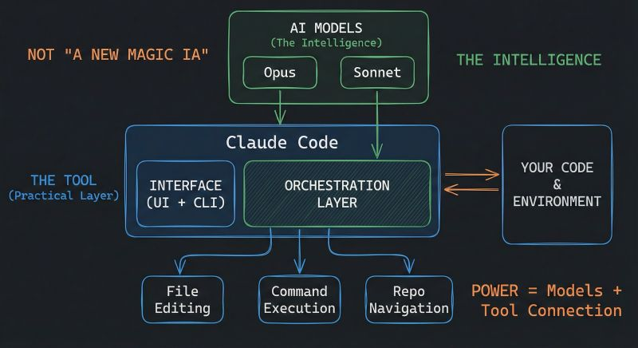

# How Claude Code Works: Architecture & Internals

> A technical deep-dive into Claude Code's internal mechanisms, based on official Anthropic documentation and verified community analysis.

**Author**: Florian BRUNIAUX | Contributions from Claude (Anthropic)

**Reading time**: ~25 minutes (full) | ~5 minutes (TL;DR only)

**Last verified**: January 2026 (Claude Code 3.3.x)

---

## Source Transparency

This document combines three tiers of sources:

| Tier | Description | Confidence | Example |
|------|-------------|------------|---------|
| **Tier 1** | Official Anthropic documentation | 100% | anthropic.com/engineering/* |
| **Tier 2** | Verified reverse-engineering | 70-90% | PromptLayer analysis, code.claude.com behavior |
| **Tier 3** | Community inference | 40-70% | Observed but not officially confirmed |

Each claim is marked with its confidence level. **Always prefer official documentation** when available.

---

## TL;DR - 5 Bullet Summary

1. **Simple Loop**: Claude Code runs a `while(tool_call)` loop — no DAGs, no classifiers, no RAG. The model decides everything.

2. **Eight Core Tools**: Bash (universal adapter), Read, Edit, Write, Grep, Glob, Task (sub-agents), TodoWrite. That's the entire arsenal.

3. **200K Token Budget**: Context window shared between system prompt, history, tool results, and response buffer. Auto-compacts at ~75-92% capacity.

4. **Sub-agents = Isolation**: The `Task` tool spawns sub-agents with their own context. They cannot spawn more sub-agents (depth=1). Only their summary returns.

5. **Philosophy**: "Less scaffolding, more model" — trust Claude's reasoning instead of building complex orchestration systems around it.

---

## Visual Overview

Before diving into the technical details, this diagram by Mohamed Ali Ben Salem captures the essential architecture:



*Source: [Mohamed Ali Ben Salem on LinkedIn](https://www.linkedin.com/posts/mohamed-ali-ben-salem-2b777b9a_en-ce-moment-je-vois-passer-des-posts-du-activity-7420592149110362112-eY5a) — Used with attribution*

**Key insight**: Claude Code is NOT a new AI model — it's an orchestration layer that connects Claude (Opus/Sonnet/Haiku) to your development environment through file editing, command execution, and repository navigation.

---

## Table of Contents

- [Visual Overview](#visual-overview)

1. [The Master Loop](#1-the-master-loop)
2. [The Tool Arsenal](#2-the-tool-arsenal)
3. [Context Management Internals](#3-context-management-internals)
4. [Sub-Agent Architecture](#4-sub-agent-architecture)
5. [Permission & Security Model](#5-permission--security-model)
6. [MCP Integration](#6-mcp-integration)
7. [The Edit Tool: How It Actually Works](#7-the-edit-tool-how-it-actually-works)
8. [Session Persistence](#8-session-persistence)
9. [Philosophy: Less Scaffolding, More Model](#9-philosophy-less-scaffolding-more-model)
10. [Claude Code vs Alternatives](#10-claude-code-vs-alternatives)
11. [Sources & References](#11-sources--references)
12. [Appendix: What We Don't Know](#12-appendix-what-we-dont-know)

---

## 1. The Master Loop

**Confidence**: 100% (Tier 1 - Official)
**Source**: [Anthropic Engineering Blog](https://www.anthropic.com/engineering/claude-code-best-practices)

At its core, Claude Code is remarkably simple:

```
┌─────────────────────────────────────────────────────────────┐
│                    CLAUDE CODE MASTER LOOP                  │
├─────────────────────────────────────────────────────────────┤
│                                                             │
│   ┌──────────────┐                                          │
│   │  Your Prompt │                                          │
│   └──────┬───────┘                                          │
│          │                                                  │
│          ▼                                                  │
│   ┌──────────────────────────────────────────────────────┐  │
│   │                                                      │  │
│   │                  CLAUDE REASONS                      │  │
│   │        (No classifier, no routing layer)            │  │
│   │                                                      │  │
│   └────────────────────────┬─────────────────────────────┘  │
│                            │                                │
│                            ▼                                │
│                   ┌────────────────┐                        │
│                   │  Tool Call?    │                        │
│                   └───────┬────────┘                        │
│                           │                                 │
│              YES          │           NO                    │
│         ┌─────────────────┴─────────────────┐               │
│         │                                   │               │
│         ▼                                   ▼               │
│  ┌────────────┐                      ┌────────────┐         │
│  │  Execute   │                      │   Text     │         │
│  │   Tool     │                      │  Response  │         │
│  │            │                      │   (DONE)   │         │
│  └─────┬──────┘                      └────────────┘         │
│        │                                                    │
│        ▼                                                    │
│  ┌─────────────┐                                            │
│  │ Feed Result │                                            │
│  │  to Claude  │──────────────────┐                         │
│  └─────────────┘                  │                         │
│                                   │                         │
│                                   ▼                         │
│                          ┌────────────────┐                 │
│                          │   LOOP BACK    │                 │
│                          │  (Next turn)   │                 │
│                          └────────────────┘                 │
│                                                             │
└─────────────────────────────────────────────────────────────┘
```

### What This Means

The entire architecture is a simple `while` loop:

```
while (claude_response.has_tool_call):
    result = execute_tool(tool_call)
    claude_response = send_to_claude(result)
return claude_response.text
```

**There is no:**
- Intent classifier
- Task router
- RAG/embedding pipeline
- DAG orchestrator
- Planner/executor split

The model itself decides when to call tools, which tools to call, and when it's done. This is the "agentic loop" pattern described in Anthropic's engineering blog.

### Why This Design?

1. **Simplicity**: Fewer components = fewer failure modes
2. **Model-driven**: Claude's reasoning is better than hand-coded heuristics
3. **Flexibility**: No rigid pipeline constraining what Claude can do
4. **Debuggability**: Easy to understand what happened and why

---

## 2. The Tool Arsenal

**Confidence**: 100% (Tier 1 - Official)
**Source**: [code.claude.com/docs](https://code.claude.com/docs/en/setup)

Claude Code has exactly 8 core tools:

| Tool | Purpose | Key Behavior | Token Cost |
|------|---------|--------------|------------|
| `Bash` | Execute shell commands | Universal adapter, most powerful | Low (command) + Variable (output) |
| `Read` | Read file contents | Max 2000 lines, handles truncation | High for large files |
| `Edit` | Modify existing files | Diff-based, requires exact match | Medium |
| `Write` | Create/overwrite files | Must read first if file exists | Medium |
| `Grep` | Search file contents | Ripgrep-based, replaces RAG | Low |
| `Glob` | Find files by pattern | Path matching, sorted by mtime | Low |
| `Task` | Spawn sub-agents | Isolated context, depth=1 limit | High (new context) |
| `TodoWrite` | Track progress | Structured task management | Low |

### The Bash Universal Adapter

**Key insight**: Bash is Claude's swiss-army knife. It can:

- Run any CLI tool (git, npm, docker, curl...)
- Execute scripts
- Chain commands with pipes
- Access system state

The model has been trained on massive amounts of shell data, making it highly effective at using Bash as a universal adapter when specialized tools aren't enough.

### Tool Selection Logic

Claude decides which tool to use based on the task. There's no hardcoded routing:

```
┌─────────────────────────────────────────────────────┐
│              TOOL SELECTION (Model-Driven)          │
├─────────────────────────────────────────────────────┤
│                                                     │
│  "Read auth.ts"           → Read tool               │
│  "Find all test files"    → Glob tool               │
│  "Search for TODO"        → Grep tool               │
│  "Run npm test"           → Bash tool               │
│  "Explore the codebase"   → Task tool (sub-agent)   │
│  "Track my progress"      → TodoWrite tool          │
│                                                     │
│  The model learns these patterns during training,   │
│  not from explicit rules.                           │
│                                                     │
└─────────────────────────────────────────────────────┘
```

---

## 3. Context Management Internals

**Confidence**: 80% (Tier 2 - Partially Official)
**Sources**:
- [platform.claude.com/docs](https://platform.claude.com/docs/en/build-with-claude/context-windows) (Tier 1)
- Observed behavior (Tier 2)

Claude Code operates within a fixed context window (200K tokens for Claude 3.5 Sonnet, varies by model).

### Context Budget Breakdown

```
┌─────────────────────────────────────────────────────────────┐
│                 CONTEXT BUDGET (~200K tokens)               │
├─────────────────────────────────────────────────────────────┤
│                                                             │
│  ┌──────────────────────────────────────────────────────┐   │
│  │ System Prompt                            (~5-15K)    │   │
│  │ • Tool definitions                                   │   │
│  │ • Safety instructions                               │   │
│  │ • Behavioral guidelines                             │   │
│  ├──────────────────────────────────────────────────────┤   │
│  │ CLAUDE.md Files                          (~1-10K)    │   │
│  │ • Global ~/.claude/CLAUDE.md                        │   │
│  │ • Project /CLAUDE.md                                │   │
│  │ • Local /.claude/CLAUDE.md                          │   │
│  ├──────────────────────────────────────────────────────┤   │
│  │ Conversation History                     (variable)  │   │
│  │ • Your prompts                                      │   │
│  │ • Claude's responses                                │   │
│  │ • Tool call records                                 │   │
│  ├──────────────────────────────────────────────────────┤   │
│  │ Tool Results                             (variable)  │   │
│  │ • File contents from Read                           │   │
│  │ • Command outputs from Bash                         │   │
│  │ • Search results from Grep                          │   │
│  ├──────────────────────────────────────────────────────┤   │
│  │ Reserved for Response                    (~40-45K)   │   │
│  │ • Claude's thinking                                 │   │
│  │ • Generated code/text                               │   │
│  └──────────────────────────────────────────────────────┘   │
│                                                             │
│  USABLE = Total - System - Reserved ≈ 140-150K tokens       │
│                                                             │
└─────────────────────────────────────────────────────────────┘
```

### Auto-Compaction

**Confidence**: 50% (Tier 3 - Conflicting reports)

When context usage exceeds a threshold, Claude Code automatically summarizes older conversation turns:

| Source | Reported Threshold |
|--------|-------------------|
| PromptLayer analysis | 92% |
| Community observations | 75-80% |
| User-triggered `/compact` | Anytime |

**What happens during compaction:**

1. Older conversation turns are summarized
2. Tool results are condensed
3. Recent context is preserved in full
4. The model receives a "context was compacted" signal

**User control**: Use `/compact` to manually trigger summarization before hitting limits.

### Context Preservation Strategies

| Strategy | When to Use | How |
|----------|-------------|-----|
| Sub-agents | Exploratory tasks | `Task` tool for isolated search |
| Manual compact | Proactive cleanup | `/compact` command |
| Clear session | Fresh start needed | `/clear` command |
| Specific reads | Know what you need | Read exact files, not directories |
| CLAUDE.md | Persistent context | Store conventions in memory files |

### Session Degradation Limits

**Confidence**: 70% (Tier 2 - Practitioner studies, arXiv research)

Claude Code's effectiveness degrades predictably under certain conditions:

| Condition | Observed Threshold | Symptom |
|-----------|-------------------|---------|
| Conversation turns | **15-25 turns** | Loses track of earlier constraints |
| Token accumulation | **80-100K tokens** | Ignores requirements stated early in session |
| Problem scope | **>5 files simultaneously** | Inconsistent changes, missed files |

**Success rates by scope** (from practitioner studies):

| Scope | Success Rate | Example |
|-------|--------------|---------|
| 1-3 files | ~85% | Fix bug in single module |
| 4-7 files | ~60% | Refactor feature across components |
| 8+ files | ~40% | Codebase-wide changes |

**Mitigation strategies**:

1. **Checkpoint prompts**: "Before continuing, recap the current requirements and constraints."
2. **Session resets**: Start fresh for new tasks (`/clear`)
3. **Scope tightly**: Break large tasks into focused sub-tasks
4. **Use sub-agents**: Delegate exploration to `Task` tool to preserve main context

---

## 4. Sub-Agent Architecture

**Confidence**: 100% (Tier 1 - Documented behavior)
**Source**: [code.claude.com/docs](https://code.claude.com/docs/en/setup) + System prompt (visible in tool definitions)

The `Task` tool spawns sub-agents for parallel or isolated work.

### Isolation Model

```
┌─────────────────────────────────────────────────────────────┐
│                        MAIN AGENT                           │
│                                                             │
│  ┌───────────────────────────────────────────────────────┐  │
│  │ Context: Full conversation + all file reads          │  │
│  │                                                       │  │
│  │         Task("Explore authentication patterns")      │  │
│  │                        │                              │  │
│  │                        ▼                              │  │
│  │  ┌─────────────────────────────────────────────────┐ │  │
│  │  │             SUB-AGENT (Spawned)                │ │  │
│  │  │                                                 │ │  │
│  │  │  • Own fresh context window                    │ │  │
│  │  │  • Receives: task description only             │ │  │
│  │  │  • Has access to: same tools (except Task)     │ │  │
│  │  │  • CANNOT spawn sub-sub-agents (depth = 1)     │ │  │
│  │  │  • Returns: summary text only                  │ │  │
│  │  │                                                 │ │  │
│  │  └─────────────────────────────────────────────────┘ │  │
│  │                        │                              │  │
│  │                        ▼                              │  │
│  │         Result: "Found 3 auth patterns: JWT in..."   │  │
│  │         (Only this text enters main context)         │  │
│  │                                                       │  │
│  └───────────────────────────────────────────────────────┘  │
│                                                             │
└─────────────────────────────────────────────────────────────┘
```

### Why Depth = 1?

Limiting sub-agents to one level prevents:

1. **Recursive explosion**: Agent-ception would consume infinite resources
2. **Context pollution**: Each level would accumulate context
3. **Debugging nightmares**: Tracking multi-level agent chains is hard
4. **Unpredictable costs**: Nested agents = unpredictable token usage

### Sub-Agent Types

Claude Code offers specialized sub-agent types via the `subagent_type` parameter:

| Type | Purpose | Tools Available |
|------|---------|-----------------|
| `Explore` | Codebase exploration | All read-only tools |
| `Plan` | Architecture planning | All except Edit/Write |
| `Bash` | Command execution | Bash only |
| `general-purpose` | Complex multi-step | All tools |

### When to Use Sub-Agents

| Use Case | Why Sub-Agent Helps |
|----------|---------------------|
| Searching large codebases | Keeps main context clean |
| Parallel exploration | Multiple searches simultaneously |
| Risky exploration | Errors don't pollute main context |
| Specialized analysis | Different "mindset" for different tasks |

---

## 5. Permission & Security Model

**Confidence**: 100% (Tier 1 - Official)
**Sources**:
- [code.claude.com/docs/en/hooks](https://code.claude.com/docs/en/hooks)
- [code.claude.com/docs/en/sandboxing](https://code.claude.com/docs/en/sandboxing)

Claude Code has a layered security model:

```
┌─────────────────────────────────────────────────────────────┐
│                    PERMISSION LAYERS                        │
├─────────────────────────────────────────────────────────────┤
│                                                             │
│  Layer 1: INTERACTIVE PROMPTS                               │
│  ┌────────────────────────────────────────────────────────┐ │
│  │ Claude wants to run: rm -rf node_modules              │ │
│  │ [Allow once] [Allow always] [Deny] [Edit command]     │ │
│  └────────────────────────────────────────────────────────┘ │
│                          │                                  │
│                          ▼                                  │
│  Layer 2: ALLOW/DENY RULES (settings.json)                  │
│  ┌────────────────────────────────────────────────────────┐ │
│  │ {                                                      │ │
│  │   "permissions": {                                     │ │
│  │     "allow": ["Bash(npm:*)", "Read(**)"],             │ │
│  │     "deny": ["Bash(rm -rf *)"]                        │ │
│  │   }                                                    │ │
│  │ }                                                      │ │
│  └────────────────────────────────────────────────────────┘ │
│                          │                                  │
│                          ▼                                  │
│  Layer 3: HOOKS (Pre/Post execution)                        │
│  ┌────────────────────────────────────────────────────────┐ │
│  │ PreToolUse: Validate before execution                 │ │
│  │ PostToolUse: Audit after execution                    │ │
│  │ PermissionRequest: Override permission prompts        │ │
│  └────────────────────────────────────────────────────────┘ │
│                          │                                  │
│                          ▼                                  │
│  Layer 4: SANDBOX MODE (Optional isolation)                 │
│  ┌────────────────────────────────────────────────────────┐ │
│  │ Filesystem isolation + Network restrictions           │ │
│  └────────────────────────────────────────────────────────┘ │
│                                                             │
└─────────────────────────────────────────────────────────────┘
```

### Dangerous Pattern Detection

**Confidence**: 80% (Tier 2 - Observed but not exhaustive)

Claude Code appears to flag certain patterns for extra scrutiny:

| Pattern | Risk | Behavior |
|---------|------|----------|
| `rm -rf` | Destructive deletion | Always prompts |
| `sudo` | Privilege escalation | Always prompts |
| `curl \| sh` | Remote code execution | Always prompts |
| `chmod 777` | Insecure permissions | Always prompts |
| `git push --force` | History destruction | Always prompts |
| `DROP TABLE` | Data destruction | Always prompts |

This is not a complete blocklist — patterns are likely detected through model training rather than explicit rules.

### Hooks System

Hooks allow programmatic control over Claude's actions:

```json
{
  "hooks": {
    "PreToolUse": [
      {
        "matcher": "Bash",
        "hooks": [{
          "type": "command",
          "command": "/path/to/validate-command.sh"
        }]
      }
    ],
    "PostToolUse": [
      {
        "matcher": "*",
        "hooks": [{
          "type": "command",
          "command": "/path/to/audit-log.sh"
        }]
      }
    ]
  }
}
```

**Hook capabilities:**

| Capability | Supported | How |
|------------|-----------|-----|
| Block execution | Yes | Exit code != 0 |
| Modify parameters | Yes | Return modified JSON |
| Log actions | Yes | Write to file in hook |
| Async processing | No | Hooks are synchronous |

**Hook JSON payload** (passed via stdin):

```json
{
  "event": "PreToolUse",
  "tool": "Bash",
  "params": {
    "command": "npm install lodash"
  },
  "sessionId": "abc123",
  "cwd": "/path/to/project"
}
```

→ **Cross-reference**: See [Section 7 - Hooks](./ultimate-guide.md#7-hooks) in the main guide for complete examples.

---

## 6. MCP Integration

**Confidence**: 100% (Tier 1 - Official)
**Source**: [code.claude.com/docs/en/mcp](https://code.claude.com/docs/en/mcp)

MCP (Model Context Protocol) servers extend Claude Code with additional tools.

### How MCP Works

```
┌─────────────────────────────────────────────────────────────┐
│                    MCP INTEGRATION                          │
├─────────────────────────────────────────────────────────────┤
│                                                             │
│  ┌─────────────────────────────────────────────────────┐    │
│  │                  CLAUDE CODE                        │    │
│  │                                                     │    │
│  │   Native Tools        MCP Tools                     │    │
│  │   ┌─────────┐        ┌─────────────────────────┐    │    │
│  │   │ Bash    │        │ mcp__serena__*         │    │    │
│  │   │ Read    │        │ mcp__context7__*       │    │    │
│  │   │ Edit    │        │ mcp__playwright__*     │    │    │
│  │   │ ...     │        │ mcp__custom__*         │    │    │
│  │   └─────────┘        └───────────┬─────────────┘    │    │
│  │                                  │                  │    │
│  └──────────────────────────────────┼──────────────────┘    │
│                                     │                       │
│                           JSON-RPC 2.0                      │
│                                     │                       │
│                                     ▼                       │
│  ┌─────────────────────────────────────────────────────┐    │
│  │                  MCP SERVER                         │    │
│  │                                                     │    │
│  │   stdio/HTTP transport                              │    │
│  │   Tool definitions (JSON Schema)                    │    │
│  │   Tool implementations                              │    │
│  │                                                     │    │
│  └─────────────────────────────────────────────────────┘    │
│                                                             │
└─────────────────────────────────────────────────────────────┘
```

### Key MCP Facts

| Aspect | Behavior |
|--------|----------|
| Protocol | JSON-RPC 2.0 over stdio or HTTP |
| Tool naming | `mcp__<server>__<tool>` convention |
| Context sharing | Only via tool parameters and return values |
| Lifecycle | Server starts on first use, stays alive during session |
| Permissions | Same system as native tools |

### What MCP Cannot Do

| Limitation | Explanation |
|------------|-------------|
| Access conversation history | Only sees tool params, not full context |
| Maintain state across calls | Each call is independent (unless server implements caching) |
| Modify Claude's system prompt | Tools only, no prompt injection |
| Bypass permissions | Same security layer as native tools |

→ **Cross-reference**: See [Section 8.6 - MCP Security](./ultimate-guide.md#86-mcp-security) for security considerations.

### MCP Tool Search (Lazy Loading)

**Confidence**: 100% (Tier 1 - Official)
**Source**: [anthropic.com/engineering/advanced-tool-use](https://www.anthropic.com/engineering/advanced-tool-use)

Since v2.1.7 (January 2026), Claude Code uses **lazy loading** for MCP tool definitions instead of preloading all tools into context. This is powered by Anthropic's [Advanced Tool Use](https://www.anthropic.com/engineering/advanced-tool-use) API feature.

**The problem solved:**
- MCP tool definitions consume significant context (e.g., GitHub MCP alone: ~46K tokens for 93 tools)
- Developer Scott Spence documented 66,000+ tokens consumed before typing a single prompt
- This "context pollution" limited practical MCP adoption

**How Tool Search works:**

```
┌─────────────────────────────────────────────────────────────┐
│                   MCP TOOL SEARCH FLOW                       │
├─────────────────────────────────────────────────────────────┤
│                                                             │
│  WITHOUT Tool Search (eager loading):                       │
│  ┌──────────────────────────────────────────────────────┐   │
│  │ All 100+ tool definitions loaded upfront (~55K tokens)│   │
│  └──────────────────────────────────────────────────────┘   │
│                                                             │
│  WITH Tool Search (lazy loading):                           │
│  ┌──────────────────────────────────────────────────────┐   │
│  │ Step 1: Only search tool loaded (~500 tokens)        │   │
│  │ Step 2: Claude determines needed capability          │   │
│  │ Step 3: Tool Search finds matching tools (regex/BM25)│   │
│  │ Step 4: Only matched tools loaded (~600 tokens each) │   │
│  │ Step 5: Tool invoked normally                        │   │
│  └──────────────────────────────────────────────────────┘   │
│                                                             │
│  Result: 55K tokens → ~8.7K tokens (85% reduction)          │
│                                                             │
└─────────────────────────────────────────────────────────────┘
```

**Measured improvements** (Anthropic benchmarks):

| Metric | Before | After | Improvement |
|--------|--------|-------|-------------|
| Token overhead (5-server setup) | ~55K | ~8.7K | **85% reduction** |
| Opus 4 tool selection accuracy | 49% | 74% | +25 points |
| Opus 4.5 tool selection accuracy | 79.5% | 88.1% | +8.6 points |

**Configuration** (v2.1.9+):

```bash
# Environment variable
ENABLE_TOOL_SEARCH=auto      # Default (10% context threshold)
ENABLE_TOOL_SEARCH=auto:5    # Aggressive (5% threshold)
ENABLE_TOOL_SEARCH=auto:20   # Conservative (20% threshold)
ENABLE_TOOL_SEARCH=true      # Always enabled
ENABLE_TOOL_SEARCH=false     # Disabled (eager loading)
```

| Threshold | Recommended for |
|-----------|-----------------|
| `auto:20` | Lightweight setups (5-10 tools) |
| `auto:10` | Balanced default (20-50 tools) |
| `auto:5` | Power users (100+ tools) |

→ As Simon Willison noted: "Context pollution is why I rarely used MCP. Now that it's solved, there's no reason not to hook up dozens or even hundreds of MCPs to Claude Code." — [X/Twitter, January 14, 2026](https://twitter.com/simonw)

---

## 7. The Edit Tool: How It Actually Works

**Confidence**: 90% (Tier 2 - Verified through behavior)
**Sources**:
- Observed behavior
- [github.com/cline/cline/issues/2909](https://github.com/cline/cline/issues/2909) (similar implementation)

The Edit tool is more sophisticated than it appears.

### Edit Algorithm

```
┌─────────────────────────────────────────────────────────────┐
│                     EDIT TOOL FLOW                          │
├─────────────────────────────────────────────────────────────┤
│                                                             │
│  Input: old_string, new_string, file_path                   │
│                                                             │
│         ┌──────────────────────────────────────┐            │
│         │ Step 1: EXACT MATCH                  │            │
│         │ Search for literal old_string        │            │
│         └────────────────┬─────────────────────┘            │
│                          │                                  │
│              Found?  ────┴────  Not found?                  │
│                │                     │                      │
│                ▼                     ▼                      │
│         ┌──────────┐         ┌──────────────────┐           │
│         │ REPLACE  │         │ Step 2: FUZZY    │           │
│         │  (done)  │         │ MATCH            │           │
│         └──────────┘         └────────┬─────────┘           │
│                                       │                     │
│                           Found?  ────┴────  Not found?     │
│                             │                     │         │
│                             ▼                     ▼         │
│                      ┌──────────┐         ┌──────────────┐  │
│                      │ REPLACE  │         │    ERROR     │  │
│                      │ + WARN   │         │  (mismatch)  │  │
│                      └──────────┘         └──────────────┘  │
│                                                             │
└─────────────────────────────────────────────────────────────┘
```

### Fuzzy Matching Details

When exact match fails, the Edit tool attempts:

1. **Whitespace normalization**: Ignore trailing spaces, normalize indentation
2. **Line ending normalization**: Handle CRLF vs LF differences
3. **Context expansion**: Use surrounding lines to locate the right spot

If fuzzy matching also fails, the tool returns an error asking Claude to verify the old_string.

### Edit Validation

Before applying changes, the Edit tool:

| Check | Purpose |
|-------|---------|
| File exists | Prevent creating files via Edit |
| old_string found | Ensure we're editing the right place |
| Single match | old_string must be unique (or use `replace_all`) |
| New content differs | Prevent no-op edits |

### When Edit Fails

| Error | Cause | Claude's Response |
|-------|-------|-------------------|
| "old_string not found" | Content changed since last read | Re-reads file, tries again |
| "Multiple matches" | old_string isn't unique | Uses more context lines |
| "File not found" | Wrong path | Searches for correct path |

---

## 8. Session Persistence

**Confidence**: 100% (Tier 1 - Official)
**Source**: [code.claude.com/docs](https://code.claude.com/docs/en/setup)

Sessions can be resumed across terminal sessions.

### Resume Mechanisms

| Command | Behavior |
|---------|----------|
| `claude --continue` / `claude -c` | Resume most recent session |
| `claude --resume <id>` / `claude -r <id>` | Resume specific session by ID |

### What Gets Persisted

| Persisted | Not Persisted |
|-----------|---------------|
| Conversation history | Live tool state |
| Tool call results | Pending operations |
| Session ID | File locks |
| Working directory context | Environment variables |

### Storage Format

**Confidence**: 50% (Tier 3 - Inferred)

Sessions appear to be stored as JSON/JSONL files in `~/.claude/` but:

- Format is not publicly documented
- Not intended as a stable API
- May change between versions

**Do not rely on session file format** for external tooling.

---

## 9. Philosophy: Less Scaffolding, More Model

**Confidence**: 100% (Tier 1 - Official)
**Source**: Daniela Amodei (Anthropic CEO) - Public statements

The core philosophy behind Claude Code:

> "Do more with less. Smart architecture choices, better training efficiency, and focused problem-solving can compete with raw scale."

### What This Means in Practice

| Traditional Approach | Claude Code Approach |
|---------------------|---------------------|
| Intent classifier → Router → Specialist | Single model decides everything |
| RAG with embeddings | Grep + Glob (regex search) |
| DAG task orchestration | Simple while loop |
| Tool-specific planners | Model-driven tool selection |
| Complex state machines | Conversation as state |
| Prompt engineering frameworks | Trust the model |

### Why It Works

1. **Model capability**: Claude 3.5+ is capable enough to handle routing decisions
2. **Reduced latency**: Fewer components = faster response
3. **Simpler debugging**: When something fails, there's one place to look
4. **Better generalization**: No hand-coded rules to break on edge cases

### The Trade-offs

| Advantage | Disadvantage |
|-----------|--------------|
| Simplicity | Less fine-grained control |
| Flexibility | Harder to enforce strict behaviors |
| Fewer bugs | Model errors affect everything |
| Fast iteration | Requires good model quality |

---

## 10. Claude Code vs Alternatives

**Confidence**: 70% (Tier 3 - Based on public information)
**Sources**: Various 2024-2025 comparisons, official documentation

| Dimension | Claude Code | GitHub Copilot Workspace | Cursor | Amazon Q Developer |
|-----------|-------------|-------------------------|--------|-------------------|
| **Architecture** | while(tool) loop | Cloud-based planning | Event-driven + cloud | AWS-integrated agents |
| **Execution** | Local terminal | Cloud sandbox | Local + cloud | Cloud/local hybrid |
| **Model** | Claude (single) | GPT-4 variants | Multiple (adaptive) | Amazon Titan + others |
| **Context** | ~200K tokens | Limited | Limited | Varies |
| **Transparency** | High (visible reasoning) | Medium | Medium | Low |
| **Customization** | CLAUDE.md + hooks | Limited | Plugins | AWS integration |
| **MCP Support** | Native | No | Some servers | No |
| **Pricing** | Pro/Max tiers | GitHub subscription | Per-seat | AWS-integrated |

### When to Choose Claude Code

| Scenario | Claude Code | Alternative |
|----------|-------------|-------------|
| Deep codebase exploration | Excellent | Good |
| Terminal-native workflow | Excellent | Limited |
| Custom automation (hooks) | Excellent | Limited |
| Team standardization | Good (CLAUDE.md) | Varies |
| IDE integration | Limited (VS Code ext) | Cursor/Copilot better |
| Enterprise compliance | Via Anthropic enterprise | Varies |

---

## 11. Sources & References

### Tier 1 - Official Anthropic

| Source | URL | Topics |
|--------|-----|--------|
| Engineering Blog | anthropic.com/engineering/claude-code-best-practices | Master loop, philosophy |
| Setup Docs | code.claude.com/docs/en/setup | Tools, commands |
| Context Windows | platform.claude.com/docs/en/build-with-claude/context-windows | Token limits |
| Hooks Reference | code.claude.com/docs/en/hooks | Hook system |
| Hooks Guide | code.claude.com/docs/en/hooks-guide | Hook examples |
| MCP Docs | code.claude.com/docs/en/mcp | MCP integration |
| Sandboxing | code.claude.com/docs/en/sandboxing | Security model |

### Tier 2 - Verified Analysis

| Source | URL | Topics |
|--------|-----|--------|
| PromptLayer Analysis | blog.promptlayer.com/claude-code-behind-the-scenes-of-the-master-agent-loop/ | Internal architecture |
| Steve Kinney Course | stevekinney.com/courses/ai-development/claude-code-* | Permissions, sessions |

### Tier 3 - Community Resources

| Source | Topics |
|--------|--------|
| GitHub Issues (anthropics/claude-code) | Edge cases, bugs, feature discussions |
| Reddit r/ClaudeAI | User experiences, workarounds |
| YouTube tutorials | Visual walkthroughs |

---

## 12. Appendix: What We Don't Know

Transparency about gaps in our understanding:

### Unknown or Unconfirmed

| Topic | What We Don't Know | Confidence in Current Understanding |
|-------|-------------------|-------------------------------------|
| **Exact compaction threshold** | Is it 75%? 85%? 92%? Varies by model? | 40% |
| **System prompt contents** | Full text not public, varies by model version | 30% |
| **Token counting method** | Exact tokenizer, overhead for tool schemas | 50% |
| **Model fallback** | Does Claude Code fallback if a model fails? | 20% |
| **Internal caching** | Is there result caching between sessions? | 20% |
| **Rate limiting logic** | How rate limits are applied per-tool | 40% |

### Explicitly Undocumented

These are intentionally not documented by Anthropic:

- Session file format (internal implementation detail)
- System prompt variations between models
- Internal component names/architecture
- Token usage breakdown per component
- Exact permission evaluation order

### How to Stay Updated

1. **Official changelog**: Watch anthropic.com/changelog
2. **GitHub releases**: github.com/anthropics/claude-code/releases
3. **Community Discord**: Various Claude-focused servers
4. **This guide**: Updated periodically based on verified information

---

## Contributing

Found an error? Have verified new information? Contributions welcome:

1. **For official facts**: Cite the Anthropic source
2. **For observations**: Describe how you verified the behavior
3. **For corrections**: Explain what's wrong and why

---

**Last updated**: January 2026
**Claude Code version**: 3.3.x
**Document version**: 1.0.0
