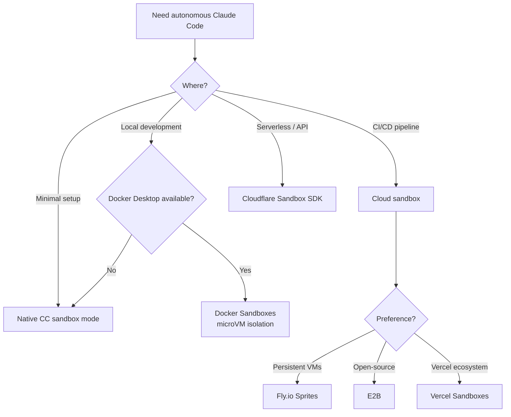

# Sandbox Isolation for Coding Agents

> **Confidence**: Tier 2 — Official Docker docs + verified vendor documentation
> **Reading time**: ~10 minutes
> **Scope**: Running Claude Code safely in isolated environments

---

## TL;DR

| Solution | Isolation | Local/Cloud | Best For |
|----------|-----------|-------------|----------|
| **Docker Sandboxes** | microVM (hypervisor) | Local | Max security, Docker-in-Docker needed |
| **Native CC sandbox** | Process (Seatbelt/bubblewrap) | Local | Lightweight daily dev, trusted code |
| **Fly.io Sprites** | Firecracker microVM | Cloud | API-driven agent workflows |
| **E2B** | Firecracker microVM | Cloud | Multi-framework AI apps |
| **Vercel Sandboxes** | Firecracker microVM | Cloud | Next.js / Vercel ecosystem |
| **Cloudflare Sandbox SDK** | Container | Cloud | Workers-based serverless |

Quick start:

```bash
docker sandbox run claude ~/my-project
```

---

## 1. The Problem: Safe Autonomy

Claude Code's permission system protects you from unintended actions. But it creates a tension:

- **`--dangerously-skip-permissions`** removes all guardrails — Claude can `rm -rf`, `git push --force`, or `DROP TABLE` without asking. On a bare host, this is dangerous.
- **Permission fatigue** — approving every file edit and shell command slows down autonomous workflows. For large refactors or CI pipelines, interactive approval is impractical.
- **The gap**: How do you run Claude Code autonomously AND safely?

**Answer**: Isolate the execution environment. Let the agent run free inside a sandbox where the blast radius is contained. The sandbox is the security boundary, not the permission system.

---

## 2. Isolation Approaches



---

## 3. Docker Sandboxes

> **Source**: [docs.docker.com/ai/sandboxes/](https://docs.docker.com/ai/sandboxes/)
> **Requires**: Docker Desktop 4.58+ (macOS or Windows)

Docker Sandboxes run AI coding agents in microVM-based isolation on your local machine. Each sandbox gets its own private Docker daemon and filesystem. Sandboxes do NOT appear in `docker ps` — they are VMs, not containers.

### Quick Start

```bash
# Create and run a sandbox with your project
docker sandbox run claude ~/my-project

# Run with autonomous mode (safe inside sandbox)
docker sandbox run claude ~/my-project -- --dangerously-skip-permissions

# Pass a prompt directly
docker sandbox run claude ~/my-project -- "Refactor auth module to use JWT"

# Continue a previous session
docker sandbox run my-sandbox -- --continue
```

### Architecture

```
┌──────────────────────────────────────────────────────────┐
│                     HOST MACHINE                          │
│                                                          │
│  ┌────────────────────────────────────────────────────┐  │
│  │              DOCKER SANDBOX (microVM)               │  │
│  │                                                    │  │
│  │  ┌──────────────┐  ┌───────────────────────────┐  │  │
│  │  │ Claude Code   │  │ Private Docker daemon     │  │  │
│  │  │ (--dsp mode)  │  │ (isolated from host)      │  │  │
│  │  └──────────────┘  └───────────────────────────┘  │  │
│  │                                                    │  │
│  │  ┌──────────────────────────────────────────────┐  │  │
│  │  │ Workspace: ~/my-project (synced with host)   │  │  │
│  │  │ Same absolute path as host                   │  │  │
│  │  └──────────────────────────────────────────────┘  │  │
│  │                                                    │  │
│  │  Base: Ubuntu, Node.js, Python 3, Go, Git,        │  │
│  │        Docker CLI, GitHub CLI, ripgrep, jq         │  │
│  │  User: non-root 'agent' with sudo                 │  │
│  └────────────────────────────────────────────────────┘  │
│                                                          │
│  Host Docker daemon: NOT accessible from sandbox          │
│  Host filesystem: NOT accessible (except workspace)       │
└──────────────────────────────────────────────────────────┘
```

Key properties:
- **Workspace sync**: Host directory mounts at the same absolute path inside the sandbox
- **Full isolation**: Agent cannot access host Docker daemon, host containers, or files outside workspace
- **Private Docker**: Each sandbox has its own Docker daemon for building/running containers
- **Claude runs with `--dangerously-skip-permissions`**: Intentional — the sandbox is the security boundary

### Network Policies

Control what the sandbox can access on the network.

```bash
# View network activity
docker sandbox network log my-sandbox

# Set up denylist mode (block all, allow specific)
docker sandbox network proxy my-sandbox \
  --policy deny \
  --allow-host api.anthropic.com \
  --allow-host "*.npmjs.org" \
  --allow-host "*.pypi.org" \
  --allow-host github.com

# Set up allowlist mode (allow all, block specific)
docker sandbox network proxy my-sandbox \
  --policy allow \
  --block-host "*.malicious-domain.com" \
  --block-cidr "192.168.0.0/16"
```

| Mode | Default behavior | Use case |
|------|-----------------|----------|
| **Allowlist** (default) | Permits most traffic, blocks specific destinations | General development |
| **Denylist** | Blocks all traffic, allows only specified destinations | High-security environments |

**Default blocked ranges**: Private CIDRs (`10.0.0.0/8`, `127.0.0.0/8`, `172.16.0.0/12`, `192.168.0.0/16`, `169.254.0.0/16`) and IPv6 equivalents.

**Pattern matching**: Exact (`example.com`), port-specific (`example.com:443`), wildcards (`*.example.com` matches subdomains only). Most specific pattern wins.

**Security caveat**: Domain filtering does not inspect traffic content. Broad allowances (e.g., `github.com`) permit access to user-generated content. HTTPS inspection is not performed in bypass mode.

**Config storage**: Per-sandbox at `~/.docker/sandboxes/vm/[name]/proxy-config.json`. Policies persist across restarts.

### Custom Templates

For teams needing reproducible environments with specific tooling:

```dockerfile
FROM docker/sandbox-templates:claude-code

USER root

# Install project-specific dependencies
RUN apt-get update && apt-get install -y \
    postgresql-client \
    redis-tools

# Install global npm packages
RUN npm install -g pnpm turbo

USER agent
```

Build and use:

```bash
# Build the template
docker build -t my-team-sandbox:v1 .

# Create sandbox with custom template
docker sandbox create my-sandbox \
  --template my-team-sandbox:v1 \
  --load-local-template ~/my-project
```

Use custom templates when: team environments, specific tool versions, repeated setups, complex configurations. For simple one-off work, use the defaults and let the agent install what it needs.

### Commands Reference

| Command | Description |
|---------|-------------|
| `docker sandbox run <agent> <path>` | Create and start a sandbox |
| `docker sandbox create <name>` | Create without starting |
| `docker sandbox ls` | List all sandboxes |
| `docker sandbox run <name> -- "prompt"` | Pass a prompt |
| `docker sandbox run <name> -- --continue` | Continue previous session |
| `docker sandbox run <name> -- --dsp` | Short for --dangerously-skip-permissions |
| `docker sandbox network proxy <name>` | Configure network policies |
| `docker sandbox network log <name>` | View network activity |

### Authentication

**Option 1: API key (recommended for headless)**

Set `ANTHROPIC_API_KEY` in `~/.bashrc` or `~/.zshrc`. The sandbox daemon reads from these files, not the current shell session. Restart the daemon after changes. Persists across sandbox recreation.

**Option 2: Interactive login (per-session)**

Triggered automatically if no credentials found. Use `/login` inside Claude Code to trigger manually. Authentication does NOT persist when the sandbox is destroyed.

### Supported Agents

| Agent | Provider | Status |
|-------|----------|--------|
| Claude Code | Anthropic | Full support |
| Codex CLI | OpenAI | Supported |
| Gemini CLI | Google | Supported |
| cagent | Docker | Supported |
| Kiro | AWS | Supported |

### Limitations

- **macOS and Windows only** for microVM mode. Linux uses legacy container-based sandboxes (Docker Desktop 4.57+).
- **Docker Desktop required** — not available with standalone Docker Engine. Community alternatives like [dclaude](https://github.com/jedi4ever/dclaude) (Patrick Debois) wrap Claude Code in standard Docker containers for Docker Engine-only environments, but use container isolation (not microVM) and mount the host Docker socket — weaker security boundary.
- **MCP Gateway not yet supported** inside sandboxes.
- **No GPU passthrough** — not suitable for ML training workloads.
- **Workspace sync is one-way**: changes inside the sandbox propagate to the host, but concurrent host edits may conflict.

---

## 4. Native Claude Code Sandbox

> **Source**: [code.claude.com/docs/en/sandboxing](https://code.claude.com/docs/en/sandboxing)
> **Requires**: macOS (built-in) or Linux/WSL2 (bubblewrap + socat)
> **Feature**: Claude Code v2.1.0+

Claude Code includes built-in **native sandboxing** using OS-level primitives for process-level isolation. No Docker required.

### Architecture

```
┌──────────────────────────────────────────────────────┐
│                    HOST MACHINE                      │
│                                                      │
│  Claude Code (main process)                          │
│       │                                              │
│       ├─ spawn bash command                          │
│       │                                              │
│       ▼                                              │
│  Sandbox wrapper (Seatbelt/bubblewrap)               │
│       │                                              │
│       ├─ Filesystem: read all, write CWD only        │
│       ├─ Network: SOCKS5 proxy, domain filtering     │
│       ├─ Process: isolated environment               │
│       │                                              │
│       ▼                                              │
│  Command executes with restrictions                  │
│       │                                              │
│       └─ Violations blocked at OS level              │
│                                                      │
└──────────────────────────────────────────────────────┘
```

**Key differences from Docker Sandboxes**:

| Aspect | Native Sandbox | Docker Sandboxes |
|--------|---------------|------------------|
| **Isolation level** | Process (Seatbelt/bubblewrap) | microVM (hypervisor) |
| **Kernel** | Shared with host | Separate kernel per sandbox |
| **Setup** | 0 dependencies (macOS), 2 packages (Linux) | Docker Desktop 4.58+ |
| **Overhead** | Minimal (~1-3% CPU) | Moderate (~5-10% CPU, +200MB RAM) |
| **Docker-in-Docker** | ❌ Not supported | ✅ Private Docker daemon |
| **Use case** | Daily dev, trusted code | Untrusted code, max isolation |

### OS Primitives

**macOS**: Uses Seatbelt (TrustedBSD Mandatory Access Control)
- Built-in, works out of the box
- Kernel-level system call filtering

**Linux/WSL2**: Uses bubblewrap (Linux namespaces + seccomp)
- Requires installation: `sudo apt-get install bubblewrap socat`
- Creates isolated namespace per command

**WSL1**: ❌ Not supported (bubblewrap needs kernel features unavailable)

**Windows native**: ⏳ Planned (not yet available)

### Quick Start

```bash
# Enable sandboxing (interactive menu)
/sandbox

# Linux/WSL2 only: install prerequisites first
sudo apt-get install bubblewrap socat  # Ubuntu/Debian
sudo dnf install bubblewrap socat      # Fedora
```

**Two modes**:

1. **Auto-allow mode**: Bash commands auto-approved if sandboxed (recommended for daily dev)
2. **Regular permissions mode**: All commands require approval (for high-security)

### Configuration Example

```json
{
  "sandbox": {
    "autoAllowMode": true,
    "filesystem": {
      "allowedWritePaths": ["${CWD}"],
      "deniedReadPaths": ["${HOME}/.ssh", "${HOME}/.aws"]
    },
    "network": {
      "policy": "deny",
      "allowedDomains": [
        "api.anthropic.com",
        "registry.npmjs.com",
        "github.com"
      ]
    }
  }
}
```

### When to Use Native vs Docker

**Use Native Sandbox when**:
- ✅ Daily development with trusted team
- ✅ Lightweight setup (no Docker Desktop)
- ✅ Minimal overhead priority
- ✅ Code is mostly trusted
- ✅ Don't need Docker-in-Docker

**Use Docker Sandboxes when**:
- ✅ Running untrusted code
- ✅ Maximum security isolation (kernel exploits protection)
- ✅ Need private Docker daemon inside sandbox
- ✅ Testing AI-generated scripts
- ✅ Production CI/CD with sensitive workloads

**Decision tree**:

```
Daily development?
├─ Trusted code + team → Native Sandbox (lightweight)
└─ Untrusted scripts → Docker Sandboxes (max isolation)

Need Docker inside?
├─ Yes → Docker Sandboxes (only option)
└─ No → Either works, prefer Native for simplicity

Maximum security?
├─ Yes (kernel exploit protection) → Docker Sandboxes
└─ Standard (process isolation OK) → Native Sandbox
```

### Security Limitations

**⚠️ Native Sandbox limitations** (see [guide/sandbox-native.md](./sandbox-native.md) for details):

1. **Shared kernel**: Vulnerable to kernel exploits (Docker microVM protects against this)
2. **Domain fronting**: CDN-based bypass possible (Cloudflare, Akamai)
3. **Unix sockets**: Can grant unexpected privileges if misconfigured
4. **Filesystem**: Overly broad write permissions enable privilege escalation

**For untrusted code**, Docker Sandboxes provide stronger isolation.

### Open-Source Runtime

The sandbox implementation is available as an open-source npm package:

```bash
# Use sandbox runtime directly
npx @anthropic-ai/sandbox-runtime <command-to-sandbox>

# Example: sandbox an MCP server
npx @anthropic-ai/sandbox-runtime node mcp-server.js
```

**Repository**: [github.com/anthropic-experimental/sandbox-runtime](https://github.com/anthropic-experimental/sandbox-runtime)

### Deep Dive

For complete technical details, configuration examples, troubleshooting, and security analysis:

→ **[Native Sandboxing Guide](./sandbox-native.md)**

Covers: OS primitives, network proxy architecture, sandbox modes, escape hatch, security limitations, best practices.

---

## 5. Cloud Sandboxes Landscape

### Fly.io Sprites

> **Source**: [sprites.dev](https://sprites.dev)

Hardware-isolated execution environments built on Firecracker microVMs, by Fly.io.

- **Isolation**: Firecracker microVMs with full hardware isolation
- **Persistence**: Fully mutable ext4 filesystem, automatic 100GB partition
- **Checkpoint/restore**: Live checkpoints in ~300ms (copy-on-write), restore under 1 second
- **HTTP access**: Individual URLs per Sprite, auto-activation on requests (cold-start under 1s)
- **Network**: Layer 3 egress policies, public/private toggles
- **Resources**: Up to 8 CPUs, 16GB RAM per Sprite
- **API**: CLI (`sprite` command), REST API, JavaScript and Go client libraries
- **Pricing**: Pay-per-use ($0.07/CPU-hour, $0.04/GB-hour). $30 trial credits.

### Cloudflare Sandbox SDK

> **Source**: [developers.cloudflare.com/sandbox/](https://developers.cloudflare.com/sandbox/)

Secure code execution in isolated containers, built on Cloudflare's Workers platform.

- **Isolation**: Containers (not microVMs) on Cloudflare's serverless runtime
- **Languages**: Python, JavaScript/TypeScript, shell commands
- **Persistence**: R2 bucket mounting as local filesystem paths
- **API**: TypeScript SDK (`getSandbox()`, `exec()`, `runCode()`, file ops, WebSocket)
- **Integration**: Claude generates code, Sandbox executes it, results return as text/visualizations
- **Pricing**: Workers Paid plan required. Based on Containers platform pricing.
- **Tutorial**: [developers.cloudflare.com/sandbox/tutorials/claude-code/](https://developers.cloudflare.com/sandbox/tutorials/claude-code/)

### Vercel Sandboxes

> **Source**: [vercel.com/docs/vercel-sandbox/](https://vercel.com/docs/vercel-sandbox/)

Ephemeral Linux microVMs for AI agents and code generation, GA since 2026-01-30.

- **Isolation**: Firecracker microVMs, isolated from env vars, DBs, and cloud resources
- **Performance**: Sub-second initialization, automatic termination on task completion
- **Timeouts**: Default 5 min, Hobby up to 45 min, Pro/Enterprise up to 5 hours
- **SDK**: `Sandbox`, `Command`, `Snapshot` classes. Filesystem snapshots for faster repeated runs.
- **Auth**: Vercel OIDC tokens (recommended) or access tokens for external CI/CD
- **Integration**: Works with Claude's Agent SDK for autonomous agent tasks

### E2B

> **Source**: [e2b.dev](https://e2b.dev)

Open-source sandbox platform for AI agents and LLM applications.

- **Isolation**: Firecracker microVMs (same technology as AWS Lambda)
- **Performance**: ~150ms cold boot, under 25ms standby resume
- **Custom images**: Up to 10GB, boot in under 2 seconds (Blueprints)
- **Snapshots**: Capture and restore full VM state
- **Languages**: Python, JavaScript, Ruby, C++, anything on Linux. LLM-agnostic.
- **Integrations**: LangChain, LangGraph, LlamaIndex, Vercel/Next.js, Ollama
- **Deployment**: Cloud-hosted, BYOC (AWS/GCP/Azure), self-hosted on-premises/VPC
- **Pricing**: Free tier ($100 credits, 1h max), Pro from $150/month (24h max)

### Native Claude Code Sandbox Mode

> **Source**: [code.claude.com/docs/en/sandboxing](https://code.claude.com/docs/en/sandboxing)

Claude Code's built-in process-level sandboxing (Layer 4 in the [architecture](./architecture.md)).

- **No external dependencies**: Works out of the box
- **Process isolation**: Restricts what commands Claude can execute
- **Configurable**: Through `allowedTools` in settings
- **Limitations**: Not full VM isolation — shares host kernel and filesystem

Use this when: Docker is unavailable, lightweight isolation is sufficient, or you want defense-in-depth alongside a sandbox.

---

## 6. Comparison Matrix

| Criterion | Docker Sandboxes | Native CC | Fly.io Sprites | Cloudflare SDK | E2B | Vercel Sandboxes |
|-----------|-----------------|-----------|----------------|----------------|-----|-----------------|
| **Isolation level** | microVM (hypervisor) | Process (Seatbelt/bubblewrap) | Firecracker microVM | Container | Firecracker microVM | Firecracker microVM |
| **Kernel isolation** | ✅ Separate kernel | ❌ Shared kernel | ✅ Separate kernel | Partial | ✅ Separate kernel | ✅ Separate kernel |
| **Runs locally** | Yes | Yes | No (cloud) | No (cloud) | No (cloud) | No (cloud) |
| **Setup** | Docker Desktop 4.58+ | 0 deps (macOS), 2 pkgs (Linux) | API key | Workers Paid | API key | SDK |
| **Docker-in-Docker** | ✅ Private daemon | ❌ Not supported | Yes | No | Yes | Yes |
| **Network control** | Allow/Deny lists | Allow/Deny lists (SOCKS5) | L3 egress policies | Not detailed | Not detailed | Not detailed |
| **Platform** | macOS, Windows (WSL2) | macOS, Linux, WSL2 | Any (API) | Any (Workers) | Any (API/SDK) | Any (SDK) |
| **Overhead** | Moderate (~5-10% CPU) | Minimal (~1-3% CPU) | Cloud | Cloud | Cloud | Cloud |
| **Free tier** | Docker Desktop | Free | $30 credits | Workers Paid | $100 credits | Yes (limited) |
| **Best for** | Max security, Docker needed | Daily dev, trusted code | API-driven agents | Serverless | Multi-framework | Next.js/Vercel |

---

## 7. Safe Autonomy Workflows

### Pattern: Docker Sandbox + --dangerously-skip-permissions

The recommended pattern for local autonomous development:

```bash
# 1. Create a sandbox with your project
docker sandbox create my-feature ~/my-project

# 2. Configure network (optional, recommended for security)
docker sandbox network proxy my-feature \
  --policy deny \
  --allow-host api.anthropic.com \
  --allow-host "*.npmjs.org" \
  --allow-host github.com

# 3. Run Claude autonomously (safe inside sandbox)
docker sandbox run my-feature -- --dangerously-skip-permissions \
  "Refactor the auth module to use JWT. Run all tests before finishing."

# 4. Review changes on host (workspace syncs automatically)
cd ~/my-project && git diff

# 5. If satisfied, commit. If not, discard or re-run.
git add -A && git commit -m "feat: JWT auth (sandbox-generated)"
```

### Pattern: CI/CD Pipeline with Sandbox

Sketch for GitHub Actions:

```yaml
jobs:
  agent-task:
    runs-on: ubuntu-latest
    steps:
      - uses: actions/checkout@v4

      - name: Run Claude in E2B sandbox
        uses: e2b-dev/e2b-github-action@v1
        with:
          api-key: ${{ secrets.E2B_API_KEY }}
          command: |
            claude --dangerously-skip-permissions \
              -p "Run the full test suite and fix any failures"
```

For CI/CD, cloud sandboxes (E2B, Vercel, Sprites) are typically better than Docker Sandboxes since they don't require Docker Desktop.

---

## 8. Anti-Patterns

| Anti-pattern | Why it's dangerous | Do instead |
|-------------|-------------------|------------|
| `--dangerously-skip-permissions` without sandbox | Agent has unrestricted access to host filesystem, network, and Docker | Use a sandbox as the security boundary |
| Assuming containers = VMs | Containers share the host kernel. A container escape exposes the host. | Use microVM-based solutions (Docker Sandboxes, E2B, Sprites) for strong isolation |
| Mounting entire filesystem into sandbox | Defeats the purpose of isolation. Agent can access credentials, SSH keys, etc. | Mount only the project workspace directory |
| Allowlisting `*` in network policies | Agent can exfiltrate data to any endpoint | Use denylist mode with explicit allowances |
| Skipping `git diff` review after sandbox run | Autonomous agent may have made unintended changes | Always review diffs before committing sandbox-generated code |
| Using sandbox as excuse to skip code review | Isolation protects the host, not code quality | Sandbox + code review are complementary, not alternatives |

---

## See Also

- [architecture.md](./architecture.md) — Layer 4 (Sub-Agent Architecture) and permission model
- [security-hardening.md](./security-hardening.md) — MCP vetting, injection defense, CVE tracking
- [code.claude.com/docs/en/sandboxing](https://code.claude.com/docs/en/sandboxing) — Official Claude Code sandbox docs
- [docs.docker.com/ai/sandboxes/](https://docs.docker.com/ai/sandboxes/) — Docker Sandboxes documentation
