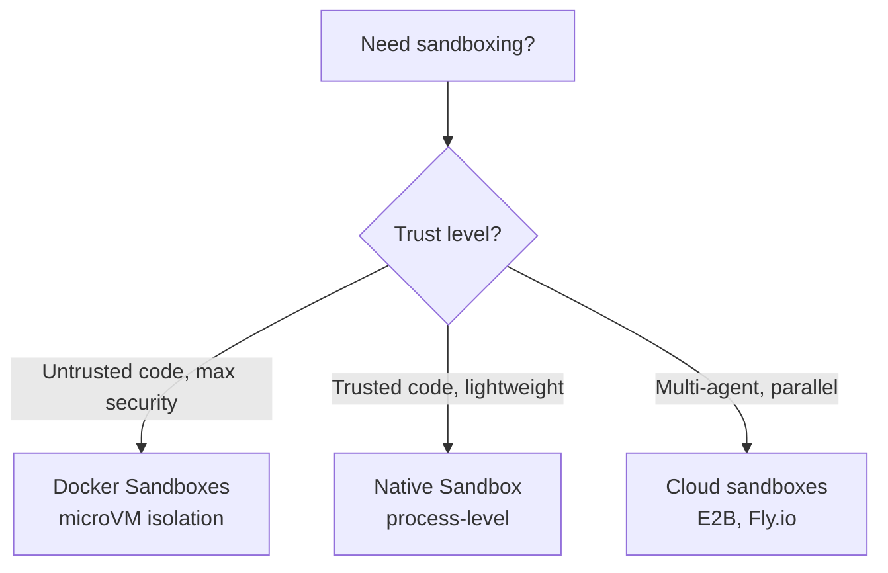
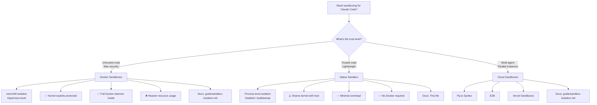

# Native Sandboxing in Claude Code

> **Confidence**: Tier 1 — Official Anthropic documentation
> **Reading time**: ~15 minutes
> **Scope**: Understanding and configuring native process-level sandboxing in Claude Code
> **Last updated**: 2026-02-02

---

## TL;DR

Claude Code includes built-in **native sandboxing** (v2.1.0+) using OS-level primitives to isolate bash commands:

| Aspect | Details |
|--------|---------|
| **macOS** | Seatbelt (built-in, works out of the box) |
| **Linux/WSL2** | bubblewrap + socat (must install) |
| **Filesystem** | Read all (configurable), write workspace only |
| **Network** | SOCKS5 proxy, domain allowlist/denylist |
| **Modes** | Auto-allow (bash auto-approved) vs Regular permissions |
| **Escape hatch** | `dangerouslyDisableSandbox` for incompatible tools |
| **Platform support** | ✅ macOS, Linux, WSL2 • ❌ WSL1 • ⏳ Windows (planned) |

**Quick start**:

```bash
# Enable sandboxing
/sandbox

# Linux/WSL2 prerequisites
sudo apt-get install bubblewrap socat  # Ubuntu/Debian
sudo dnf install bubblewrap socat      # Fedora
```

**When to use Native vs Docker Sandboxes**:



---

## 1. Why Native Sandboxing?

### The Autonomy-Safety Tension

Claude Code's permission system creates a fundamental tension:

- **`--dangerously-skip-permissions`** removes all guardrails → fast, autonomous, but dangerous on bare host
- **Interactive permissions** → safe, but slow and impractical for large refactors

**Native sandboxing resolves this**: Let Claude run freely inside OS-enforced boundaries. The sandbox becomes the security perimeter, not the permission system.

### Benefits

1. **Reduced approval fatigue** - Safe commands auto-approved within sandbox
2. **Autonomous workflows** - Large refactors, CI pipelines without constant prompts
3. **Prompt injection protection** - Malicious prompts can't escape sandbox boundaries
4. **Dependency safety** - Compromised npm packages contained within workspace
5. **Transparent operation** - Sandbox violations trigger immediate notifications

---

## 2. OS Primitives

Native sandboxing uses operating system security mechanisms to enforce isolation:

### macOS: Seatbelt

**Built-in, works out of the box** - no installation required.

- **Mechanism**: macOS Sandbox framework (TrustedBSD Mandatory Access Control)
- **Enforcement**: Kernel-level system call filtering
- **Scope**: Per-process restrictions on filesystem, network, IPC
- **Performance**: Minimal overhead (~1-2% CPU for typical workloads)

**How it works**:

```
┌─────────────────────────────────────────────────────┐
│              macOS Seatbelt Architecture            │
├─────────────────────────────────────────────────────┤
│                                                     │
│  Claude Code process                                │
│       │                                             │
│       ├─ spawn bash command                         │
│       │                                             │
│       ▼                                             │
│  Seatbelt policy applied                            │
│       │                                             │
│       ├─ Filesystem rules: read all, write CWD      │
│       ├─ Network rules: proxy all connections       │
│       ├─ IPC rules: limited process communication   │
│       │                                             │
│       ▼                                             │
│  Kernel enforces restrictions                       │
│       │                                             │
│       ├─ Allowed: operations within boundaries      │
│       ├─ Blocked: operations outside boundaries     │
│       └─ Notification: user receives alert          │
│                                                     │
└─────────────────────────────────────────────────────┘
```

### Linux/WSL2: bubblewrap

**Requires installation** - must install `bubblewrap` and `socat` packages.

- **Mechanism**: Linux namespaces + seccomp-bpf system call filtering
- **Enforcement**: Kernel namespace isolation (mount, network, PID, IPC)
- **Scope**: Creates isolated container-like environment for each command
- **Performance**: Minimal overhead (~2-3% CPU, <10ms startup per command)

**Prerequisites**:

```bash
# Ubuntu/Debian
sudo apt-get install bubblewrap socat

# Fedora
sudo dnf install bubblewrap socat

# Arch Linux
sudo pacman -S bubblewrap socat
```

**How it works**:

```
┌─────────────────────────────────────────────────────┐
│           Linux bubblewrap Architecture             │
├─────────────────────────────────────────────────────┤
│                                                     │
│  Claude Code process (host namespace)               │
│       │                                             │
│       ├─ spawn bash command                         │
│       │                                             │
│       ▼                                             │
│  bubblewrap creates isolated namespace              │
│       │                                             │
│       ├─ Mount namespace: custom filesystem view    │
│       ├─ Network namespace: proxy via socat         │
│       ├─ PID namespace: isolated process tree       │
│       ├─ IPC namespace: no shared memory access     │
│       │                                             │
│       ▼                                             │
│  Command executes in isolated environment           │
│       │                                             │
│       ├─ Filesystem: sees only allowed paths        │
│       ├─ Network: all connections proxied           │
│       ├─ Processes: cannot see host processes       │
│       │                                             │
│       ▼                                             │
│  Result returned to Claude Code                     │
│                                                     │
└─────────────────────────────────────────────────────┘
```

### WSL2 vs WSL1

- **WSL2**: ✅ Supported (uses bubblewrap, same as Linux)
- **WSL1**: ❌ **Not supported** - bubblewrap requires kernel features (namespaces, cgroups) unavailable in WSL1's translation layer

**Migration required**: If you're on WSL1, [upgrade to WSL2](https://learn.microsoft.com/en-us/windows/wsl/install) to use native sandboxing.

---

## 3. Filesystem Isolation

### Default Behavior

- **Read access**: Entire computer (except explicitly denied directories)
- **Write access**: Current working directory (CWD) and subdirectories only
- **Blocked**: Modifications outside CWD without explicit permission

### Why "Read All, Write CWD"?

This asymmetric policy balances usability and security:

- **Read all**: Claude needs to search/analyze entire codebase, read system configs, inspect dependencies
- **Write CWD**: Most development work happens within project directory; restricting writes prevents accidental/malicious system modifications

### Configurable Paths

Customize via `settings.json`:

```json
{
  "sandbox": {
    "filesystem": {
      "allowedWritePaths": [
        "/Users/you/projects/my-app",
        "/tmp"
      ],
      "deniedReadPaths": [
        "/Users/you/.ssh",
        "/Users/you/.aws",
        "/Users/you/.kube"
      ]
    }
  }
}
```

**⚠️ Security Warning**: Overly broad write permissions enable privilege escalation:

- ❌ **Never allow writes to**: `$PATH` directories (`/usr/local/bin`), shell configs (`~/.bashrc`, `~/.zshrc`), system dirs (`/etc`)
- ✅ **Safe to allow**: Project directories, temporary directories (`/tmp`), build output directories

---

## 4. Network Isolation

### Proxy Architecture

All network connections from sandboxed commands are routed through a SOCKS5 proxy running **outside** the sandbox:

```
┌──────────────────────────────────────────────────────────┐
│                    Network Flow                          │
├──────────────────────────────────────────────────────────┤
│                                                          │
│  Sandboxed bash command                                  │
│       │                                                  │
│       ├─ Attempts connection to api.anthropic.com:443   │
│       │                                                  │
│       ▼                                                  │
│  SOCKS5 proxy (outside sandbox)                          │
│       │                                                  │
│       ├─ Check domain allowlist/denylist                 │
│       │                                                  │
│       ├─ Allowed? → Forward connection                   │
│       ├─ Blocked? → Reject + notify user                 │
│       │                                                  │
│       ▼                                                  │
│  External network (if allowed)                           │
│                                                          │
└──────────────────────────────────────────────────────────┘
```

### Domain Filtering

**Two modes**:

1. **Allowlist (default)**: Permit most traffic, block specific destinations
2. **Denylist**: Block all traffic, allow only specified destinations

**Configuration**:

```json
{
  "sandbox": {
    "network": {
      "policy": "deny",
      "allowedDomains": [
        "api.anthropic.com",
        "*.npmjs.org",
        "*.pypi.org",
        "github.com",
        "registry.yarnpkg.com"
      ]
    }
  }
}
```

**Pattern matching**:

- **Exact**: `example.com` (matches exactly)
- **Port-specific**: `example.com:443` (HTTPS only)
- **Wildcards**: `*.example.com` (matches `sub.example.com`, **not** `example.com` itself)

**⚠️ Default blocked ranges**: Private CIDRs (`10.0.0.0/8`, `127.0.0.0/8`, `172.16.0.0/12`, `192.168.0.0/16`, `169.254.0.0/16`)

### Custom Proxy

For advanced use cases (HTTPS inspection, enterprise proxies):

```json
{
  "sandbox": {
    "network": {
      "httpProxyPort": 8080,
      "socksProxyPort": 8081
    }
  }
}
```

---

## 5. Sandbox Modes

### Auto-Allow Mode

**Behavior**:

- Bash commands **automatically approved** if they run inside sandbox
- Commands incompatible with sandbox (e.g., need non-allowed domain) → fall back to regular permission flow
- Explicit ask/deny rules **always respected**

**⚠️ Important**: Auto-allow mode is **independent** of permission mode (default/auto-accept/plan). Even in "default" mode, sandboxed bash commands run without prompts.

**When to use**: Daily development, autonomous refactors, CI/CD pipelines

### Regular Permissions Mode

**Behavior**:

- All bash commands require explicit approval, even if sandboxed
- Sandbox still enforces filesystem/network restrictions
- More control, but slower workflows

**When to use**: High-security environments, untrusted codebases, learning Claude Code behavior

### Switching Modes

```bash
# Interactive menu
/sandbox

# Or edit settings.json
{
  "sandbox": {
    "autoAllowMode": true  # or false for Regular Permissions
  }
}
```

---

## 6. Escape Hatch

### `dangerouslyDisableSandbox` Parameter

Some tools are **incompatible** with sandboxing (e.g., `docker`, `watchman`). Claude Code includes an escape hatch:

**How it works**:

1. Command fails due to sandbox restrictions
2. Claude analyzes failure
3. Claude retries with `dangerouslyDisableSandbox` parameter
4. User receives permission prompt (normal Claude Code flow)
5. If approved, command runs **outside sandbox**

**Example incompatible tools**:

- `docker` (needs access to `/var/run/docker.sock`)
- `watchman` (needs filesystem watch APIs)
- `jest` with watchman (use `jest --no-watchman` instead)

### Disabling the Escape Hatch

For maximum security, disable the escape hatch entirely:

```json
{
  "sandbox": {
    "allowUnsandboxedCommands": false
  }
}
```

When disabled:

- `dangerouslyDisableSandbox` parameter **completely ignored**
- All commands must run sandboxed OR be explicitly listed in `excludedCommands`

**Recommended for**: Production CI/CD, untrusted environments, high-security contexts

### `excludedCommands`

For tools that **never** work in sandbox, exclude them permanently:

```json
{
  "sandbox": {
    "excludedCommands": ["docker", "kubectl", "vagrant"]
  }
}
```

Excluded commands always run outside sandbox (with normal permission prompts).

---

## 7. Security Limitations

### Domain Fronting

**Risk**: CDNs (Cloudflare, Akamai) allow hosting user content on trusted domains.

**Attack scenario**:

1. Attacker whitelists `cloudflare.com`
2. Attacker uploads malicious payload to Cloudflare Workers (subdomain of `cloudflare.com`)
3. Compromised agent downloads payload via whitelisted domain
4. Data exfiltration succeeds

**Mitigation**:

- ❌ **Avoid broad CDN domains**: `*.cloudflare.com`, `*.akamai.net`, `*.fastly.net`
- ✅ **Whitelist specific subdomains**: `my-app.pages.dev`, `my-workers.workers.dev`
- ✅ **Use denylist mode** for untrusted environments

**Impossibility of perfect blocking**: Domain fronting is [hard to prevent](https://en.wikipedia.org/wiki/Domain_fronting) without HTTPS inspection.

### Unix Sockets Privilege Escalation

**Risk**: `allowUnixSockets` configuration can grant access to powerful system services.

**Attack scenario**:

1. User allows `/tmp/*.sock` (thinking it's safe)
2. Compromised agent connects to `/tmp/supervisor.sock` (process manager)
3. Agent spawns privileged process outside sandbox
4. Full system compromise

**Common vulnerable sockets**:

- `/var/run/docker.sock` (Docker daemon - full host access)
- `/run/containerd/containerd.sock` (containerd - container control)
- `/tmp/supervisor.sock` (supervisord - process management)
- `~/.config/systemd/user/bus` (systemd user bus - service control)

**Mitigation**:

- ❌ **Never allow broad patterns**: `/tmp/*.sock`, `/var/run/*.sock`
- ✅ **Whitelist specific sockets** after auditing: `/run/postgresql/.s.PGSQL.5432` (PostgreSQL)
- ✅ **Default**: Unix sockets **blocked** unless explicitly allowed

### Filesystem Permission Escalation

**Risk**: Overly broad write permissions enable privilege escalation.

**Attack scenario**:

1. User allows writes to `/usr/local/bin`
2. Compromised agent creates `/usr/local/bin/sudo` (malicious binary)
3. Next time user runs `sudo`, malicious binary executes
4. System compromise

**Vulnerable directories**:

- `$PATH` directories (`/usr/local/bin`, `~/bin`)
- Shell config files (`~/.bashrc`, `~/.zshrc`, `~/.profile`)
- System directories (`/etc`, `/opt`, `/Library`)
- Cron directories (`/etc/cron.d`, `/var/spool/cron`)

**Mitigation**:

- ✅ **Restrict writes to project directories only**
- ✅ **Audit `allowedWritePaths` carefully**
- ✅ **Monitor sandbox violation logs**

### Linux: Nested Sandbox Weakness

**Risk**: `enableWeakerNestedSandbox` mode weakens isolation.

**When it's used**: Running Claude Code inside Docker containers without privileged namespaces.

**Security impact**: Reduces sandbox strength to compatibility mode (fewer namespace isolations).

**Mitigation**:

- ✅ **Only use if additional isolation enforced** (Docker Sandboxes, cloud sandboxes)
- ✅ **Never use on bare host with untrusted code**
- ✅ **Prefer running Claude Code outside Docker** when possible

---

## 8. Open-Source Runtime

The sandbox runtime is available as an **open-source npm package**:

```bash
# Use sandbox runtime directly
npx @anthropic-ai/sandbox-runtime <command-to-sandbox>

# Example: sandbox an MCP server
npx @anthropic-ai/sandbox-runtime node mcp-server.js
```

**Benefits**:

- **Community audits**: Security researchers can inspect implementation
- **Custom use cases**: Sandbox any AI agent, not just Claude Code
- **Contributions**: Community can improve sandbox strength

**Repository**: [github.com/anthropic-experimental/sandbox-runtime](https://github.com/anthropic-experimental/sandbox-runtime)

**License**: Open source (check repository for specific license)

---

## 9. Platform Support

| Platform | Support | Notes |
|----------|---------|-------|
| **macOS** | ✅ Full | Seatbelt built-in, works out of the box |
| **Linux** | ✅ Full | Requires `bubblewrap` + `socat` installation |
| **WSL2** | ✅ Full | Same as Linux (uses bubblewrap) |
| **WSL1** | ❌ Not supported | bubblewrap needs kernel features unavailable in WSL1 |
| **Windows (native)** | ⏳ Planned | Not yet available, [upgrade to WSL2](https://learn.microsoft.com/en-us/windows/wsl/install) in the meantime |

---

## 10. Decision Tree: Native vs Docker Sandboxes



### Comparison Matrix

| Aspect | Native Sandbox | Docker Sandboxes |
|--------|---------------|------------------|
| **Isolation level** | Process (Seatbelt/bubblewrap) | microVM (hypervisor) |
| **Kernel isolation** | ❌ Shared kernel | ✅ Full kernel per sandbox |
| **Overhead** | Minimal (~1-3% CPU) | Moderate (~5-10% CPU, +200MB RAM) |
| **Setup** | 0 dependencies (macOS), 2 packages (Linux) | Docker Desktop 4.58+ |
| **Use case** | Daily dev, trusted code, lightweight | Untrusted code, max security, isolated Docker |
| **Platform support** | macOS, Linux, WSL2 | macOS, Windows (via WSL2) |

**Rule of thumb**:

- **Daily development, trusted team** → Native Sandbox (lightweight, sufficient security)
- **Running untrusted code, AI-generated scripts** → Docker Sandboxes (max isolation)
- **Multi-agent orchestration** → Cloud Sandboxes (parallel, scalable)

---

## 11. Configuration Examples

### Strict Security (Denylist Mode)

```json
{
  "sandbox": {
    "autoAllowMode": true,
    "allowUnsandboxedCommands": false,
    "filesystem": {
      "allowedWritePaths": [
        "/Users/you/projects/my-app",
        "/tmp"
      ],
      "deniedReadPaths": [
        "/Users/you/.ssh",
        "/Users/you/.aws",
        "/Users/you/.kube",
        "/Users/you/.gnupg"
      ]
    },
    "network": {
      "policy": "deny",
      "allowedDomains": [
        "api.anthropic.com",
        "registry.npmjs.com",
        "registry.yarnpkg.com",
        "files.pythonhosted.org",
        "github.com"
      ]
    },
    "excludedCommands": []
  }
}
```

### Balanced (Allowlist Mode + Escape Hatch)

```json
{
  "sandbox": {
    "autoAllowMode": true,
    "allowUnsandboxedCommands": true,
    "filesystem": {
      "allowedWritePaths": [
        "${CWD}"
      ],
      "deniedReadPaths": [
        "${HOME}/.ssh",
        "${HOME}/.aws"
      ]
    },
    "network": {
      "policy": "allow",
      "blockedDomains": [
        "*.malicious-domain.com"
      ]
    },
    "excludedCommands": ["docker", "kubectl"]
  }
}
```

### Development (Permissive)

```json
{
  "sandbox": {
    "autoAllowMode": true,
    "allowUnsandboxedCommands": true,
    "filesystem": {
      "allowedWritePaths": [
        "${CWD}",
        "/tmp",
        "${HOME}/.cache"
      ]
    },
    "network": {
      "policy": "allow"
    },
    "excludedCommands": ["docker", "podman", "kubectl", "vagrant"]
  }
}
```

---

## 12. Best Practices

1. **Start restrictive, expand as needed** - Begin with denylist mode, whitelist domains/paths incrementally
2. **Monitor sandbox violations** - Review logs to understand Claude's access patterns
3. **Audit `allowedWritePaths`** - Never allow writes to `$PATH` dirs, shell configs, or system directories
4. **Avoid broad CDN domains** - Whitelist specific subdomains (`my-app.pages.dev`) instead of `*.cloudflare.com`
5. **Disable escape hatch in production** - Set `allowUnsandboxedCommands: false` for CI/CD, untrusted environments
6. **Combine with IAM policies** - Use sandboxing **alongside** [permission settings](https://code.claude.com/docs/en/iam) for defense-in-depth
7. **Test configurations** - Verify sandbox doesn't block legitimate workflows before deploying to team
8. **Document allowed domains** - Comment why each domain is whitelisted (`github.com # For git operations`)

---

## 13. Troubleshooting

### Sandbox not active

**Symptom**: `/sandbox` shows "Sandboxing not available"

**Causes**:

- **Linux/WSL2**: `bubblewrap` or `socat` not installed
- **WSL1**: Not supported (upgrade to WSL2 required)
- **Windows native**: Not yet supported (use WSL2)

**Solution**:

```bash
# Linux/WSL2
sudo apt-get install bubblewrap socat

# Verify
which bubblewrap socat
```

### Commands failing with "Network error"

**Symptom**: `npm install` fails with connection timeout

**Cause**: Domain not whitelisted

**Solution**:

1. Check sandbox logs (Claude shows notification with denied domain)
2. Add domain to `allowedDomains`:

```json
{
  "sandbox": {
    "network": {
      "allowedDomains": [
        "registry.npmjs.com",
        "registry.yarnpkg.com"
      ]
    }
  }
}
```

### Docker commands always require permission

**Symptom**: `docker ps` triggers permission prompt every time

**Cause**: Docker incompatible with sandbox, falls back to regular flow

**Solution**: Add to `excludedCommands`:

```json
{
  "sandbox": {
    "excludedCommands": ["docker"]
  }
}
```

### jest failing with watchman error

**Symptom**: `jest` fails with "watchman not available"

**Cause**: watchman incompatible with sandbox

**Solution**: Use `jest --no-watchman`

---

## 14. See Also

- [Sandbox Isolation (Docker, Cloud)](./sandbox-isolation.md) - microVM-based sandboxing for maximum isolation
- [Architecture: Permission Model](./architecture.md#5-permission--security-model) - How permissions and sandboxing interact
- [Official Docs: Sandboxing](https://code.claude.com/docs/en/sandboxing) - Anthropic's official reference
- [Official Docs: Security](https://code.claude.com/docs/en/security) - Comprehensive security features
- [Official Docs: IAM](https://code.claude.com/docs/en/iam) - Permission configuration
- [Open-Source Runtime](https://github.com/anthropic-experimental/sandbox-runtime) - Inspect/contribute to sandbox implementation

---

**Questions or issues?** Report them at [github.com/anthropics/claude-code/issues](https://github.com/anthropics/claude-code/issues)
